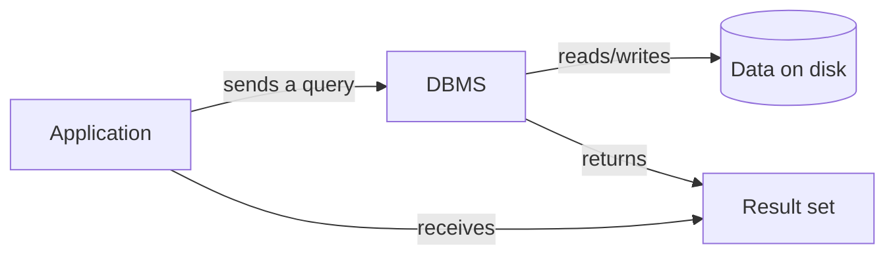

← [Module 01](README.md) | [Course Home](../README.md)

# 1.1 What Is a Database?

## The problem databases solve

Imagine you're storing customer orders in a text file. It works — until:

- Two people edit it at the same time and one person's changes vanish.
- The file grows to a million lines and searching for one order takes minutes.
- The power goes out mid-write and the file is now corrupted.
- You need "every order over $100 from customers in Spain" and there's no way to
  ask that question of a text file except reading the whole thing.

A **database** is an organized collection of data. A **DBMS** (Database Management
System) is the software that stores, retrieves, and manages that data reliably,
even with many users, huge volumes, and things going wrong mid-operation.

> **Database vs. DBMS** — people use the words interchangeably, but strictly: the
> *database* is the data itself; the *DBMS* (e.g., PostgreSQL, MongoDB) is the
> engine that manages it. "I have a PostgreSQL database" really means "a database
> managed by the PostgreSQL DBMS."

## What a DBMS actually guarantees

A good DBMS gives you things a plain file never will:

| Guarantee | What it means |
|---|---|
| **Persistence** | Data survives crashes and restarts |
| **Concurrency** | Many users can read/write at once without corrupting data |
| **Integrity** | Rules (e.g., "age can't be negative") are enforced automatically |
| **Fast retrieval** | Indexes let you find rows without scanning everything |
| **Durability** | Once you're told "saved," it's saved — even if the power cuts out next instant |
| **A query language** | You describe *what* you want; the engine figures out *how* |

We'll formalize the strongest of these guarantees (atomicity, consistency,
isolation, durability — "ACID") in [Module 06](../06-transactions-concurrency/01-acid.md).

## A simple mental model

Your application never touches the raw files on disk directly — it always goes
through the DBMS, which is what makes all the guarantees above possible.

## Data vs. information vs. schema

- **Data** — raw facts: `42`, `"Alice"`, `2026-01-05`
- **Schema** — the structure that gives data meaning: "column `age` is an integer,
  column `name` is text, column `signup_date` is a date"
- **Information** — data interpreted through a schema: "Alice, age 42, signed up
  Jan 5, 2026"

A database without a schema is just a pile of bytes. Designing good schemas is
most of what Modules 02 and 04 are about.

## Try it yourself

1. Think of an app you use daily (a to-do list, a banking app, a chat app). List
   three pieces of data it must store, and one rule that data must always follow
   (e.g., "an account balance can't go below zero" for a bank).
2. Without looking anything up, guess: what goes wrong if two people click
   "buy" on the last item in stock at the exact same millisecond, and the
   system has no protection against it? Keep your answer — we'll revisit this
   exact scenario in [Module 06](../06-transactions-concurrency/01-acid.md) when we
   cover **race conditions** and **transactions**.

---
← [Module 01](README.md) | Next: [Types of Databases →](02-types-of-databases.md)
