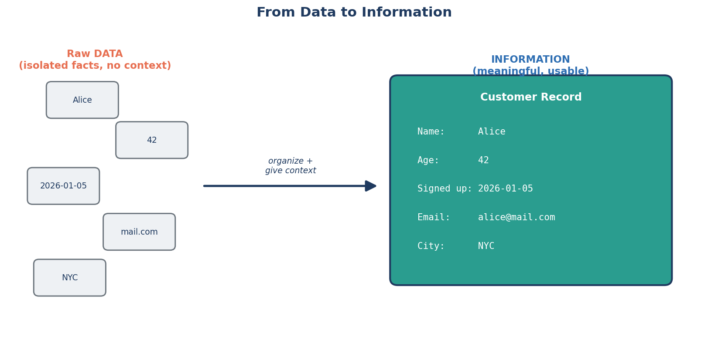
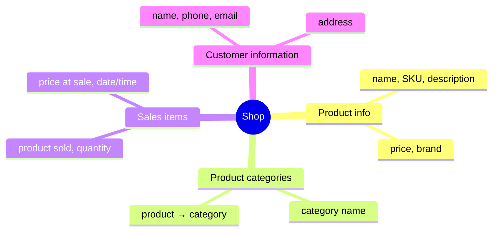
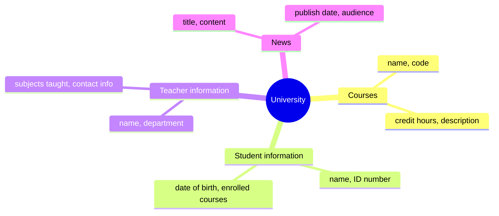
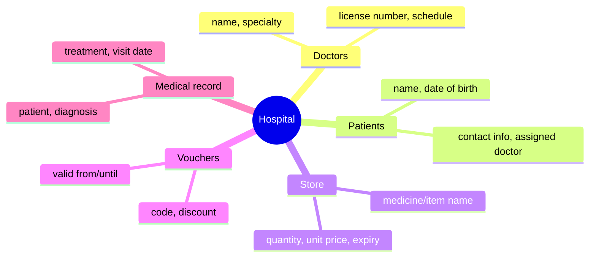

# 1.1 What Is Data?

## Definition

**Data** is raw facts and figures, collected but not yet organized or given
context — names, numbers, dates, words, measurements. On its own, a single
piece of data doesn't tell you much (`"Alice"`, `42`, `2026-01-05`). Once data
is organized and given meaning, it becomes **information**
(*"Alice is 42 years old and signed up on January 5, 2026"*). A database's job
is to store data in a structured way so it can reliably be turned back into
useful information whenever it's needed.

Scattered facts on the left mean nothing on their own — `"Alice"`, `42`, and
`"NYC"` could belong to anyone. Organized into a record with labeled fields on
the right, the exact same facts become a usable **Customer Record**. That
labeled structure — field names, and how facts relate to one thing — is what a
database actually stores.

## Examples

To make this concrete, here's the kind of data a few different real-world
systems need to track. Notice that "data" always means specific, storable
facts — not the whole real-world concept.

### 🛒 A Shop

| Category | What it stores |
|---|---|
| **Product info** | Product name, SKU, description, price, brand |
| **Product categories** | Category name (e.g., "Electronics", "Groceries"), which category a product belongs to |
| **Sales items** | Which products were sold, quantity, price at time of sale, date/time of sale |
| **Customer information** | Customer name, phone number, email, address |

### 🎓 A University

| Category | What it stores |
|---|---|
| **Courses** | Course name, course code, credit hours, description |
| **Student information** | Student name, ID number, date of birth, enrolled courses |
| **Teacher information** | Teacher name, department, subjects taught, contact info |
| **News** | Announcement title, content, publish date, target audience (students/staff) |

### 🏥 A Hospital

| Category | What it stores |
|---|---|
| **Doctors** | Doctor name, specialty, license number, schedule |
| **Patients** | Patient name, date of birth, contact info, assigned doctor |
| **Store** | Medicine/item name, quantity in stock, unit price, expiry date |
| **Vouchers** | Voucher code, discount amount/percentage, valid-from and valid-until dates |
| **Medical record** | Patient visited, diagnosis, prescribed treatment, date of visit |

## The pattern to notice

Across all three examples, data always breaks down into individual facts about
a **thing** (a product, a student, a patient) or an **event** (a sale, a visit,
an announcement). That distinction — "things" vs. "events happening to things"
— is the very first step toward designing a database, and it's exactly what
we'll build on in the next lesson.
