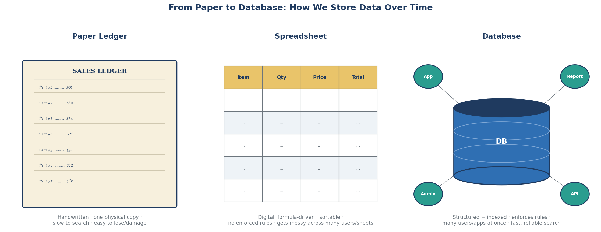
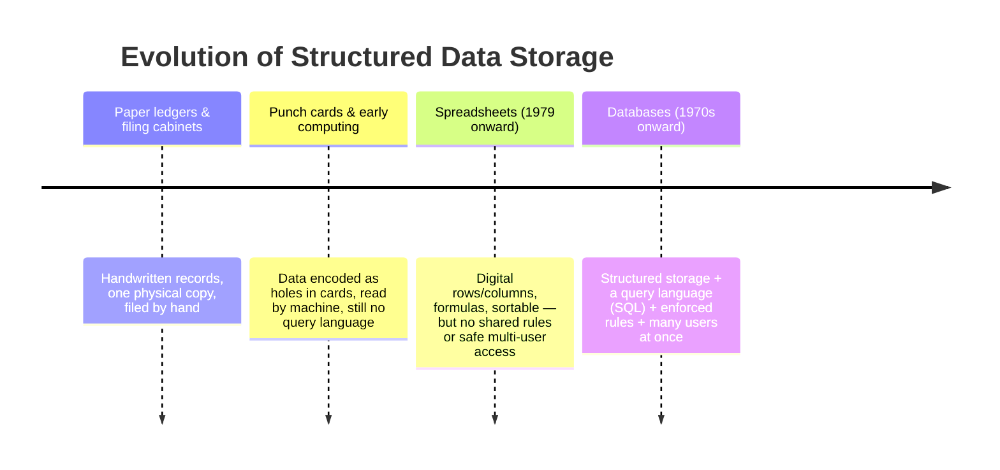

← [1.1 What Is Data?](01-what-is-data.md)

# 1.2 Structured Data & From Paper to Databases

Let's take this slowly, one small step at a time.

## Step 1 — What "structured data" means

**Structured data** = data organized into consistent fields, like a table.
Every row has the exact same columns. Example: every customer record always
has `name, phone, email, address` — never more, never less.

## Step 2 — There are 3 levels of "organized-ness"

| Type | What it means | Example |
|---|---|---|
| **Structured** | A strict table — every record has the same fields | A customer record: `name, phone, email, address` |
| **Semi-structured** | Loosely organized, not a rigid table | An email (has sender/date, but the body is free text) |
| **Unstructured** | No organization at all | A photo, a voice recording |

Databases are really good at the first kind — **structured data**. That's what
this course focuses on.

## Step 3 — Before computers: paper ledgers

Shops, hospitals, and schools used to keep records on paper. This worked, but
had 3 problems:
- Only **one copy** existed — lose it or burn it, and it's gone.
- **Searching meant reading every page** by hand.
- **Nothing stopped mistakes** (e.g., writing a negative price).

## Step 4 — Then came spreadsheets

Same rows/columns as paper, but now digital — searchable and calculable.
Better, but still 2 problems:
- **Nothing stops bad data** — you could still type text into a "price" column.
- **Breaks when shared** — if two people edit the same file at once, whoever
  saves last quietly overwrites the other person's work.

## Step 5 — Then came databases

Databases keep everything good about spreadsheets, and fix both problems:
- **Rules can be enforced** — e.g., "price must be a positive number," and the
  database itself rejects bad data.
- **Many people can safely work at once** — many people/apps can read and
  write at the same time without overwriting each other.

## Step 6 — The big idea to remember

Each stage fixed the problem of the one before it:

```
paper (can't search)  →  spreadsheet (can search, but no safety rules)  →  database (search + safety + many users)
```

Everything you'll learn later in this course (tables, keys, rules,
transactions) exists just to deliver on Step 6.

## The full picture, visually





---
← [1.1 What Is Data?](01-what-is-data.md)
