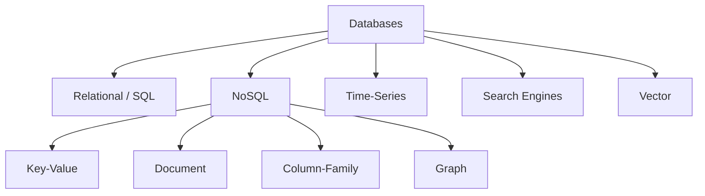
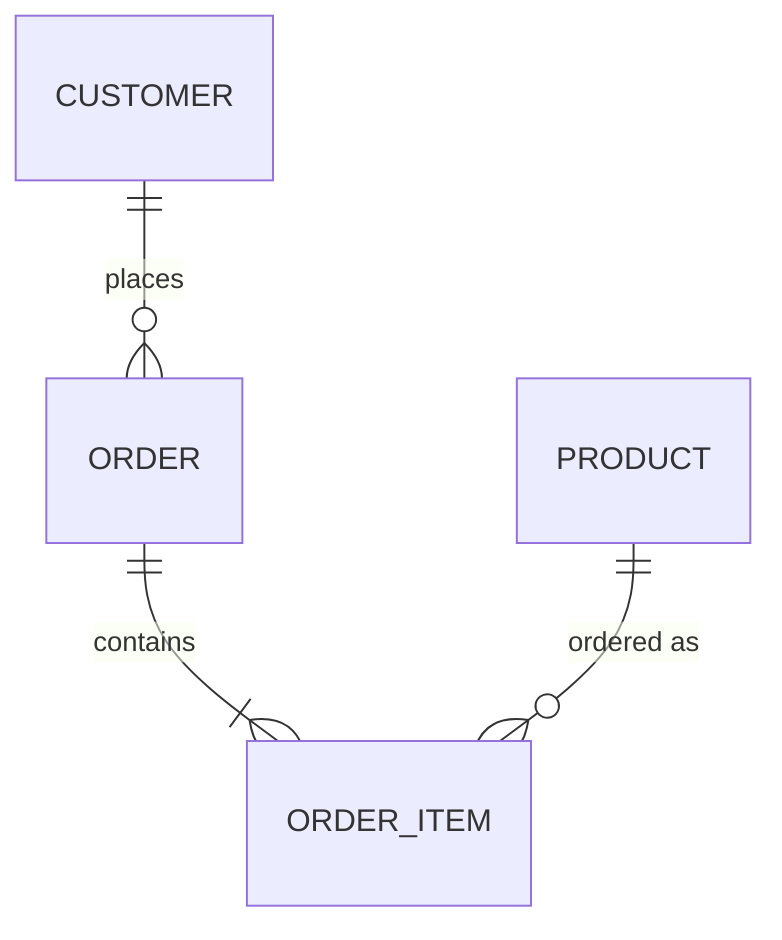

← [Module 01](README.md) | [Course Home](../README.md)

# 1.2 Types of Databases

Not all databases store data the same way. The right choice depends on your
data's shape, how you'll query it, and how much scale you need.

## The main categories

| Type | Stores data as | Example systems | Great for |
|---|---|---|---|
| **Relational (SQL)** | Tables of rows & columns, related by keys | PostgreSQL, MySQL, SQL Server, Oracle | Structured data with relationships, strong consistency needs |
| **Key-Value** | `key → value` pairs, value is opaque | Redis, DynamoDB, etcd | Caching, sessions, simple lookups at huge scale |
| **Document** | JSON/BSON-like documents | MongoDB, Couchbase | Semi-structured data, flexible/evolving schemas |
| **Column-Family** | Rows with dynamic, sparse columns grouped in families | Cassandra, HBase | Massive write throughput, time-series-ish workloads |
| **Graph** | Nodes and edges (relationships as first-class citizens) | Neo4j, Amazon Neptune | Social networks, recommendation engines, fraud detection |
| **Time-Series** | Timestamped data points | InfluxDB, TimescaleDB | Metrics, IoT sensor data, monitoring |
| **Search Engines** | Inverted indexes over text | Elasticsearch, OpenSearch | Full-text search, log analytics |
| **Vector** | High-dimensional embeddings | Pinecone, pgvector, Weaviate | Similarity search, AI/RAG applications |

This course focuses on **Relational** databases in depth (Modules 02–06, since
they're the most broadly used foundation) and covers **NoSQL** categories
(key-value, document, column-family, graph) in [Module 07](../07-nosql/).

## Relational, in one sentence

Data lives in **tables** (like spreadsheets) with strictly typed **columns**, and
relationships between tables are expressed through shared key values rather than
by nesting data inside other data.

## NoSQL, in one sentence

"NoSQL" is a broad umbrella for anything that *isn't* the classic relational
table model — usually trading some relational guarantees (strict schema, joins,
strong consistency) for flexibility or horizontal scale.

## How to choose

Ask these questions, roughly in order:

1. **Is my data naturally tabular with clear relationships?** (customers, orders,
   inventory) → start with relational.
2. **Does my data have a fast-changing, nested, or inconsistent shape** (each
   record can have different fields)? → document store.
3. **Do I just need ultra-fast lookups by a single key** (cache, session store,
   feature flags)? → key-value store.
4. **Is my dataset dominated by relationships themselves** (who-knows-who,
   who-bought-what-influenced-what)? → graph database.
5. **Do I need to ingest huge write volumes across many machines**, and can I
   accept eventual consistency? → column-family store.

We build a full decision framework with worked examples in
[Module 07, Lesson 4](../07-nosql/04-sql-vs-nosql-decision-guide.md) — for now, just
know the categories exist and roughly what each is for.

## Try it yourself

For each scenario below, guess which category (relational, key-value, document,
column-family, or graph) fits best, and write one sentence why:

1. A bank's ledger of account balances and transactions.
2. A shopping-cart session store that must respond in under 5ms.
3. A "people you may know" feature on a social network.
4. A product catalog where every product category has wildly different attributes
   (a book has "author"/"ISBN"; a laptop has "CPU"/"RAM").

*(No wrong answers yet — you'll be able to check your reasoning against Module 07.)*

---
← [1.1 What Is a Database?](01-what-is-a-database.md) | [Module 01](README.md) | Next: [DBMS Architecture →](03-dbms-architecture.md)
