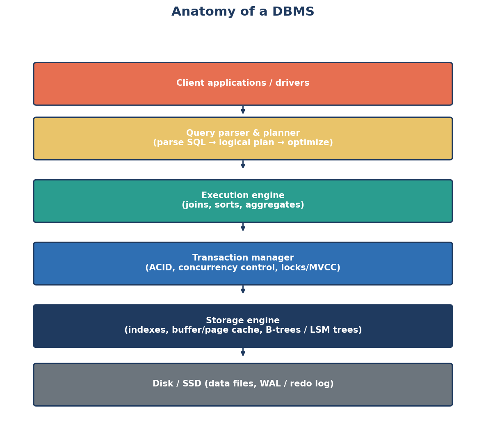
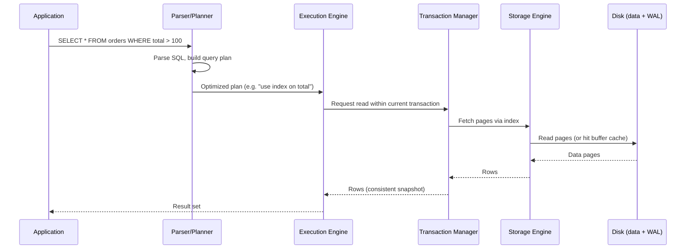

← [Module 01](README.md) | [Course Home](../README.md)

# 1.3 DBMS Architecture

When you run `SELECT * FROM orders WHERE total > 100`, a surprising amount of
machinery kicks into gear before you get a result back. Understanding these
layers demystifies almost every advanced topic later in the course — indexing,
query plans, transactions, and replication all live in specific layers here.

## The layers, top to bottom

1. **Client applications / drivers** — your app, a CLI tool, or a BI dashboard,
   talking to the DBMS over a protocol (e.g., PostgreSQL's wire protocol, or a
   driver library).

2. **Query parser & planner**
   - **Parser**: checks your SQL is syntactically valid and turns it into an
     internal representation (a parse tree).
   - **Planner/Optimizer**: decides *how* to execute the query — which indexes
     to use, which join algorithm, what order to join tables in — by estimating
     costs. This is what you inspect with `EXPLAIN` (see
     [Module 05](../05-indexing-performance/02-execution-plans.md)).

3. **Execution engine** — actually runs the chosen plan: scanning tables, using
   indexes, performing joins, sorting, and aggregating.

4. **Transaction manager** — enforces ACID guarantees. Handles concurrency
   control (locks or MVCC) so simultaneous transactions don't corrupt each
   other's work (see [Module 06](../06-transactions-concurrency/)).

5. **Storage engine** — the layer that actually reads/writes data on disk.
   Manages indexes (B-trees, LSM trees), a buffer/page cache in memory (so hot
   data doesn't need a disk read every time), and free-space tracking.

6. **Disk / SSD** — the physical (or cloud-virtual) storage: data files and the
   **write-ahead log (WAL)**, which records changes before they're applied so a
   crash never loses committed data.

## Following one query through the stack

## Why the WAL matters

Almost every serious DBMS writes changes to an append-only **write-ahead log**
*before* modifying the actual data files. If the system crashes mid-write, on
restart it replays the WAL to reconstruct any change that was committed but not
yet fully applied to the data files. This single mechanism is the backbone of
the **Durability** guarantee in ACID — we'll dig into it properly in
[Module 06, Lesson 1](../06-transactions-concurrency/01-acid.md).

## Row-oriented vs. column-oriented storage

A quick preview of a design choice that matters a lot for analytics workloads:

| | Row-oriented (OLTP) | Column-oriented (OLAP) |
|---|---|---|
| Stores | Each row's fields together | Each column's values together |
| Great for | Reading/writing whole records (e.g., "get order #42") | Aggregating one column across millions of rows (e.g., "average order total") |
| Examples | PostgreSQL, MySQL, most "classic" databases | ClickHouse, Amazon Redshift, Snowflake |

Most databases you'll use day-to-day (and most of this course) are row-oriented,
optimized for **OLTP** (Online Transaction Processing — lots of small
read/writes). **OLAP** (Online Analytical Processing — big aggregations over
huge datasets) systems make different tradeoffs, which is why "your production
database" and "your analytics warehouse" are often different systems entirely.

## Try it yourself

1. In your own words, explain why a DBMS writes to a log *before* writing to the
   actual data file, instead of just writing directly and more simply.
2. If you have PostgreSQL, MySQL, or SQLite installed, run `EXPLAIN SELECT * FROM
   <any table>;` and see what it prints. Don't worry about understanding every
   line yet — just notice that the database *shows its work*. We return to this
   in depth in [Module 05](../05-indexing-performance/02-execution-plans.md).

---
← [1.2 Types of Databases](02-types-of-databases.md) | [Module 01](README.md) | Next: [Module 02 — Relational Model →](../02-relational-model/)
