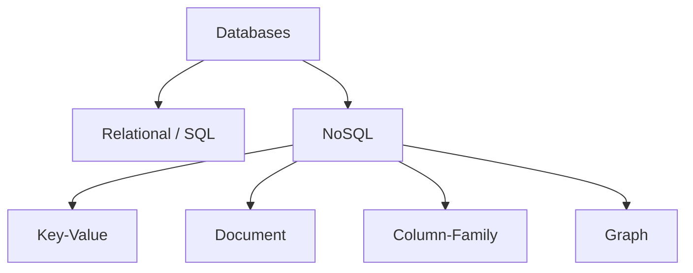
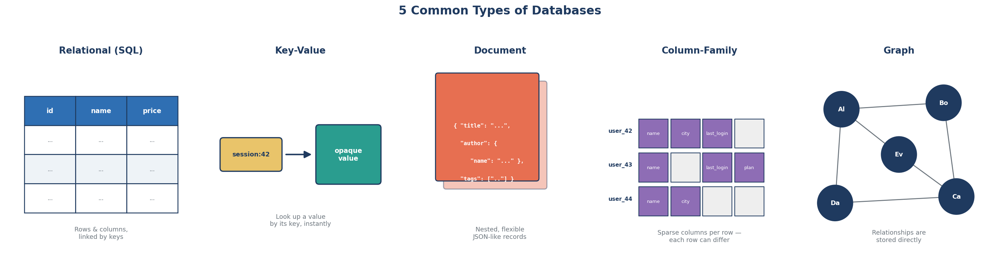

← [1.2 Structured Data & Storage Evolution](02-structured-data-and-storage-evolution.md)

# 1.3 Types of Databases

Let's go slowly again, one type at a time.

## Step 1 — Two big families

Every database falls into one of two families:

- **SQL (Relational)** — data lives in tables, like the spreadsheets from
  [Lesson 1.2](02-structured-data-and-storage-evolution.md).
- **NoSQL ("Not Only SQL")** — several different shapes of storage, built for
  cases where a strict table doesn't fit well.

## Step 2 — Relational (SQL)

The classic model: tables with fixed columns, connected to each other by
shared IDs. Example: a `customers` table and an `orders` table, linked by
`customer_id`.

**Best for**: data with clear structure and relationships — a shop's
products/orders, a hospital's patients/appointments.

## Step 3 — Key-Value

The simplest model possible: every piece of data is just a **key** pointing to
a **value**. The database doesn't look inside the value at all — it just
stores and returns it, extremely fast.

**Best for**: things you look up by one exact ID very often — a shopping cart
session, a cached password-reset code.

## Step 4 — Document

Like key-value, but the value is a structured, readable document (JSON-like),
and the database *can* look inside it — search by a field, update just one
part.

**Best for**: data whose shape varies a lot — a product catalog where a book
has different fields than a laptop.

## Step 5 — Column-Family

Data is stored by a row key, but unlike a strict table, every row can have a
*different* set of columns — some filled in, some empty.

**Best for**: huge amounts of fast-arriving data — sensor readings, activity
logs — spread across many machines.

## Step 6 — Graph

Here, the *relationships* themselves are what's stored and searched — not
reconstructed from IDs like in relational tables.

**Best for**: questions that are really about connections — "who knows who,"
"what influenced what."

## Step 7 — Picture all five together

## Step 8 — Quick recap table

| Type | Stores data as | Best for |
|---|---|---|
| Relational (SQL) | Tables, rows & columns | Structured data with relationships |
| Key-Value | key → value | Fast lookup by one ID |
| Document | Nested JSON-like records | Flexible, varying-shape data |
| Column-Family | Sparse columns per row | Massive write volume |
| Graph | Nodes + edges | Relationship-heavy questions |

This course focuses mainly on **Relational (SQL)** first, since it's the most
widely used foundation — the other types get their own deeper lessons later.

---
← [1.2 Structured Data & Storage Evolution](02-structured-data-and-storage-evolution.md)
