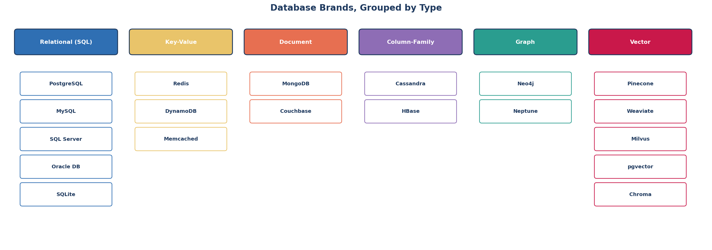

← [1.3 Types of Databases](03-types-of-databases.md)

# 1.4 Database Brands

In [Lesson 1.3](03-types-of-databases.md) we covered the 6 *types* of
databases. Now let's meet the actual products — the "brands" — you'll
encounter in real jobs and projects. One step at a time.

## Step 1 — Why so many brands exist for the same type

Multiple companies/communities each built their own database software for the
same category, competing on things like speed, cost, features, and ease of
use. Two important labels you'll see attached to every brand:

- **Open-source** — free to use, source code publicly available (e.g.,
  PostgreSQL, MySQL, Redis, MongoDB Community Edition).
- **Proprietary** — owned and sold by a company, usually with paid licensing
  (e.g., Oracle Database, Microsoft SQL Server).

## Step 2 — Relational (SQL) brands

| Brand | Made by | Known for |
|---|---|---|
| **PostgreSQL** | Open-source community | Extremely capable, standards-compliant, free — this course's default choice |
| **MySQL** | Oracle Corporation (open-source) | Very popular for web apps, pairs with PHP historically |
| **Microsoft SQL Server ("MS")** | Microsoft | Common in Windows/enterprise environments |
| **Oracle Database** | Oracle Corporation | Long history in large enterprises, banks, telecoms |
| **SQLite** | Open-source | A tiny, file-based database — no server needed, used inside apps/phones |

## Step 3 — Key-Value brands

| Brand | Made by | Known for |
|---|---|---|
| **Redis** | Open-source (Redis Ltd.) | Extremely fast, in-memory, the most common caching layer |
| **DynamoDB** | Amazon (AWS) | Fully managed, scales automatically, cloud-only |
| **Memcached** | Open-source | Simple, pure in-memory caching |

## Step 4 — Document brands

| Brand | Made by | Known for |
|---|---|---|
| **MongoDB** | MongoDB Inc. | The most widely used document database |
| **Couchbase** | Couchbase Inc. | Document storage + built-in caching |

## Step 5 — Column-Family brands

| Brand | Made by | Known for |
|---|---|---|
| **Cassandra** | Apache (open-source, started at Facebook) | Massive write throughput across many machines |
| **HBase** | Apache (open-source) | Built on top of Hadoop, big-data ecosystems |

## Step 6 — Graph brands

| Brand | Made by | Known for |
|---|---|---|
| **Neo4j** | Neo4j Inc. | The most widely used graph database |
| **Amazon Neptune** | Amazon (AWS) | Fully managed graph database |

## Step 7 — Vector brands (for AI/ML)

| Brand | Made by | Known for |
|---|---|---|
| **Pinecone** | Pinecone Systems | Fully managed, one of the most popular for AI apps |
| **Weaviate** | Weaviate B.V. (open-source) | Open-source, built-in hybrid (keyword + vector) search |
| **Milvus** | Zilliz (open-source) | Open-source, built for very large-scale vector search |
| **pgvector** | Open-source | Not a separate database — an extension that adds vector search *into PostgreSQL* |
| **Chroma** | Open-source | Lightweight, popular for local AI prototypes |

> `pgvector` is worth remembering specifically: it means you don't always need
> a brand-new database just to add AI features — you can add vector search
> directly to a PostgreSQL database you're already using.

## Step 8 — See them all grouped together

## Step 9 — A simple rule for picking a brand, not just a type

Once you know the *type* you need ([Lesson 1.3](03-types-of-databases.md)),
picking a specific brand usually comes down to:
1. **Cost** — open-source (free) vs. proprietary (licensing fees)?
2. **Hosting** — do you manage the server yourself, or use a cloud-managed
   version (AWS, Google Cloud, Azure all offer managed versions of most of
   these)?
3. **Team familiarity** — the "best" database is often the one your team
   already knows well.

For this course, we'll use **PostgreSQL** for all relational examples — it's
free, extremely capable, and one of the most in-demand skills in the industry.

---
← [1.3 Types of Databases](03-types-of-databases.md)
