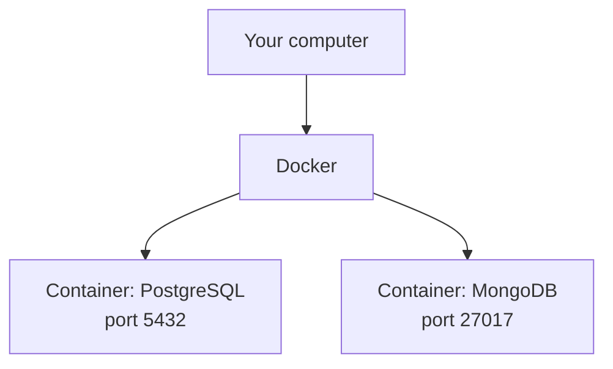

← [1.5 Installing PostgreSQL & MongoDB](05-installation.md)

# 1.6 Running with Docker

[Lesson 1.5](05-installation.md) installed PostgreSQL and MongoDB directly
onto your machine. **Docker** offers a third option — run both without
installing either one natively at all.

## Step 1 — Why use Docker for this

- **No conflicts** with other software, or other versions of Postgres/Mongo
  already on your machine.
- **Identical versions** to whatever your teammates or production servers
  run — no "it works on my machine" surprises.
- **A completely clean slate** whenever you want one — delete the container,
  and every trace of it is gone, no leftover files scattered around your OS.
- **Both databases run side by side**, on their own ports, with zero setup
  conflicts between them.



Each container is an isolated, disposable mini-environment — your actual
computer never has PostgreSQL or MongoDB "installed" on it at all.

## Step 2 — Install Docker itself

Download **Docker Desktop** (macOS/Windows) or **Docker Engine** (Linux) from
[docker.com/get-started](https://www.docker.com/get-started/). Once it's
running, verify it in a terminal:

```bash
docker --version
```

## Step 3 — Run PostgreSQL in a container

```bash
docker run --name my-postgres \
  -e POSTGRES_PASSWORD=mysecretpassword \
  -e POSTGRES_DB=my_store \
  -p 5432:5432 \
  -d postgres:16
```

| Flag | Means |
|---|---|
| `--name my-postgres` | A friendly name to refer to this container later |
| `-e POSTGRES_PASSWORD=...` | Sets an environment variable inside the container — here, the `postgres` user's password |
| `-e POSTGRES_DB=my_store` | Automatically creates this database on first start — [Lesson 2.2](../02-sql/02-your-first-database-apple-example.md)'s Step 1, done for you |
| `-p 5432:5432` | Maps port 5432 on your machine to port 5432 inside the container |
| `-d` | "Detached" — runs in the background |
| `postgres:16` | The image (software + version) to run — PostgreSQL 16 |

Connect to it:

```bash
docker exec -it my-postgres psql -U postgres -d my_store
```

## Step 4 — Run MongoDB in a container

```bash
docker run --name my-mongo \
  -p 27017:27017 \
  -d mongo:7
```

Connect to it:

```bash
docker exec -it my-mongo mongosh
```

## Step 5 — Managing containers

```bash
docker ps                    # list running containers
docker stop my-postgres   # stop it (data stays, container just isn't running)
docker start my-postgres  # start it again
docker logs my-postgres   # see what it's printed
docker rm my-postgres     # delete the container entirely
```

⚠️ `docker rm` deletes the container — and by default, **everything it
stored**, since a container's filesystem disappears with it. That's exactly
what the next step fixes.

## Step 6 — Persisting data with volumes

Without a **volume**, all your data vanishes the moment the container is
removed. A volume stores data *outside* the container, on your actual
machine, so it survives even if the container is deleted and recreated.
Docker gives you two flavors:

- **Named volume** — Docker manages the storage location for you, somewhere
  inside Docker's own internal storage (e.g., `my_postgres_data:/var/lib/...`).
- **Bind mount** — *you* choose the exact folder on your machine, and Docker
  writes directly into it. This is what you want if you'd rather see and
  back up the data yourself.

To keep everything inside this course's own project folder, run these
commands **from inside `Desktop/learn-databases`** (the same folder this
lesson lives in) — `$(pwd)` resolves to that folder automatically:

```bash
mkdir -p data/postgres data/mongo

docker run --name my-postgres \
  -e POSTGRES_PASSWORD=mysecretpassword \
  -e POSTGRES_DB=my_store \
  -p 5432:5432 \
  -v "$(pwd)/data/postgres:/var/lib/postgresql/data" \
  -d postgres:16

docker run --name my-mongo \
  -p 27017:27017 \
  -v "$(pwd)/data/mongo:/data/db" \
  -d mongo:7
```

`-v "$(pwd)/data/postgres:/var/lib/postgresql/data"` says: *"store this
container's data directory at `Desktop/learn-databases/data/postgres` on my
actual machine — not somewhere hidden inside Docker."* You can now literally
open that folder in Finder/Explorer and see PostgreSQL's raw data files.

> Add `data/` to a `.gitignore` file in this project if you're tracking it
> with git — database files don't belong in version control.

## Step 7 — Bonus: running both together with Docker Compose

Instead of two long `docker run` commands, describe both containers once in
a file, and start them together. Save this as `docker-compose.yml` **at the
root of `Desktop/learn-databases`** — with a bind mount, Compose's relative
paths (`./data/...`) resolve automatically against wherever this file sits,
so you don't need `$(pwd)` here at all:

```yaml
# docker-compose.yml
services:
  postgres:
    image: postgres:16
    container_name: my-postgres
    environment:
      POSTGRES_PASSWORD: mysecretpassword
      POSTGRES_DB: my_store
    ports:
      - "5432:5432"
    volumes:
      - ./data/postgres:/var/lib/postgresql/data

  mongo:
    image: mongo:7
    container_name: my-mongo
    ports:
      - "27017:27017"
    volumes:
      - ./data/mongo:/data/db
```

```bash
docker compose up -d     # starts BOTH databases at once
docker compose down      # stops both (the data/ folder is kept)
```

Both databases' actual data files now live at
`Desktop/learn-databases/data/postgres` and
`Desktop/learn-databases/data/mongo` — plain folders on your machine, not
hidden inside Docker. Deleting `data/` by hand is now the equivalent of a
full wipe (there's no separate `-v` volume to clean up, since there's no
longer a Docker-managed named volume at all).

## Step 8 — Native install vs. Docker: quick comparison

| | Native install (Lesson 1.5) | Docker |
|---|---|---|
| Setup effort | Different steps per OS | Same commands everywhere |
| Cleanliness | Leaves files on your system | Fully removable, zero leftovers |
| Multiple versions at once | Awkward | Trivial — just change the image tag |
| Matches production | Depends on what you installed | Exactly matches the image version you chose |
| Best for | A single, permanent local setup | Experimenting, disposable setups, matching a team's exact versions |

Either approach works fine for the rest of this course — pick whichever you
just set up. Next, [Lesson 1.7](07-gui-tools.md) connects a visual tool to
whichever database you now have running.

---
← [1.5 Installing PostgreSQL & MongoDB](05-installation.md) | Next: [1.7 Connecting with a GUI →](07-gui-tools.md)
