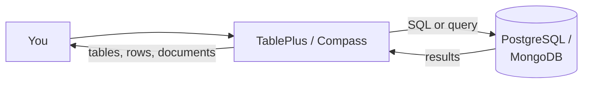

← [1.6 Running with Docker](06-run-with-docker.md)

# 1.7 Connecting with a GUI: TablePlus & MongoDB Compass

Everything so far has meant typing commands in a terminal. A GUI tool lets
you browse tables, click through documents, and run queries visually —
genuinely useful, not just a beginner crutch. This course uses **TablePlus**
for PostgreSQL and **MongoDB Compass** for MongoDB.

## Step 1 — Why bother with a GUI at all

- **See the shape of your data at a glance** — every column, every row,
  without typing `SELECT * FROM ...` first just to remember what's there.
- **Click to edit** a single cell or document, instead of writing an `UPDATE`
  statement for a quick one-off fix.
- **Still lets you run raw SQL/queries** whenever you actually want to —
  a GUI doesn't replace what you learned in Part 1, it sits alongside it.



## Step 2 — Install TablePlus

Download it from [tableplus.com](https://tableplus.com/) (macOS, Windows,
and Linux). The free tier is fully usable for this course — it just limits
how many tabs you can have open at once.

## Step 3 — Connect TablePlus to PostgreSQL

Click **Create a new connection → PostgreSQL**, then fill in exactly what
you set up in [Lesson 1.5](05-installation.md) or [Lesson 1.6](06-run-with-docker.md):

| Field | Value |
|---|---|
| Name | Anything you like, e.g. `Learn Databases` |
| Host | `localhost` |
| Port | `5432` |
| User | `postgres` |
| Password | whatever you set (Lesson 1.5's native install, or `mysecretpassword` from Lesson 1.6's Docker example) |
| Database | `apple_store` |

Click **Connect** — if it fails, double check PostgreSQL is actually
running (`docker ps`, if you used Docker).

## Step 4 — Browsing and editing in TablePlus

- The left sidebar lists every table — click `products` to see every row,
  spreadsheet-style.
- Double-click any cell to edit it directly — this runs a real `UPDATE`
  behind the scenes, exactly like [Lesson 2.2](../02-sql/02-your-first-database-apple-example.md)'s
  Step 6, just without typing it.
- The **SQL tab** at the top lets you run any query from this course
  directly — paste in anything from [Part 1](../02-sql/) and run it.

## Step 5 — Install MongoDB Compass

Download it from
[mongodb.com/products/compass](https://www.mongodb.com/products/compass)
(macOS, Windows, and Linux) — it's also offered as an optional install
during MongoDB's own installer from [Lesson 1.5](05-installation.md).

## Step 6 — Connect Compass to MongoDB

Compass asks for one thing: a **connection string**. For a local install or
Docker setup from [Lesson 1.6](06-run-with-docker.md), it's simply:

```
mongodb://localhost:27017
```

Paste that into Compass's connection screen and click **Connect** — no
username/password needed for a default local setup.

## Step 7 — Browsing and editing in Compass

- The left sidebar lists every **database**, and inside each, every
  **collection** (MongoDB's equivalent of a table — covered properly once
  Part 2 starts).
- Click a collection to see its **documents** — each one shown as readable,
  expandable JSON, not a rigid grid.
- Click any document to edit its fields directly, or use the query bar at
  the top to filter — Compass even has a visual query builder for beginners
  who aren't ready to type MongoDB's query syntax yet.

## Step 8 — Recap

| | TablePlus | MongoDB Compass |
|---|---|---|
| For | PostgreSQL (and other SQL databases) | MongoDB only |
| Shows data as | Rows and columns (spreadsheet-style) | Expandable JSON documents |
| Connects via | Host / port / user / password | A connection string |
| Can still run raw queries? | Yes — a full SQL tab | Yes — a query bar, plus a visual builder |

Both tools are optional — everything in this course still works entirely
from the command line (`psql`, `mongosh`) if you'd rather stay there. Use
whichever feels more comfortable as you move into [Part 1 — SQL](../02-sql/01-what-is-sql.md).

---
← [1.6 Running with Docker](06-run-with-docker.md) | Next: [2.1 What Is SQL? →](../02-sql/01-what-is-sql.md)
