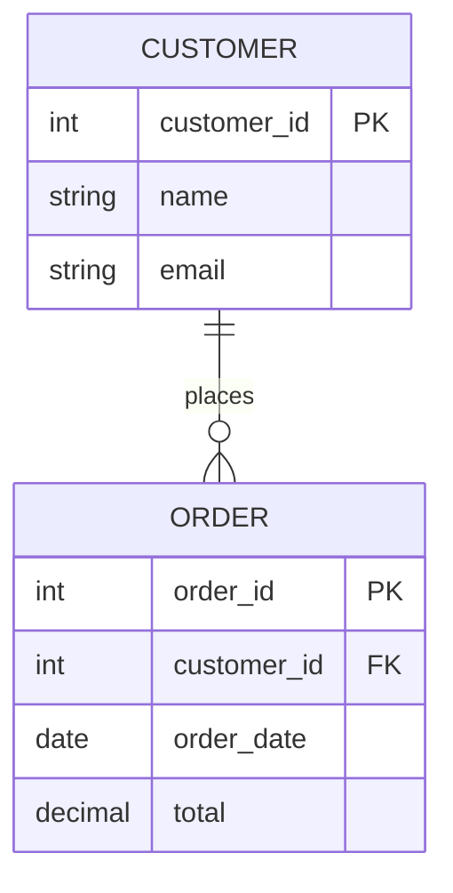

← [Module 02](README.md) | [Course Home](../README.md)

# 2.1 Relational Model Basics

The relational model, introduced by Edgar F. Codd in 1970, describes data as a
collection of **relations** — what you and I call **tables**. Almost every idea
in SQL traces back to a small set of concepts from this model.

## Vocabulary: formal terms vs. everyday terms

| Formal term | Everyday term | Example |
|---|---|---|
| Relation | Table | `customers` |
| Tuple | Row / record | One customer: `(1, "Alice", "alice@mail.com")` |
| Attribute | Column / field | `email` |
| Domain | Data type / valid value set | `email` must be text matching an email pattern |
| Degree | Number of columns | A table with 5 columns has degree 5 |
| Cardinality | Number of rows | A table with 10,000 customers has cardinality 10,000 |

You'll hear "table/row/column" far more often in practice — that's fine, this
course uses them interchangeably with the formal terms, but it helps to
recognize both when reading academic material or documentation.

## A table, visually

**`customers`**

| customer_id | name | email | signup_date |
|---|---|---|---|
| 1 | Alice Chen | alice@mail.com | 2025-01-10 |
| 2 | Bob Diaz | bob@mail.com | 2025-02-03 |
| 3 | Carla Ruiz | carla@mail.com | 2025-02-20 |

- Each **row** is one entity instance (one specific customer).
- Each **column** holds one kind of fact about every row, and has a fixed type.
- Column order and row order carry **no meaning** — a relation is technically a
  set/multiset, not a sequence. (In practice, `ORDER BY` controls the order you
  see results in.)

## Relationships between tables

Tables relate to each other through **keys**, not by nesting one inside another.

Here, `ORDER.customer_id` points back to `CUSTOMER.customer_id`. This is a
**foreign key** — we cover it fully in the [next lesson](02-keys-and-constraints.md).
The `||--o{` notation means "exactly one customer relates to zero-or-many orders" —
this "crow's foot" notation is standard for entity-relationship (ER) diagrams and
we'll use it throughout the course.

## Why relationships instead of nesting?

You *could* store a customer's orders nested inside the customer record (like a
document database does — see [Module 07](../07-nosql/02-key-value-and-document-stores.md)).
The relational model deliberately avoids this because:

1. **No duplication** — a product's price lives in exactly one row, not copied
   into every order that references it.
2. **Independent evolution** — you can add/remove orders without touching the
   customer row at all.
3. **Flexible querying** — you can ask questions that cut across relationships in
   ways nested data makes awkward (e.g., "all orders across all customers over
   $500, joined with product names").

The tradeoff: retrieving "a customer and all their orders together" now requires
a **join** — combining rows from multiple tables based on matching key values.
Joins are covered hands-on in [Module 03, Lesson 4](../03-sql-fundamentals/04-joins.md).

## Try it yourself

Sketch (on paper or in this file) a simple relational schema — just table names
and their columns — for a **library system**: books, members, and loans (which
member borrowed which book and when). Identify which column in `loans` would
need to reference `books`, and which would need to reference `members`. Keep this
sketch — we'll refine it with proper keys and constraints in the next lesson.

---
← [Module 02](README.md) | Next: [Keys & Constraints →](02-keys-and-constraints.md)
