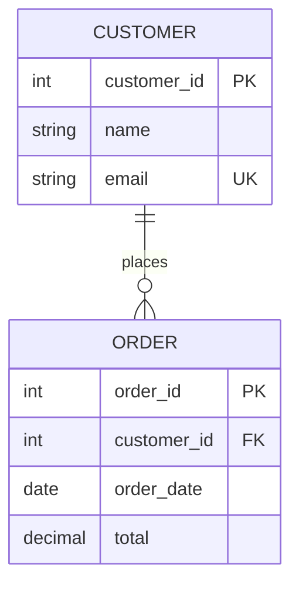

← [Module 02](README.md) | [Course Home](../README.md)

# 2.2 Keys & Constraints

Keys are how tables identify their own rows and reference each other. Constraints
are rules the DBMS enforces automatically so bad data can never sneak in.

## Primary key

A **primary key (PK)** uniquely identifies each row in a table. Rules:

- Must be unique across every row.
- Cannot be `NULL`.
- Should rarely (ideally never) change once assigned.

```sql
CREATE TABLE customers (
    customer_id INTEGER PRIMARY KEY,
    name        TEXT NOT NULL,
    email       TEXT NOT NULL UNIQUE
);
```

**Natural key vs. surrogate key**

| | Natural key | Surrogate key |
|---|---|---|
| What it is | An existing real-world attribute (email, SSN, ISBN) | An artificial ID with no business meaning (auto-incrementing integer, UUID) |
| Pro | No extra column; meaningful | Never needs to change; stable even if business rules change |
| Con | Real-world values change (emails get reassigned!) or aren't truly unique | One more column to manage |

**Recommendation** (used throughout this course): default to a surrogate key
(`id SERIAL PRIMARY KEY` in PostgreSQL, `id INT AUTO_INCREMENT PRIMARY KEY` in
MySQL) even when a natural key exists, and add a `UNIQUE` constraint on the
natural key separately if it truly must be unique. This avoids painful key
migrations later.

## Foreign key

A **foreign key (FK)** is a column (or set of columns) in one table that
references the primary key of another table, enforcing **referential
integrity**: you cannot insert an order for a customer that doesn't exist, and
(by default) you cannot delete a customer who still has orders.

```sql
CREATE TABLE orders (
    order_id    INTEGER PRIMARY KEY,
    customer_id INTEGER NOT NULL REFERENCES customers(customer_id),
    order_date  DATE NOT NULL,
    total       DECIMAL(10,2) NOT NULL CHECK (total >= 0)
);
```



### What happens on delete/update?

When a referenced row is deleted, the DBMS needs instructions for what to do with
the rows that reference it:

| Option | Behavior | Example use |
|---|---|---|
| `RESTRICT` / `NO ACTION` | Block the delete if references exist (default) | Prevent deleting a customer with active orders |
| `CASCADE` | Delete/update the referencing rows too | Deleting a blog post deletes its comments |
| `SET NULL` | Set the FK column to `NULL` | Deleting an employee sets `assigned_to` to NULL on their tasks |
| `SET DEFAULT` | Set the FK column to a default value | Reassign orphaned records to a "default" bucket |

```sql
customer_id INTEGER REFERENCES customers(customer_id) ON DELETE CASCADE
```

Choose deliberately — `CASCADE` is convenient but can silently delete far more
data than you expect. When in doubt, default to `RESTRICT` and delete
dependent rows explicitly.

## Other essential constraints

```sql
CREATE TABLE products (
    product_id  INTEGER PRIMARY KEY,
    sku         TEXT NOT NULL UNIQUE,          -- UNIQUE: no two rows share this value
    name        TEXT NOT NULL,                 -- NOT NULL: this column must have a value
    price       DECIMAL(10,2) NOT NULL
                CHECK (price > 0),             -- CHECK: custom validation rule
    category    TEXT NOT NULL
                DEFAULT 'uncategorized'        -- DEFAULT: value used when none is given
);
```

| Constraint | Enforces |
|---|---|
| `NOT NULL` | Column can never be empty/missing |
| `UNIQUE` | No two rows share this value (unlike PK, multiple `NULL`s are usually allowed) |
| `CHECK` | An arbitrary boolean condition (e.g., `price > 0`, `age >= 18`) |
| `DEFAULT` | Value auto-filled when not explicitly provided |
| `FOREIGN KEY` | Value must exist in a referenced table (or be `NULL`, if the column allows it) |

## Composite keys

A key can span multiple columns when no single column is unique on its own —
common in **junction tables** that model many-to-many relationships:

```sql
CREATE TABLE order_items (
    order_id   INTEGER REFERENCES orders(order_id),
    product_id INTEGER REFERENCES products(product_id),
    quantity   INTEGER NOT NULL CHECK (quantity > 0),
    PRIMARY KEY (order_id, product_id)   -- composite key
);
```

This says: "an order can list a given product at most once" — exactly what a
many-to-many relationship (many orders ↔ many products) needs. We build a full
example of this pattern in
[Module 04, Lesson 2](../04-schema-design/02-case-study-bookstore.md).

## Try it yourself

Take your library schema sketch from the previous lesson. For each table, write
the `CREATE TABLE` statement with:
1. A surrogate primary key.
2. At least one `NOT NULL` and one `CHECK` constraint that makes sense.
3. Correct foreign keys with an explicit `ON DELETE` behavior (justify your choice
   in a comment).

---
← [2.1 Relational Model Basics](01-relational-model-basics.md) | [Module 02](README.md) | Next: [Normalization →](03-normalization.md)
