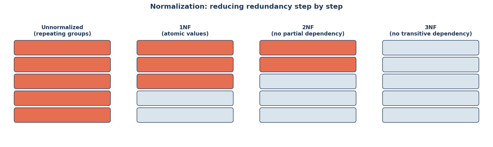
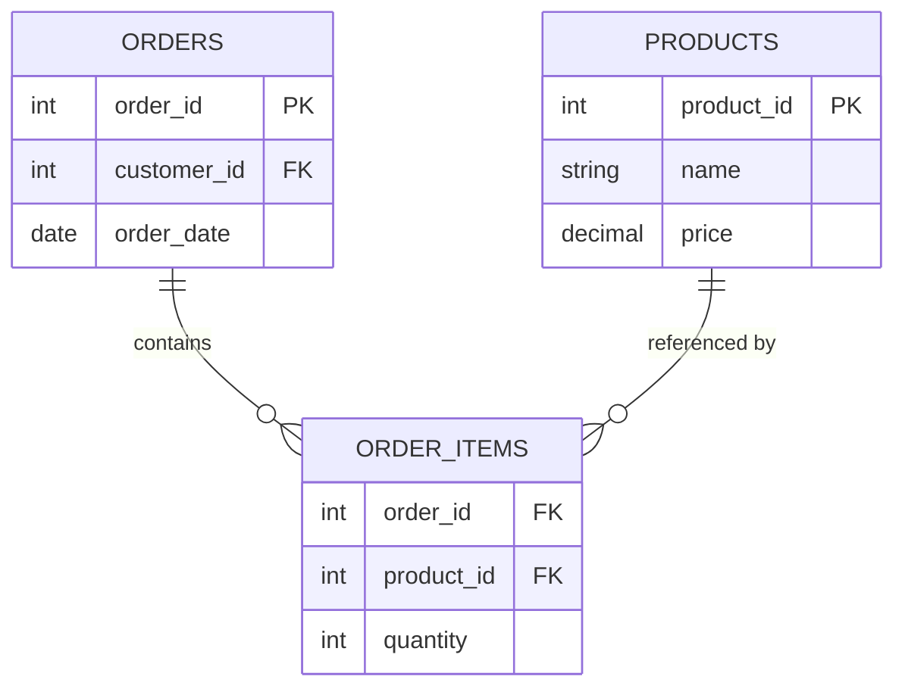
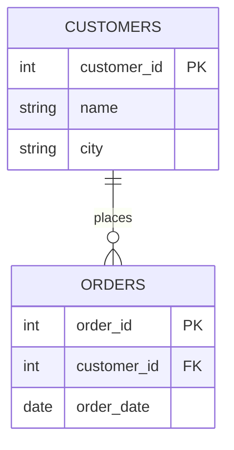

← [Module 02](README.md) | [Course Home](../README.md)

# 2.3 Normalization

Normalization is the process of organizing tables to minimize redundancy and
avoid update anomalies — situations where the same fact is stored in multiple
places and can go out of sync.



## A motivating example: the bad table

```
| order_id | customer_name | customer_email  | product_name | product_price | quantity |
|----------|----------------|-----------------|--------------|---------------|----------|
| 1        | Alice Chen     | alice@mail.com  | Widget       | 9.99          | 3        |
| 2        | Alice Chen     | alice@mail.com  | Gadget       | 19.99         | 1        |
| 3        | Bob Diaz       | bob@mail.com    | Widget       | 9.99          | 2        |
```

Problems with this single, flat table:

- **Update anomaly**: if Alice changes her email, you must update it in every row
  she appears in — miss one, and now her data is inconsistent.
- **Insertion anomaly**: you can't record a new product until someone orders it
  (there's no place to store a product that has zero orders).
- **Deletion anomaly**: if you delete order #3, you lose the fact that
  "Widget costs $9.99" if that was its only remaining row.

Normalization fixes this by splitting data into multiple related tables.

## First Normal Form (1NF)

**Rule**: every column holds atomic (indivisible) values — no comma-separated
lists, no repeating groups.

❌ Violates 1NF:
| order_id | products |
|---|---|
| 1 | "Widget, Gadget, Gizmo" |

✅ Satisfies 1NF (one row per product per order):
| order_id | product |
|---|---|
| 1 | Widget |
| 1 | Gadget |
| 1 | Gizmo |

## Second Normal Form (2NF)

**Rule**: must satisfy 1NF, *and* every non-key column must depend on the
**entire** primary key — not just part of it. This only matters when you have a
**composite** primary key.

❌ Violates 2NF (PK is `order_id + product_id`, but `customer_name` only depends
on `order_id`, and `product_price` only depends on `product_id`):

| order_id | product_id | customer_name | product_price | quantity |
|---|---|---|---|---|

✅ Split into three tables so each column depends on its *whole* key:



## Third Normal Form (3NF)

**Rule**: must satisfy 2NF, *and* no non-key column depends on another
**non-key** column (no "transitive dependencies").

❌ Violates 3NF — `customer_city` depends on `customer_id`, not directly on the
order's own key:

| order_id (PK) | customer_id | customer_city |
|---|---|---|

Here, `customer_city` transitively depends on `order_id` *through*
`customer_id`. If a customer moves, you'd need to update `customer_city` in
every one of their orders.

✅ Fix — move `customer_city` into the `customers` table where it actually
belongs:



**Rule of thumb for 3NF**: every non-key column should depend on "the key, the
whole key, and nothing but the key" — a phrase worth memorizing.

## Beyond 3NF (know these exist)

- **BCNF (Boyce-Codd Normal Form)** — a stricter version of 3NF for edge cases
  with multiple overlapping candidate keys.
- **4NF** — eliminates independent multi-valued facts stored in the same table.

Most real-world schemas stop at 3NF/BCNF — going further usually isn't worth the
extra join complexity for typical applications.

## When to denormalize (on purpose)

Normalization optimizes for **data integrity** and **less redundancy**, at the
cost of needing more **joins** to reconstruct a full picture. Sometimes you
deliberately **denormalize** — duplicate data — to optimize reads:

- A `product_name_snapshot` stored directly on an `order_item` row, so historical
  orders still show the name a product had *at the time of purchase*, even if
  the product is later renamed.
- A cached `total_reviews` count on a `products` row, instead of running
  `COUNT(*)` over the reviews table on every page load.

The rule: **normalize by default, denormalize deliberately, and document why**
whenever you do. We revisit this tradeoff with a real example in
[Module 04, Lesson 3](../04-schema-design/03-antipatterns.md), and its performance
angle in [Module 05](../05-indexing-performance/03-performance-tuning.md).

## Try it yourself

Here's a flat, unnormalized table for a school system:

```
enrollment_id | student_name | student_email | course_name | course_credits | teacher_name | teacher_office
```

1. Identify every update anomaly you can find in this design.
2. Redesign it into 3NF — draw the resulting tables (an ER diagram like the ones
   above is great practice) and identify each table's primary and foreign keys.

---
← [2.2 Keys & Constraints](02-keys-and-constraints.md) | [Module 02](README.md) | Next: [Module 03 — SQL Fundamentals →](../03-sql-fundamentals/)
