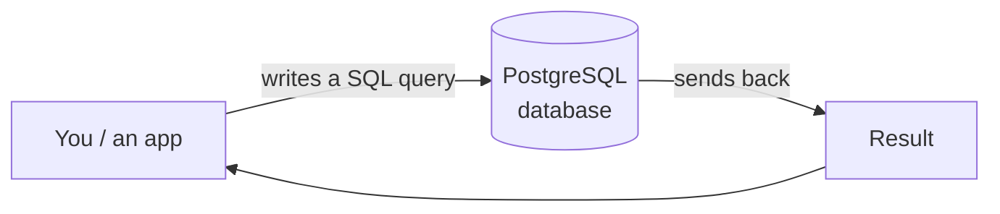

← [1.7 Connecting with a GUI](../01-fundamentals/07-gui-tools.md)

# 2.1 What Is SQL?

Welcome to Part 1 of the course — everything here uses **PostgreSQL**. Before
any definitions, 3 real-world moments where someone actually needs SQL.

## 3 real-world scenarios

**1. A shop owner** wants to know "which products sold over $1,000 last
month?" — that answer is sitting somewhere in their database, but they need
a way to actually ask the question.

**2. A university admin** needs to email every student enrolled in a
specific course — again, the data exists, but pulling out exactly that list
by hand from thousands of records isn't realistic.

**3. A hospital app** needs to update a patient's contact info the moment
they confirm a new phone number — some precise, reliable way to change
exactly that one record, without touching anyone else's.

## What connects all 3

Each scenario needs to *ask* a relational database something, or *tell* it to
change something — precisely, not by scrolling through spreadsheets by hand.
SQL is that shared language. Let's start slow, one step at a time.

## Step 1 — What SQL stands for

**SQL** = **S**tructured **Q**uery **L**anguage. It's not a database itself —
it's the *language* you use to talk to a relational database (from
[Lesson 1.3](../01-fundamentals/03-types-of-databases.md)).

Think of it like this: PostgreSQL is the actual storage system (the "brand,"
from [Lesson 1.4](../01-fundamentals/04-database-brands.md)); SQL is the
language you type to ask it questions or give it data.

## Step 2 — Where SQL fits



You write a SQL statement → the database understands it → the database sends
back an answer. That's the entire loop, every single time.

## Step 3 — The 4 basic things SQL does

Almost everything in SQL boils down to 4 actions, often remembered by the
acronym **CRUD**:

| Action | SQL keyword | Means |
|---|---|---|
| **C**reate | `INSERT` | Add new data |
| **R**ead | `SELECT` | Look up existing data |
| **U**pdate | `UPDATE` | Change existing data |
| **D**elete | `DELETE` | Remove data |

## Step 4 — A tiny real example

Using the shop example from [Lesson 1.1](../01-fundamentals/01-what-is-data.md):

```sql
SELECT name, price FROM products WHERE price < 20;
```

Read this like English: *"Show me the `name` and `price` from `products`,
where `price` is less than 20."* That's really all SQL is — a very structured
way of asking a precise question.

## Step 5 — Why SQL specifically (and not something else)

SQL isn't tied to just PostgreSQL — the same language (with small differences)
also works on MySQL, SQL Server, Oracle, and SQLite, all from
[Lesson 1.4](../01-fundamentals/04-database-brands.md). Learning SQL once
means you can work with almost any relational database, not just one brand.

## Step 6 — Recap

- SQL = the language, PostgreSQL = the database that understands it.
- 4 basic actions: `INSERT`, `SELECT`, `UPDATE`, `DELETE`.
- One skill, usable across almost every relational database brand.

Next, we'll actually get PostgreSQL installed and running so you can type your
first real query.

---
Next: [2.2 Your First Database →](02-your-first-database-apple-example.md)
