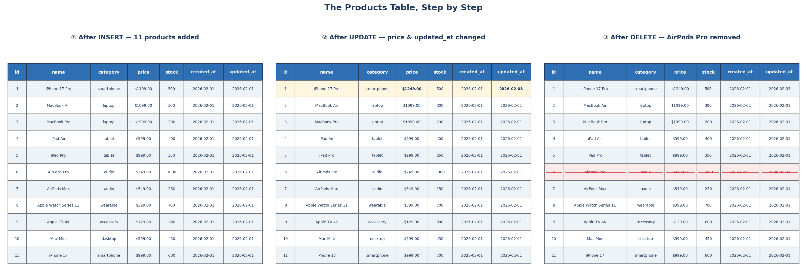

← [2.1 What Is SQL?](01-what-is-sql.md)

# 2.2 Your First Database: Storing Apple's Products

Imagine you're the owner of Apple. You need to store your product catalog —
iPhones, MacBooks, AirPods — somewhere reliable. Let's build that in
PostgreSQL, one command at a time. Every command here can be typed directly
into `psql` (PostgreSQL's command-line tool) or a GUI tool like pgAdmin.


## Step 1 — Create a database

The **database** is the top-level container — think of it as the entire
filing cabinet for Apple's business. Everything else lives inside it.

```sql
CREATE DATABASE apple_store;
```

Then connect to it before doing anything else (in `psql`):

```sql
\c apple_store
```

## Step 2 — Create a table

Inside the database, create a **table** to hold products — one row per
product, with fixed columns for every product:

```sql
CREATE TABLE products (
    product_id  SERIAL PRIMARY KEY,
    name        TEXT NOT NULL,
    category    TEXT NOT NULL,
    price       DECIMAL(10,2) NOT NULL,
    stock       INTEGER NOT NULL DEFAULT 0,
    created_at  TIMESTAMP NOT NULL DEFAULT CURRENT_TIMESTAMP,
    updated_at  TIMESTAMP NOT NULL DEFAULT CURRENT_TIMESTAMP
);
```

- `SERIAL PRIMARY KEY` — an ID that auto-numbers itself (1, 2, 3...) and
  uniquely identifies each product.
- `NOT NULL` — this field can never be left empty.
- `DECIMAL(10,2)` — an exact number with 2 decimal places, correct for money.
- `created_at` — records the exact moment a row was **first added**. The
  `DEFAULT CURRENT_TIMESTAMP` means PostgreSQL fills this in automatically —
  you never type it yourself.
- `updated_at` — meant to record the moment a row was **last changed**. It
  also defaults to the current time on insert, but — important — a `DEFAULT`
  only fires once, when the row is *created*. It does **not** update itself
  automatically every time you run `UPDATE`. You have to set it yourself in
  every `UPDATE` statement, which Step 6 shows below.

## Step 3 — Insert data

### 3a. Insert a single row first

Start with just one product, so it's clear what a single `INSERT` looks like:

```sql
INSERT INTO products (name, category, price, stock)
VALUES ('iPhone 17 Pro', 'smartphone', 1199.00, 500);
```

Notice `created_at` and `updated_at` aren't listed here at all — their
`DEFAULT CURRENT_TIMESTAMP` fills them in automatically the moment this row is
created.

Also notice `category` is lowercase (`'smartphone'`, not `'Smartphone'`). SQL
text comparisons are case-sensitive by default, so `'Laptop'` and `'laptop'`
count as two different values — picking one consistent casing convention (all
lowercase is the common choice) avoids `WHERE category = 'laptop'` silently
missing rows stored as `'Laptop'`.

### 3b. Insert multiple rows at once

Once you're comfortable with one row, you can add many in a single statement —
just add more comma-separated groups. Let's add the rest of Apple's lineup, 10
products at once:

```sql
INSERT INTO products (name, category, price, stock) VALUES
    ('MacBook Air',           'laptop',      1099.00, 300),
    ('MacBook Pro',           'laptop',      1999.00, 200),
    ('iPad Air',              'tablet',       599.00, 400),
    ('iPad Pro',              'tablet',       999.00, 350),
    ('AirPods Pro',           'audio',        249.00, 1000),
    ('AirPods Max',           'audio',        549.00, 250),
    ('Apple Watch Series 11', 'wearable',     399.00, 700),
    ('Apple TV 4K',           'accessory',    129.00, 800),
    ('Mac Mini',              'desktop',      599.00, 450),
    ('iPhone 17',             'smartphone',   999.00, 600);
```

One `INSERT` statement, ten new rows — this is far faster than writing ten
separate `INSERT` statements, and it's the pattern you'll use for adding real
data in bulk. Your `products` table now holds 11 rows in total (the 1 from
step 3a + these 10).

## Step 4 — Retrieve data

Now ask questions of your data:

```sql
-- Every product
SELECT * FROM products;

-- Just the laptops (now returns 2 rows: MacBook Air, MacBook Pro)
SELECT name, price FROM products WHERE category = 'laptop';

-- Anything under $300 (returns AirPods Pro and Apple TV 4K)
SELECT name, price FROM products WHERE price < 300;

-- Cheapest to most expensive
SELECT name, price FROM products ORDER BY price ASC;
```

## Step 5 — Delete data

### 5a. Delete a single row

Say `AirPods Pro` is discontinued. You can delete it two ways:

```sql
-- Option A: filter by id (recommended)
DELETE FROM products WHERE product_id = 6;

-- Option B: filter by name
DELETE FROM products WHERE name = 'AirPods Pro';
```

Both remove the exact same row here — but they're not equally safe:

| | Filter by `product_id` | Filter by `name` |
|---|---|---|
| Uniqueness | Guaranteed unique (it's the primary key) | Not guaranteed — two products *could* share a name |
| Stability | Never changes | Could be renamed later, silently breaking old code that filtered by the old name |
| Readability | Needs a lookup to know *which* product `6` is | Immediately readable |

**Rule of thumb**: once you know a row's ID (e.g., you just looked it up, or
your application already has it), filter by `product_id`. Filter by `name`
only for a quick, one-off lookup where you don't have the ID handy.

⚠️ Always double-check your `WHERE` clause. `DELETE FROM products;` with no
`WHERE` deletes **every product** — always run the matching `SELECT` first to
preview what you're about to delete:

```sql
SELECT * FROM products WHERE product_id = 6;   -- confirm this is really AirPods Pro
```

### 5b. Delete multiple rows at once

Now say Apple discontinues two products in the same announcement: `Apple
Watch Series 11` (`product_id = 8`) and `Apple TV 4K` (`product_id = 9`). You
don't need two separate `DELETE` statements — `IN` matches any value in a list:

```sql
DELETE FROM products WHERE product_id IN (8, 9);
```

`IN (8, 9)` reads as *"where `product_id` is 8 **or** 9"* — one statement,
both rows gone at once. `IN` works just as well on text columns. If you'd
rather target them by category instead of by ID:

```sql
DELETE FROM products WHERE category IN ('wearable', 'accessory');
```

Same result here, since each of those categories currently has exactly one
product — but this version would delete **every** row in either category, so
it's only safe when you're intentionally clearing a whole category, not just
these two specific products.

## Step 6 — Update data

### 6a. Update a single row

The iPhone 17 Pro just got a price increase — again, two ways to target it:

```sql
-- Option A: filter by id (recommended)
UPDATE products
SET price = 1249.00, updated_at = CURRENT_TIMESTAMP
WHERE product_id = 1;

-- Option B: filter by name
UPDATE products
SET price = 1249.00, updated_at = CURRENT_TIMESTAMP
WHERE name = 'iPhone 17 Pro';
```

Notice `updated_at` is set explicitly, right alongside `price`, in **both**
options — as explained in Step 2, PostgreSQL won't touch it on its own.
Forgetting this line is a common real bug: the price changes, but `updated_at`
silently stays stale.

Same rule of thumb as Step 5 applies: prefer `product_id` once you have it,
since it's guaranteed unique and never changes; `name` is fine for a quick
lookup. Same `WHERE` warning too — no `WHERE` means every row gets updated.

### 6b. Update multiple rows at once

Now say Apple runs a 10% discount across the entire laptop lineup —
`MacBook Air` (`product_id = 2`) and `MacBook Pro` (`product_id = 3`) — in one
statement:

```sql
UPDATE products
SET price = price * 0.9, updated_at = CURRENT_TIMESTAMP
WHERE category = 'laptop';
```

Two things worth noticing:
- `WHERE category = 'laptop'` matches **every** row in that category (2 rows
  here) — the update applies to all of them in a single statement.
- `price = price * 0.9` reads each row's *own* current price and discounts it
  by 10% — it's not one fixed number applied to every row, so MacBook Air and
  MacBook Pro each get a different new price, computed from what they already
  cost.

You can also target multiple rows by ID, the same way Step 5b did:

```sql
UPDATE products
SET price = price * 0.9, updated_at = CURRENT_TIMESTAMP
WHERE product_id IN (2, 3);
```

Same result — pick `category`/other columns when you mean "everything matching
this description," and `IN (...)` on `product_id` when you mean "these
specific, already-known rows."

## Watch the table change at each stage



## Step 7 — Recap

| Step | Command | What it did |
|---|---|---|
| 1 | `CREATE DATABASE` | Made the container for everything |
| 2 | `CREATE TABLE` | Defined the shape of a product record |
| 3 | `INSERT INTO` | Added 11 real products (1 single, then 10 in bulk) |
| 4 | `SELECT` | Asked questions about the data |
| 5 | `DELETE` | Removed a discontinued product, then two more at once with `IN` |
| 6 | `UPDATE` | Changed one product's price, then a whole category's at once |

That's the complete lifecycle of data in SQL — and every database you'll ever
build starts with exactly these same 6 steps.

---
← [2.1 What Is SQL?](01-what-is-sql.md)
