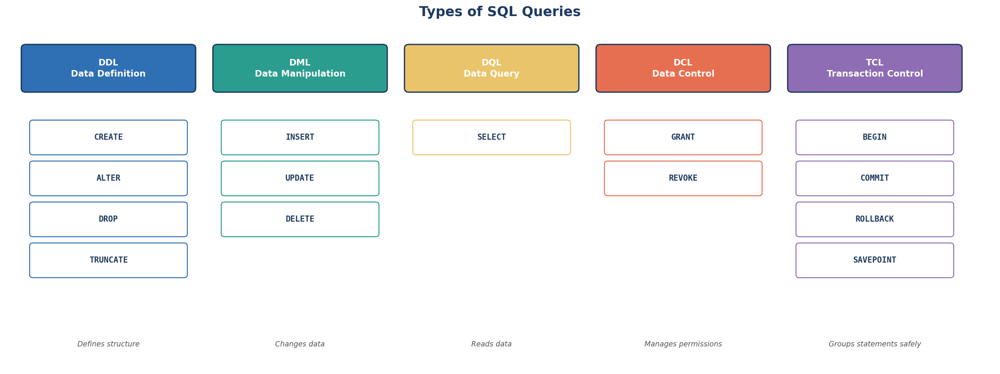

← [2.2 Your First Database](02-your-first-database-apple-example.md)

# 2.3 Types of SQL Queries

You've already used `CREATE`, `INSERT`, `SELECT`, `UPDATE`, and `DELETE` in
[Lesson 2.2](02-your-first-database-apple-example.md). Before the names,
3 real-world situations that need very different *kinds* of commands.

## 3 real-world scenarios

**1. A bank** sets up a new `accounts` table once when the system launches,
then processes thousands of deposits and withdrawals every single day — two
completely different jobs: defining the table's shape, versus changing the
data inside it.

**2. A hospital IT admin** grants a new nurse permission to *read* patient
records, but not to *delete* them — a job about controlling who can do what,
separate from the data itself.

**3. An airline booking system** must reserve a seat, charge a card, and
confirm the booking as one all-or-nothing unit — if the payment fails, the
seat reservation must undo itself too, not stay half-completed.

## Why categorize commands at all

Each scenario above needed a different *kind* of command: shaping a table's
structure, changing its data, controlling access, or grouping several steps
safely. Knowing a command's category tells you immediately what it's capable
of — e.g., "this is DDL" instantly tells you it changes structure, not data.
SQL groups every command into 5 such categories. Let's go through them one at
a time.

## Step 1 — DDL: Data Definition Language

Defines and changes the **structure** — tables, columns, constraints. You've
already used this in [Lesson 2.2](02-your-first-database-apple-example.md):

| Command | Does |
|---|---|
| `CREATE` | Make a new database, table, etc. |
| `ALTER` | Change an existing table's structure |
| `DROP` | Permanently delete a table (structure *and* data) |
| `TRUNCATE` | Empty all rows from a table, keep the structure |

```sql
CREATE TABLE products (...);   -- from Lesson 2.2, Step 2
```

## Step 2 — DML: Data Manipulation Language

Changes the **data itself**, not the structure. Also from Lesson 2.2:

| Command | Does |
|---|---|
| `INSERT` | Add new rows |
| `UPDATE` | Change existing rows |
| `DELETE` | Remove rows |

```sql
INSERT INTO products (...) VALUES (...);   -- from Lesson 2.2, Step 3
```

## Step 3 — DQL: Data Query Language

Just **reads** data — never changes anything. Technically just one command:

| Command | Does |
|---|---|
| `SELECT` | Read/retrieve rows |

```sql
SELECT * FROM products;   -- from Lesson 2.2, Step 4
```

> Some textbooks group `SELECT` under DML instead of giving it its own
> category. Both are fine — the useful distinction to remember is simply:
> DML *writes*, DQL only *reads*.

## Step 4 — DCL: Data Control Language

Controls **who is allowed** to do what — permissions, not data:

| Command | Does |
|---|---|
| `GRANT` | Give a user permission to do something |
| `REVOKE` | Take a permission away |

```sql
GRANT SELECT ON products TO analyst_role;
REVOKE DELETE ON products FROM analyst_role;
```

## Step 5 — TCL: Transaction Control Language

Groups multiple statements so they succeed or fail **together** — you saw a
preview of this idea in [Lesson 2.2](02-your-first-database-apple-example.md)'s
warnings about `WHERE` clauses:

| Command | Does |
|---|---|
| `BEGIN` | Start a group of statements (a transaction) |
| `COMMIT` | Make the whole group permanent |
| `ROLLBACK` | Undo the whole group |
| `SAVEPOINT` | Mark a point inside a transaction you can roll back to |

```sql
BEGIN;
UPDATE products SET stock = stock - 1 WHERE product_id = 1;
INSERT INTO orders (...) VALUES (...);
COMMIT;   -- or ROLLBACK to undo both statements above
```

## Step 6 — See all five together



## Step 7 — Recap table

| Category | Stands for | Example commands | Affects |
|---|---|---|---|
| DDL | Data Definition Language | `CREATE`, `ALTER`, `DROP`, `TRUNCATE` | Structure |
| DML | Data Manipulation Language | `INSERT`, `UPDATE`, `DELETE` | Data (writing) |
| DQL | Data Query Language | `SELECT` | Data (reading) |
| DCL | Data Control Language | `GRANT`, `REVOKE` | Permissions |
| TCL | Transaction Control Language | `BEGIN`, `COMMIT`, `ROLLBACK` | Safety/grouping |

Every SQL command you'll ever run fits into one of these five buckets — a
useful mental checklist any time you're not sure what a new command actually
does.

---
← [2.2 Your First Database](02-your-first-database-apple-example.md) | Next: [2.4 Data Types in PostgreSQL →](04-postgresql-data-types.md)
