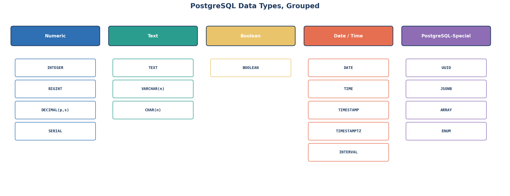

← [2.3 Types of SQL Queries](03-types-of-sql-queries.md)

# 2.4 Data Types in PostgreSQL

Every column you create needs a **data type**. Before the list, 3 real-world
situations where the *wrong* type causes a real problem.

## 3 real-world scenarios

**1. An online store's checkout** must never let `price` hold the text
`"free"` or `"TBD"` — if the column allows any value at all, a bug or bad
import can silently corrupt every total and report built on top of it.

**2. A hospital's patient record** must never let `date_of_birth` hold
something like `"a long time ago"` — age calculations, appointment
scheduling, and legal record-keeping all depend on it being a real,
comparable date.

**3. A social media profile's** `is_verified` badge is just true or false —
storing it as free text (`"yes"`, `"Yes"`, `"verified"`, `"1"`) means every
single query checking it has to account for every spelling anyone ever used.

## What a data type actually controls

Each scenario above is really the same failure: a column that *should* only
hold one specific kind of value was allowed to hold anything. A data type is
how you prevent that — you've already picked a few without much explanation
in [Lesson 2.2](02-your-first-database-apple-example.md) (`TEXT`,
`DECIMAL(10,2)`, `INTEGER`, `TIMESTAMP`). A column's type controls 3 things
at once:
1. **What values are allowed** — a `BOOLEAN` column can only ever hold
   true/false; it will reject the text `"maybe"`.
2. **How it's stored** — an `INTEGER` takes a fixed 4 bytes; a `TEXT` value's
   size depends on its length.
3. **What operations make sense** — you can do math on `DECIMAL`, but not on
   `TEXT`; you can compare `DATE`s chronologically, but not two arbitrary
   pieces of text that way.

## Step 1 — PostgreSQL's data types, grouped



### Numeric

| Type | Use for | Example value |
|---|---|---|
| `INTEGER` | Whole numbers, everyday range (stock counts, ages) | `500` |
| `BIGINT` | Whole numbers, very large range | `9007199254740992` |
| `DECIMAL(p,s)` / `NUMERIC(p,s)` | Exact decimal numbers — **always use for money** | `1199.00` |
| `SERIAL` | Auto-incrementing integer — what we used for `product_id` | `1`, `2`, `3`... (assigned automatically) |

#### Deep dive: `DECIMAL` / `NUMERIC`, explained properly

`DECIMAL` and `NUMERIC` are **exactly the same type in PostgreSQL** — just two
names for one thing. Both take two numbers in parentheses: `DECIMAL(p, s)`.

- **`p` = precision** — the *total* number of significant digits stored, on
  both sides of the decimal point combined.
- **`s` = scale** — how many of those digits sit *after* the decimal point.

So `DECIMAL(10, 2)` (what we used for `price`) means: 10 digits total, 2 of
them after the decimal point — leaving 8 digits before it. That's a maximum
value of `99999999.99`, far more than any real product will ever cost.

**More examples, worked out:**

| Declared as | Digits before decimal | Digits after decimal | Max value | Example stored value |
|---|---|---|---|---|
| `DECIMAL(5,2)` | 3 | 2 | `999.99` | `249.00` (AirPods Pro's price) |
| `DECIMAL(4,0)` | 4 | 0 | `9999` | `500` (a whole number, no cents at all) |
| `DECIMAL(6,3)` | 3 | 3 | `999.999` | `12.345` (extra decimal precision, e.g. a measurement) |
| `DECIMAL(10,2)` | 8 | 2 | `99999999.99` | `1199.00` (our `products.price` column) |

**What happens with "too many" digits?** PostgreSQL treats the two sides
differently:

```sql
CREATE TABLE test_pricing (amount DECIMAL(5,2));

INSERT INTO test_pricing VALUES (12.345);
-- Stored as 12.35 — PostgreSQL ROUNDS extra decimal digits to fit the scale

INSERT INTO test_pricing VALUES (1234.56);
-- ERROR: numeric field overflow
-- 1234 has 4 digits before the decimal, but DECIMAL(5,2) only allows 3 (5 - 2 = 3)
```

- Too many digits **after** the decimal point → silently **rounded** to fit.
- Too many digits **before** the decimal point → **rejected outright** with an
  error, since there's no safe way to "round" away a whole digit of magnitude.

**Why not just use `FLOAT`/`REAL` instead?** Floating-point numbers store
values in binary, and most decimal fractions (like `0.10`) can't be
represented *exactly* in binary — only approximated. This is a famous, very
real gotcha:

```sql
SELECT 0.1::float + 0.2::float;
-- Returns 0.30000000000000004, NOT exactly 0.3

SELECT 0.1::decimal + 0.2::decimal;
-- Returns exactly 0.3
```

For a single price this rounding error looks harmless — but multiply it
across millions of transactions (every order, every line item, every
discount calculation) and those tiny errors accumulate into real,
un-reconcilable accounting mismatches. This is exactly why
[Lesson 2.2](02-your-first-database-apple-example.md) declared
`price DECIMAL(10,2)` and not `price FLOAT` — this single type choice is one
of the most important habits to carry into every real schema you design.

### Text

| Type | Use for | Example value |
|---|---|---|
| `TEXT` | Any length of text, no limit — the simplest default choice | `'iPhone 17 Pro'` |
| `VARCHAR(n)` | Text capped at `n` characters | `VARCHAR(20)` → `'smartphone'` |
| `CHAR(n)` | Fixed-length text, padded with spaces — rarely needed today | `CHAR(2)` → `'US'` |

### Boolean

| Type | Use for | Example value |
|---|---|---|
| `BOOLEAN` | `TRUE` / `FALSE` values only | `TRUE` (e.g., `in_stock`) |

### Date / Time

| Type | Use for | Example value |
|---|---|---|
| `DATE` | A calendar date only, no time (e.g., a birthday) | `'2026-02-01'` |
| `TIME` | A time only, no date | `'14:30:00'` |
| `TIMESTAMP` | Date + time together — what we used for `created_at`/`updated_at` | `'2026-02-01 14:30:00'` |
| `TIMESTAMPTZ` | Date + time, timezone-aware — usually the *safer* real-world choice | `'2026-02-01 14:30:00+07'` |
| `INTERVAL` | A span of time (e.g., "3 days", "2 hours") | `INTERVAL '3 days'` |

### PostgreSQL-Special

| Type | Use for | Example value |
|---|---|---|
| `UUID` | A globally unique ID, not just unique within one table | `'a1b2c3d4-1234-5678-9abc-def012345678'` |
| `JSONB` | Structured, flexible data stored inside a relational column (bridges to [Module 07 NoSQL concepts](../01-fundamentals/03-types-of-databases.md)) | `'{"color": "black", "storage_gb": 256}'` |
| `ARRAY` | A list of values in a single column | `ARRAY['red', 'blue', 'green']` |
| `ENUM` | A fixed, named set of allowed values (e.g., `'small', 'medium', 'large'`) | `'medium'` (from a `size_enum` type) |

## Step 2 — Back to our products table

```sql
CREATE TABLE products (
    product_id  SERIAL PRIMARY KEY,        -- Numeric
    name        TEXT NOT NULL,             -- Text
    category    TEXT NOT NULL,             -- Text
    price       DECIMAL(10,2) NOT NULL,    -- Numeric (exact, for money)
    stock       INTEGER NOT NULL DEFAULT 0,-- Numeric
    created_at  TIMESTAMP NOT NULL DEFAULT CURRENT_TIMESTAMP,  -- Date/Time
    updated_at  TIMESTAMP NOT NULL DEFAULT CURRENT_TIMESTAMP   -- Date/Time
);
```

Every single column from Lesson 2.2 maps cleanly onto one of the 5 groups
above.

## Step 3 — Important reminder: types differ by database engine

Back in [Lesson 2.1](01-what-is-sql.md), we said SQL "transfers" across
PostgreSQL, MySQL, SQL Server, and Oracle. That's true for the *core language*
— but **exact data type names are not identical** across engines. The same
concept often has a different name:

| Concept | PostgreSQL | MySQL | SQL Server | Oracle |
|---|---|---|---|---|
| Auto-incrementing ID | `SERIAL` | `AUTO_INCREMENT` | `IDENTITY` | `sequence` + trigger |
| Arbitrary-length text | `TEXT` | `TEXT` | `VARCHAR(MAX)` | `CLOB` |
| True/false | `BOOLEAN` | `TINYINT(1)` | `BIT` | `NUMBER(1)` |
| Date + time | `TIMESTAMP` | `DATETIME` | `DATETIME2` | `TIMESTAMP` |
| Exact decimal | `DECIMAL(p,s)` | `DECIMAL(p,s)` | `DECIMAL(p,s)` | `NUMBER(p,s)` |

**Why this matters**: if you write `CREATE TABLE` code for PostgreSQL and try
to run it unchanged on MySQL or SQL Server, it can fail or silently behave
differently — `BOOLEAN` isn't real in MySQL the way it is in PostgreSQL, for
example (MySQL treats it as `TINYINT(1)` under the hood). The *skill* of
writing SQL transfers easily; the *exact syntax*, especially around data
types, needs a quick check whenever you switch engines.

## Step 4 — Recap

- A data type controls what's allowed, how it's stored, and what operations work.
- PostgreSQL groups types into: Numeric, Text, Boolean, Date/Time, and
  PostgreSQL-Special (`JSONB`, `UUID`, `ARRAY`, `ENUM`).
- The same concept can have a different name on a different engine — always
  check the specific engine's docs when switching.

---
← [2.3 Types of SQL Queries](03-types-of-sql-queries.md) | Next: [2.5 Operators →](05-operators.md)
