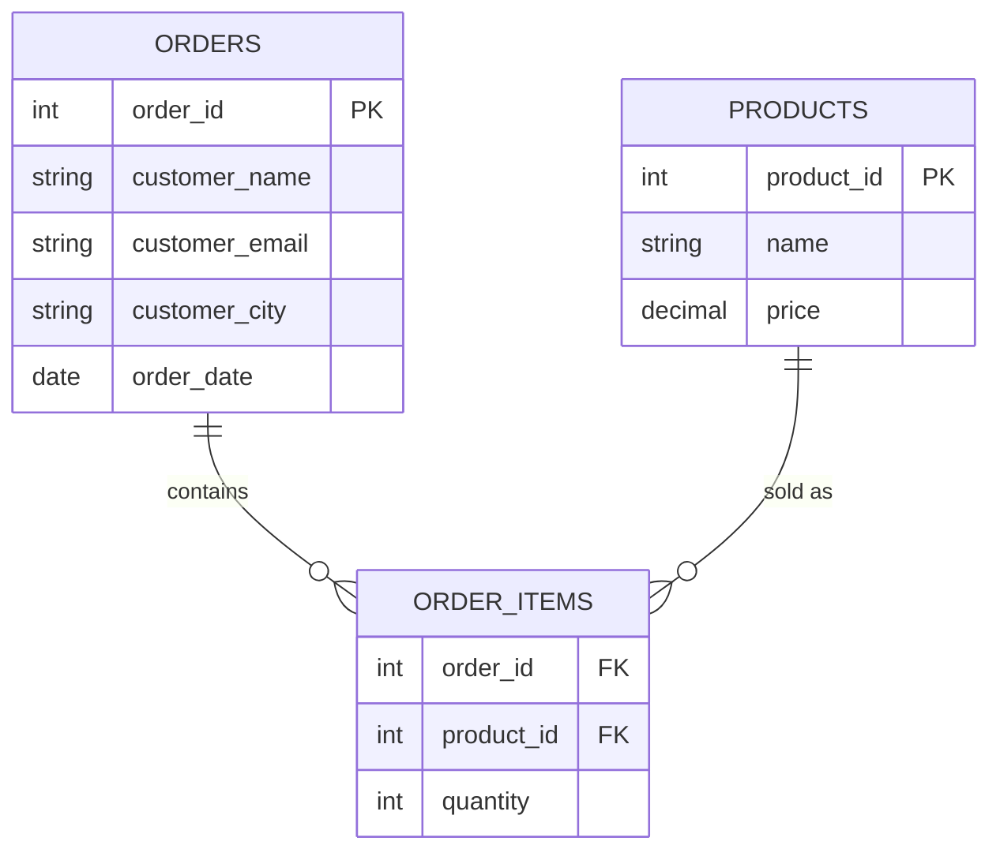
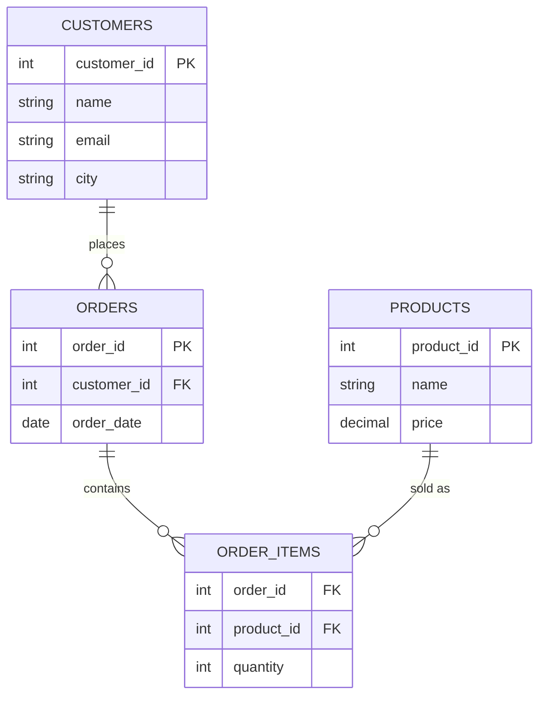

← [2.8 Group](08-group.md)

# 2.9 Normalization

Everything so far has lived in one table: `products`. Real systems need more.
Before any `CREATE TABLE`, 3 real-world situations where a single flat table
breaks down.

## 3 real-world scenarios

**1. A shop's** flat order spreadsheet repeats a customer's name and email on
every single line item they've ever ordered — change that customer's email,
and you must find and update every one of those repeated rows.

**2. A hospital's** flat patient chart repeats each doctor's phone number and
office number on every visit record — if a doctor changes offices, that
detail needs updating in hundreds of old visit rows, not just one place.

**3. A university's** flat enrollment sheet repeats a course's credit-hours
and department on every single student row enrolled in it — a course
correction (say, going from 3 to 4 credit hours) means hunting down and
fixing every student's row for that course.

## Why this breaks down

All 3 scenarios share one root cause: the same fact (a customer's email, a
doctor's office, a course's credit hours) is copied across many rows instead
of living in exactly one place. **Normalization** is the process of
restructuring tables to fix exactly this. Let's work through scenario 1 — the
shop — in full detail.

## Step 1 — Start with one flat, "obvious" table

Imagine tracking Apple Store orders the simplest possible way — one row per
purchased item, everything in a single table:

| order_id | customer_name | customer_email | customer_city | product_name | product_price | quantity | order_date |
|---|---|---|---|---|---|---|---|
| 1 | Alice Chen | alice@mail.com | New York | iPhone 17 Pro | 1249.00 | 1 | 2026-03-01 |
| 1 | Alice Chen | alice@mail.com | New York | AirPods Max | 549.00 | 1 | 2026-03-01 |
| 2 | Bob Diaz | bob@mail.com | Los Angeles | MacBook Air | 989.10 | 1 | 2026-03-02 |
| 3 | Alice Chen | alice@mail.com | New York | iPad Pro | 999.00 | 1 | 2026-03-05 |
| 3 | Alice Chen | alice@mail.com | New York | Mac Mini | 599.00 | 1 | 2026-03-05 |

Looks reasonable — but Alice's name, email, and city are repeated **4 times**.
That repetition is about to cause real problems.

## Step 2 — The 3 anomalies this causes

1. **Update anomaly** — Alice changes her email. You now must update it in
   4 different rows. Miss even one, and her record is inconsistent — some
   rows say her new email, one still says the old one.
2. **Insertion anomaly** — Carla wants an account, but hasn't ordered
   anything yet. There's no row to put her in — this table only has room for
   customers *with* an order.
3. **Deletion anomaly** — Delete order 2 (Bob's only order), and every
   trace of Bob as a customer — and of MacBook Air's price, in this flat
   design — disappears with it.

Normalization is the process of restructuring tables specifically to
eliminate these three problems.

## Step 3 — First Normal Form (1NF): atomic values only

**Rule**: every column holds one indivisible value — no comma-separated lists.

```
❌ Violates 1NF:
| order_id | customer_name | products                        |
|----------|----------------|---------------------------------|
| 1        | Alice Chen     | iPhone 17 Pro, AirPods Max       |
```

```
✅ Satisfies 1NF — one row per product (this is the table from Step 1):
| order_id | customer_name | product_name   |
|----------|----------------|----------------|
| 1        | Alice Chen     | iPhone 17 Pro  |
| 1        | Alice Chen     | AirPods Max    |
```

Our Step 1 table already satisfies 1NF — no repeating groups. The redundancy
problem is still there, though — 1NF alone doesn't fix anomalies 1–3. That
takes the next two forms.

## Step 4 — Second Normal Form (2NF): no partial dependency

This rule only matters when a table's key is **composite** (more than one
column). Here, a line item is really identified by `(order_id, product_name)`
together. Ask: *does every other column depend on the **whole** key, or just
part of it?*

- `customer_name`, `customer_email`, `customer_city`, `order_date` depend only
  on `order_id` — not on `product_name` at all. **Partial dependency.**
- `product_price` depends only on `product_name` — not on `order_id` at all.
  **Partial dependency.**

**Fix**: pull each partially-dependent group into its own table, keyed by
just the part of the key it actually depends on:



`product_price` now lives once, on `products` (which we already built in
[Lesson 2.2](02-your-first-database-apple-example.md)) — not copied onto
every line item.

## Step 5 — Third Normal Form (3NF): no transitive dependency

Look at `orders` from Step 4: `customer_name`, `customer_email`, and
`customer_city` all still depend on **which customer** placed the order —
not directly on `order_id` itself. This is a **transitive dependency**:
`order_id → customer_id → customer_name/email/city`. If Alice places a 4th
order, her name/email/city get copied in yet again.

**Fix**: pull customer details into their own table too, and reference it by
ID:



**Rule of thumb for 3NF, worth memorizing**: every non-key column should
depend on *"the key, the whole key, and nothing but the key."*

## Step 6 — Checking our anomalies are actually gone

- **Update anomaly** ✅ fixed — Alice's email lives in exactly one row, in
  `customers`. Change it once.
- **Insertion anomaly** ✅ fixed — Carla can be added to `customers` with zero
  rows in `orders` at all.
- **Deletion anomaly** ✅ fixed — deleting an order from `orders` doesn't
  touch `customers` or `products`; each fact lives in exactly one place.

## Step 7 — Recap

| Form | Rule | Fixes |
|---|---|---|
| 1NF | Every column is atomic — no comma-separated lists | Repeating groups |
| 2NF | Every column depends on the *whole* key, not part of it | Partial dependency |
| 3NF | Every column depends *only* on the key, not on another non-key column | Transitive dependency |

We now have 4 tables instead of 1: `customers`, `orders`, `order_items`, and
the `products` table we already built. [Lesson 2.10](10-relationships-and-foreign-keys.md)
turns this ER diagram into real `CREATE TABLE` statements with foreign keys.

---
← [2.8 Group](08-group.md) | Next: [2.10 Relationships & Foreign Keys →](10-relationships-and-foreign-keys.md)
