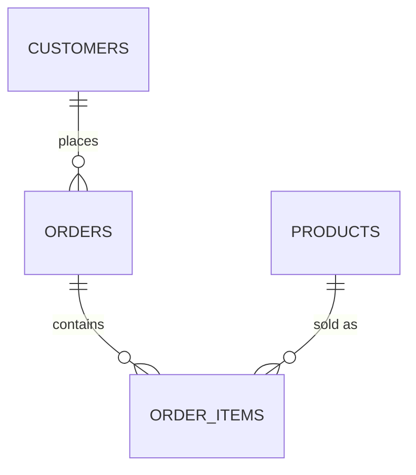

← [2.9 Normalization](09-normalization.md)

# 2.10 Relationships & Foreign Keys

[Lesson 2.9](09-normalization.md) ended with an ER diagram: `customers`,
`orders`, `order_items`, and `products`. Let's turn that into real,
running SQL.

## Step 1 — One-to-many: `customers` → `orders`

One customer can place **many** orders; each order belongs to exactly **one**
customer. The foreign key always goes on the "many" side:

```sql
CREATE TABLE customers (
    customer_id SERIAL PRIMARY KEY,
    name        TEXT NOT NULL,
    email       TEXT NOT NULL UNIQUE,
    city        TEXT
);

CREATE TABLE orders (
    order_id    SERIAL PRIMARY KEY,
    customer_id INTEGER NOT NULL REFERENCES customers(customer_id),
    order_date  DATE NOT NULL DEFAULT CURRENT_DATE
);
```

`customer_id INTEGER NOT NULL REFERENCES customers(customer_id)` is the
**foreign key** — every value in `orders.customer_id` must already exist as a
`customer_id` in `customers`.

## Step 2 — Many-to-many: `orders` ↔ `products`

One order can contain **many** products; one product can appear in **many**
orders. Neither table can hold a simple foreign key to the other — you need a
**junction table** in between, with foreign keys to *both* sides:

```sql
CREATE TABLE order_items (
    order_id    INTEGER NOT NULL REFERENCES orders(order_id),
    product_id  INTEGER NOT NULL REFERENCES products(product_id),
    quantity    INTEGER NOT NULL CHECK (quantity > 0),
    unit_price  DECIMAL(10,2) NOT NULL,
    PRIMARY KEY (order_id, product_id)
);
```

`unit_price` is deliberately duplicated here from `products.price` — this is
the same "price at time of purchase" pattern flagged as a *deliberate*
exception back in [Lesson 2.9](09-normalization.md)'s normalization rules:
`products.price` can change later, but a past order must always show what was
actually paid at the time.

## Step 3 — The full picture



## Step 4 — Insert our sample data

```sql
INSERT INTO customers (name, email, city) VALUES
    ('Alice Chen', 'alice@mail.com', 'New York'),
    ('Bob Diaz',   'bob@mail.com',   'Los Angeles'),
    ('Carla Ruiz', 'carla@mail.com', 'Chicago');
```
Auto-assigned IDs: Alice = 1, Bob = 2, Carla = 3. Notice **Carla has no
orders at all** — exactly the insertion-anomaly fix from Lesson 2.9.

```sql
INSERT INTO orders (customer_id, order_date) VALUES
    (1, '2026-03-01'),   -- Alice's 1st order
    (2, '2026-03-02'),   -- Bob's order
    (1, '2026-03-05');   -- Alice's 2nd order
```
Auto-assigned IDs: order 1 and order 3 belong to Alice; order 2 belongs to Bob.

```sql
INSERT INTO order_items (order_id, product_id, quantity, unit_price) VALUES
    (1, 1,  1, 1249.00),  -- order 1: iPhone 17 Pro
    (1, 7,  1, 549.00),   -- order 1: AirPods Max
    (2, 2,  1, 989.10),   -- order 2: MacBook Air
    (3, 5,  1, 999.00),   -- order 3: iPad Pro
    (3, 10, 1, 599.00);   -- order 3: Mac Mini
```

This is exactly the data from [Lesson 2.9](09-normalization.md)'s flat table
— just correctly split across 3 tables now instead of repeated in 1.

## Step 5 — Referential integrity in action

```sql
-- Try to insert an order for a customer that doesn't exist
INSERT INTO orders (customer_id, order_date) VALUES (99, '2026-03-10');
-- ERROR: insert or update on table "orders" violates foreign key constraint
-- Key (customer_id)=(99) is not present in table "customers".
```

PostgreSQL refuses — this is exactly the guarantee a foreign key exists to
give you: it's now **impossible** to create an order for a customer who
isn't real, no matter what a bug in your application code tries to do.

```sql
-- Try to delete a customer who still has orders
DELETE FROM customers WHERE customer_id = 1;
-- ERROR: update or delete on table "customers" violates foreign key constraint
-- Key (customer_id)=(1) is still referenced from table "orders".
```

By default, PostgreSQL also refuses to delete a row that's still referenced
elsewhere — this default behavior is called `ON DELETE RESTRICT`.

## Step 6 — Choosing what happens on delete

```sql
-- Alternative: automatically delete a customer's orders too
customer_id INTEGER NOT NULL REFERENCES customers(customer_id) ON DELETE CASCADE

-- Alternative: keep the order, but blank out which customer it belonged to
customer_id INTEGER REFERENCES customers(customer_id) ON DELETE SET NULL
```

| Option | Behavior |
|---|---|
| `RESTRICT` (default) | Blocks the delete while references exist |
| `CASCADE` | Deletes the referencing rows too |
| `SET NULL` | Sets the foreign key column to `NULL` |

**Recommendation**: default to `RESTRICT` and delete dependent rows on
purpose, explicitly. `CASCADE` is convenient but can silently delete far more
data than you intended.

## Step 7 — Recap

| Relationship | Cardinality | How it's modeled |
|---|---|---|
| `customers` → `orders` | One-to-many | Foreign key on the "many" side (`orders.customer_id`) |
| `orders` ↔ `products` | Many-to-many | Junction table with foreign keys to both (`order_items`) |

Our schema is now 4 tables, correctly related. [Lesson 2.11](11-joins.md)
shows how to query across all of them at once.

---
← [2.9 Normalization](09-normalization.md) | Next: [2.11 Joins →](11-joins.md)
