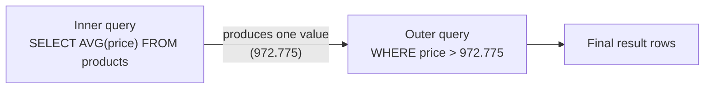
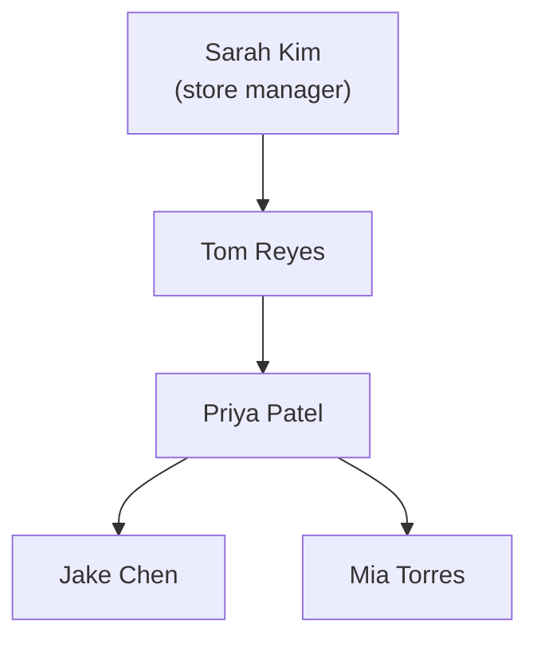

← [2.11 Joins](11-joins.md)

# 2.12 Subqueries & CTEs

Before any syntax, 3 real-world questions that naturally break into steps.

## 3 real-world scenarios

**1. A shop** asks *"which products are priced above our own average
price?"* — you can't answer that in one glance; you first need the average
computed, then compare every product against it.

**2. A university** wants *"students with no failing grades"* — that means
checking each student against a whole separate table of grades, not
comparing against one fixed value.

**3. A hospital** builds a report in two steps: first compute each doctor's
current patient count, then filter down to only the doctors above a certain
caseload — the second step depends entirely on the first being computed
already.

## Why subqueries and CTEs

Each scenario needs an **intermediate result** — an average, a check against
another table, a computed count — used *inside* a bigger query, before the
real question can even be asked. You could run two separate queries and glue
the results together in your application code, but that means two round
trips to the database, and the database itself never sees the full picture
at once. Subqueries and CTEs let you write the whole *"first find X, then use
it to find Y"* logic in a single SQL statement instead.

## What is a subquery?

A **subquery** is just a `SELECT` query written *inside* another query,
instead of being run on its own. Whatever it returns — one value, one column
of values, or a whole table-shaped result — becomes an input the outer query
can use. You've already seen the shape informally: anywhere you see a
`SELECT` sitting inside parentheses, that's a subquery.

Every example below uses the same
`customers`/`orders`/`order_items`/`products` schema from
[Lesson 2.10](10-relationships-and-foreign-keys.md).

## Step 1 — A subquery in `WHERE`

```sql
SELECT name, price
FROM products
WHERE price > (SELECT AVG(price) FROM products);
```
| name | price |
|---|---|
| iPhone 17 Pro | 1249.00 |
| MacBook Air | 989.10 |
| MacBook Pro | 1799.10 |
| iPad Pro | 999.00 |
| iPhone 17 | 999.00 |

The inner query `(SELECT AVG(price) FROM products)` runs first, producing one
number (972.775 — from [Lesson 2.7](07-functions.md)'s recap of `AVG`), which
the outer query then compares every row's `price` against:



## Step 2 — `IN` with a subquery

```sql
SELECT name FROM customers
WHERE customer_id IN (SELECT DISTINCT customer_id FROM orders);
```
| name |
|---|
| Alice Chen |
| Bob Diaz |

Carla is excluded — her `customer_id` never appears in `orders`.

## Step 3 — The `NOT IN` trap, and the safer fix

```sql
SELECT name FROM customers
WHERE customer_id NOT IN (SELECT customer_id FROM orders);
```
| name |
|---|
| Carla Ruiz |

This works correctly here — but only because `orders.customer_id` is
`NOT NULL` ([Lesson 2.10](10-relationships-and-foreign-keys.md)'s foreign
key). **If that subquery could ever return even one `NULL`, `NOT IN` would
silently return zero rows for the entire query** — a notorious, easy-to-miss
SQL bug. The safer habit, which works regardless:

```sql
SELECT name FROM customers c
WHERE NOT EXISTS (
    SELECT 1 FROM orders o WHERE o.customer_id = c.customer_id
);
```
Same result — `EXISTS` only checks *whether any row matches*, so `NULL`s in
the subquery can't break it.

## Step 4 — `EXISTS`, the positive version

```sql
SELECT name FROM customers c
WHERE EXISTS (
    SELECT 1 FROM orders o WHERE o.customer_id = c.customer_id
);
```
| name |
|---|
| Alice Chen |
| Bob Diaz |

## Step 5 — A subquery in `FROM` (a "derived table")

Treat a query's result as if it were its own table:

```sql
SELECT category, avg_price
FROM (
    SELECT category, AVG(price) AS avg_price
    FROM products
    GROUP BY category
) AS category_stats
WHERE avg_price > 700;
```
| category | avg_price |
|---|---|
| smartphone | 1124.00 |
| laptop | 1394.10 |
| tablet | 799.00 |

(`audio` at 549.00 and `desktop` at 599.00 — from
[Lesson 2.8](08-group.md)'s `GROUP BY` results — don't clear 700, so they're
filtered out.)

## Step 6 — What is a CTE, and the same query rewritten as one

**CTE** stands for **Common Table Expression** — don't worry about the
formal name, focus on what it does: a CTE lets you **give a temporary name to
a query's result**, then use that name later in the same statement as if it
were a real table. Think of it like a variable in programming: `WITH
category_stats AS (...)` says *"run this query once, call the result
`category_stats`, and let me write the rest of my query against that name"* —
instead of nesting a whole `SELECT` inside `FROM (...)` like Step 5 did.

```sql
WITH category_stats AS (
    SELECT category, AVG(price) AS avg_price
    FROM products
    GROUP BY category
)
SELECT category, avg_price
FROM category_stats
WHERE avg_price > 700;
```

Read it top to bottom, like a small 2-step program: *"Step 1 — compute
`category_stats`. Step 2 — query it."* That's the whole idea.

Identical result to Step 5 — a CTE is usually just a more readable way to
write the same thing, especially once you need the same intermediate result
more than once in one query (you can reference a CTE's name multiple times
without repeating its query each time — a plain `FROM`-subquery can't do
that).

## Step 7 — A correlated subquery

A subquery that references a column from the *outer* query — it effectively
re-runs once per outer row:

```sql
SELECT name, category, price
FROM products p1
WHERE price > (
    SELECT AVG(price) FROM products p2 WHERE p2.category = p1.category
);
```
| name | category | price |
|---|---|---|
| iPhone 17 Pro | smartphone | 1249.00 |
| MacBook Pro | laptop | 1799.10 |
| iPad Pro | tablet | 999.00 |

This finds products priced above the average **of their own category** —
different from Step 1, which compared against the average of *all* products
combined. iPhone 17 (999.00) doesn't qualify here, even though it beat the
*overall* average in Step 1 — it's below its own category's average (1124.00).

## Step 8 — Bonus: Recursive CTEs

Every CTE so far runs its query **once**. A **recursive CTE** runs its query
**repeatedly**, each time feeding off its *own* previous result — the tool
for anything shaped like a hierarchy or a chain: an org chart, a category
tree, "everyone who reports up to this manager, however many levels deep."

None of our existing tables are hierarchical, so let's introduce one small
new table just for this: the Apple Store's own staff, each employee pointing
at their manager.

```sql
CREATE TABLE employees (
    employee_id INTEGER PRIMARY KEY,
    name        TEXT NOT NULL,
    manager_id  INTEGER REFERENCES employees(employee_id)  -- points at another employee
);

INSERT INTO employees (employee_id, name, manager_id) VALUES
    (1, 'Sarah Kim',    NULL),  -- store manager, reports to no one
    (2, 'Tom Reyes',    1),     -- reports to Sarah
    (3, 'Priya Patel',  2),     -- reports to Tom
    (4, 'Jake Chen',    3),     -- reports to Priya
    (5, 'Mia Torres',   3);     -- also reports to Priya
```



*"List everyone, with how many levels down from the top they are"* can't be
answered by a normal join — you don't know in advance how many levels the
hierarchy has. A recursive CTE handles this in one query:

```sql
WITH RECURSIVE org_chart AS (
    -- Anchor: the starting point, runs once
    SELECT employee_id, name, manager_id, 1 AS depth
    FROM employees
    WHERE manager_id IS NULL

    UNION ALL

    -- Recursive step: runs again and again, each time joining the
    -- PREVIOUS round's results back to employees, one level deeper
    SELECT e.employee_id, e.name, e.manager_id, oc.depth + 1
    FROM employees e
    JOIN org_chart oc ON e.manager_id = oc.employee_id
)
SELECT * FROM org_chart ORDER BY depth;
```
| employee_id | name | manager_id | depth |
|---|---|---|---|
| 1 | Sarah Kim | `NULL` | 1 |
| 2 | Tom Reyes | 1 | 2 |
| 3 | Priya Patel | 2 | 3 |
| 4 | Jake Chen | 3 | 4 |
| 5 | Mia Torres | 3 | 4 |

Two parts, always:
- **Anchor** — the starting rows (here: whoever has no manager). Runs once.
- **Recursive step** — joins the *previous round's* output back to the real
  table, going one level deeper each time. PostgreSQL keeps re-running it
  until a round produces zero new rows, then stops automatically.

## Step 9 — Recap

| Tool | Use it when |
|---|---|
| Subquery in `WHERE` | You need to filter using a single computed value |
| `IN` / subquery | Match against a list produced by another query |
| `EXISTS` / `NOT EXISTS` | Check for *any* match, safely — even with `NULL`s involved |
| Subquery in `FROM` | You need to query the *result* of another query |
| CTE (`WITH`) | Same as a `FROM`-subquery, but far more readable for multi-step logic |
| Correlated subquery | The inner query depends on each row of the outer query |
| Recursive CTE (`WITH RECURSIVE`) | Hierarchies/chains of unknown depth — org charts, category trees |

---
← [2.11 Joins](11-joins.md) | Next: [2.13 Constraints →](13-constraints.md)
