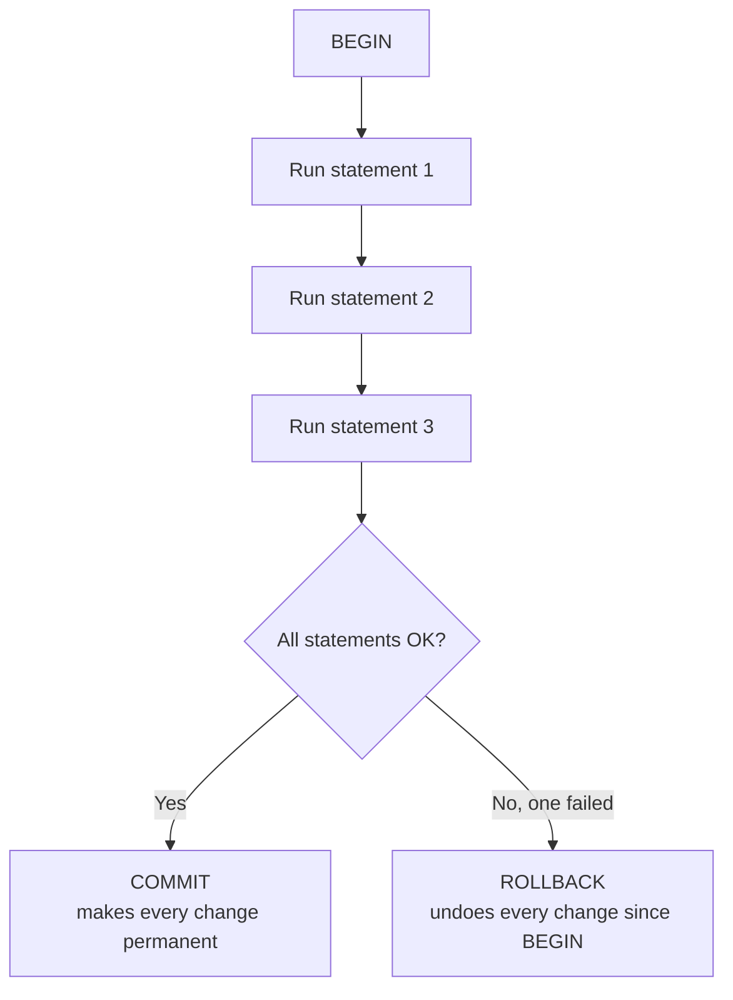

← [2.13 Constraints](13-constraints.md)

# 2.14 Transactions

Before any code, 3 real-world situations that need several steps to happen
together, or not at all.

## 3 real-world scenarios

**1. A bank transfer** must debit one account and credit another together —
if the system crashes right after the debit but before the credit, that
money must not simply vanish.

**2. An airline booking** must reserve a seat and charge the card together —
if the payment fails, the seat reservation must undo itself too, not sit
held forever for a booking that was never actually paid for.

**3. A shop's checkout** must create the order and reduce stock together —
placing one order actually takes **3 separate statements**: insert the
order, insert its line items, and reduce stock. What guarantees all 3
happen together, or not at all?

## Step 1 — The problem, concretely

```sql
INSERT INTO orders (customer_id, order_date) VALUES (3, '2026-03-10');
INSERT INTO order_items (order_id, product_id, quantity, unit_price) VALUES (4, 4, 2, 599.00);
UPDATE products SET stock = stock - 2 WHERE product_id = 4;
```

If your application crashes, loses its connection, or hits a bug between
statement 2 and 3, you're left with an order that has line items but stock
was never reduced — the database now lies about how much you have in stock.
A **transaction** groups statements so they succeed or fail as **one unit**:



There is no in-between outcome — either every statement's effect sticks, or
none of them do.

## Step 2 — `BEGIN`, `COMMIT`, `ROLLBACK`

```sql
BEGIN;

INSERT INTO orders (customer_id, order_date) VALUES (3, '2026-03-10');
INSERT INTO order_items (order_id, product_id, quantity, unit_price) VALUES (4, 4, -2, 599.00);
-- ERROR: new row for relation "order_items" violates check constraint "order_items_quantity_check"
-- (typo: quantity should be 2, not -2 — Lesson 2.13's CHECK constraint catches it)

UPDATE products SET stock = stock - 2 WHERE product_id = 4;
-- ERROR: current transaction is aborted, commands ignored until end of transaction block

ROLLBACK;
```

Once one statement inside a transaction errors, PostgreSQL refuses to run
anything else until you explicitly `ROLLBACK` — and `ROLLBACK` undoes
**everything** since `BEGIN`, including the `orders` insert that initially
succeeded. Nothing about Carla's order exists anymore.

> **A real, harmless side effect**: even though `ROLLBACK` undid the row, the
> `SERIAL` sequence that generated its `order_id` does **not** roll back —
> sequence numbers are never transactional. So the *next* successful order
> will get `order_id = 5`, not `4`. Gaps like this in auto-incrementing IDs
> are completely normal, not a bug.

Now the corrected version, run for real:

```sql
BEGIN;
INSERT INTO orders (customer_id, order_date) VALUES (3, '2026-03-10');       -- order_id = 5
INSERT INTO order_items (order_id, product_id, quantity, unit_price) VALUES (5, 4, 2, 599.00);
UPDATE products SET stock = stock - 2 WHERE product_id = 4;                  -- iPad Air: 400 → 398
COMMIT;
```

Carla finally has her first order — all 3 statements landed together, or not
at all.

## Step 3 — ACID, tied to what just happened

| Guarantee | What it means | What we just saw |
|---|---|---|
| **Atomicity** | All-or-nothing | The failed attempt's successful `orders` insert was undone by `ROLLBACK` too |
| **Consistency** | Never leaves data violating its rules | `CHECK (quantity > 0)` refused to let bad data in, ever |
| **Isolation** | Other users don't see a half-finished transaction | Nobody querying `orders` could see Carla's order mid-transaction — only after `COMMIT` |
| **Durability** | Once committed, it survives a crash | After `COMMIT` returns, Carla's order is safe even if the server crashes the next instant |

## Step 4 — `SAVEPOINT`: undo part of a transaction, not all of it

```sql
BEGIN;
INSERT INTO orders (customer_id, order_date) VALUES (2, '2026-03-12');   -- order_id = 6, Bob's 2nd order

SAVEPOINT before_item_2;
INSERT INTO order_items (order_id, product_id, quantity, unit_price) VALUES (6, 3, 1, 1799.10);  -- MacBook Pro, OK

SAVEPOINT before_duplicate;
INSERT INTO order_items (order_id, product_id, quantity, unit_price) VALUES (6, 3, 1, 1799.10);  -- oops, same product again
-- ERROR: duplicate key value violates unique constraint "order_items_pkey"

ROLLBACK TO before_duplicate;   -- undo ONLY the failed duplicate insert
COMMIT;                          -- keep the order and its one valid line item
```

Without the `SAVEPOINT`, the error would have forced a full `ROLLBACK`,
losing Bob's entire order — not just the one bad line.

## Step 5 — A preview: transactions and concurrent access

Two customers trying to buy the last 2 units of a product at the exact same
instant is a real race condition. Wrapping reads and writes in a transaction
alone doesn't automatically prevent this — the safest fix is a single atomic
statement:

```sql
UPDATE products SET stock = stock - 2 WHERE product_id = 4 AND stock >= 2;
```

If two requests run this at once, the database guarantees only one can
actually succeed in reducing stock below zero — check how many rows were
affected in your application code; `0` rows updated means "not enough stock,"
handled safely without a separate read-then-write race.

## Step 6 — Recap

| Command | Does |
|---|---|
| `BEGIN` | Starts a transaction |
| `COMMIT` | Makes every change since `BEGIN` permanent |
| `ROLLBACK` | Undoes every change since `BEGIN` |
| `SAVEPOINT name` | Marks a point you can partially roll back to |
| `ROLLBACK TO name` | Undoes back to that savepoint only, keeping earlier changes |

---
← [2.13 Constraints](13-constraints.md) | Next: [2.15 Indexes & Performance →](15-indexes-and-performance.md)
