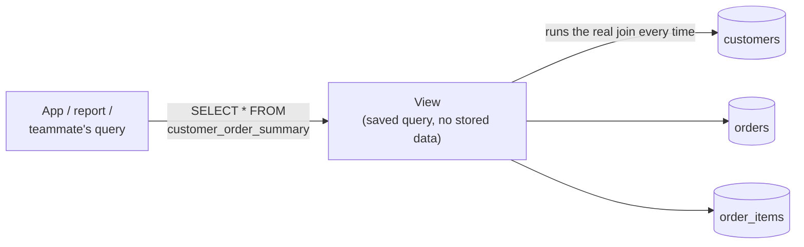

← [2.15 Indexes & Performance](15-indexes-and-performance.md)

# 2.16 Views

Before any code, 3 real-world situations where the same complex query gets
run over and over.

## 3 real-world scenarios

**1. A finance team** runs "monthly revenue by region" constantly — a
multi-table join and calculation, rewritten from scratch (or copy-pasted,
and slowly drifting out of sync) every single time someone needs it.

**2. A hospital dashboard** always needs "today's appointments, with doctor
and patient names" — the same 3-table join, shown fresh every time a nurse
opens the screen.

**3. An admin panel** wants to expose a safe "public profile" of each user —
name and join date, but never their password hash or private email — to
tools that shouldn't see the raw `users` table at all.

## What a view is, and why it helps

A **view** is a saved query that you can `SELECT` from as if it were an
ordinary table — the underlying tables are only actually queried each time
you use the view; nothing is duplicated or stored twice. It solves all 3
scenarios above: write the complex query once, reuse it by name everywhere,
and optionally hide columns nobody outside the team should see.

## Step 1 — Where our data stands after Lesson 2.14

After [Lesson 2.14](14-transactions.md)'s successful transactions, every
customer now has at least one order:

- Alice: order 1 (1798.00) + order 3 (1598.00) = **3396.00**
- Bob: order 2 (989.10) + order 6 (1799.10) = **2788.20**
- Carla: order 5 (1198.00) = **1198.00**

## Step 2 — Turning a query into a view

Recall [Lesson 2.11](11-joins.md)'s "total spent per customer" query — it's
exactly the kind of query you'd run over and over in a real app. Save it as a
view instead of retyping it:

```sql
CREATE VIEW customer_order_summary AS
SELECT c.customer_id, c.name AS customer,
       COALESCE(SUM(oi.quantity * oi.unit_price), 0) AS total_spent
FROM customers c
LEFT JOIN orders o       ON o.customer_id = c.customer_id
LEFT JOIN order_items oi ON oi.order_id = o.order_id
GROUP BY c.customer_id, c.name;
```



Nothing about `customers`/`orders`/`order_items` changes — the view is just a
named shortcut that re-runs the same join every time it's queried.

## Step 3 — Querying a view like a normal table

```sql
SELECT * FROM customer_order_summary ORDER BY total_spent DESC;
```
| customer_id | customer | total_spent |
|---|---|---|
| 1 | Alice Chen | 3396.00 |
| 2 | Bob Diaz | 2788.20 |
| 3 | Carla Ruiz | 1198.00 |

```sql
SELECT * FROM customer_order_summary WHERE total_spent > 2000;
```
| customer_id | customer | total_spent |
|---|---|---|
| 1 | Alice Chen | 3396.00 |
| 2 | Bob Diaz | 2788.20 |

You can `WHERE`, `ORDER BY`, and `JOIN` against a view exactly like a real
table — the 4-table join stays hidden behind one simple name.

## Step 4 — Why bother? (Instead of just saving the query as a text file)

- **Consistency** — every part of your application queries the exact same
  logic; fix a bug in the view definition once, and every caller is fixed.
- **Simplicity** — a teammate writing a report doesn't need to understand
  `order_items`/`orders`/`customers` at all — just `customer_order_summary`.
- **Access control** — you can grant someone permission to query a view
  without giving them direct access to the underlying tables (useful for
  hiding sensitive columns).

## Step 5 — Views and updates: a limitation worth knowing

```sql
-- This will NOT work — the view involves a JOIN and GROUP BY
UPDATE customer_order_summary SET total_spent = 5000 WHERE customer_id = 3;
-- ERROR: cannot update view "customer_order_summary"
```

A simple view over a *single* table (no joins, no aggregation) is usually
updatable directly. Once a view involves joins or `GROUP BY` — like ours —
PostgreSQL can't figure out which underlying row(s) your update should apply
to, so it refuses. In practice, most views (especially reporting ones like
this) are read-only by design; you update the real tables directly instead.

## Step 6 — A bonus: materialized views (a performance shortcut)

A regular view re-runs its full query every single time. A **materialized
view** runs it once and **stores** the result — much faster to read, at the
cost of going stale until refreshed:

```sql
CREATE MATERIALIZED VIEW customer_order_summary_cached AS
SELECT c.customer_id, c.name AS customer,
       COALESCE(SUM(oi.quantity * oi.unit_price), 0) AS total_spent
FROM customers c
LEFT JOIN orders o       ON o.customer_id = c.customer_id
LEFT JOIN order_items oi ON oi.order_id = o.order_id
GROUP BY c.customer_id, c.name;

-- Later, refresh it to catch up with new orders:
REFRESH MATERIALIZED VIEW customer_order_summary_cached;
```

This connects directly to [Lesson 2.15](15-indexes-and-performance.md)'s
theme — a materialized view is a deliberate tradeoff, trading perfect
freshness for speed, exactly like the "denormalize on purpose, document why"
principle from schema design.

## Step 7 — Recap

| Concept | What it is |
|---|---|
| `CREATE VIEW` | Save a query under a name, query it like a table |
| Regular view | Always up to date, re-runs the query every time |
| Materialized view | Stores results, faster but can go stale — needs `REFRESH` |
| Updatable views | Only works for simple, single-table views — not ones with joins/`GROUP BY` |

---
← [2.15 Indexes & Performance](15-indexes-and-performance.md) | Next: [2.17 Capstone →](17-capstone.md)
