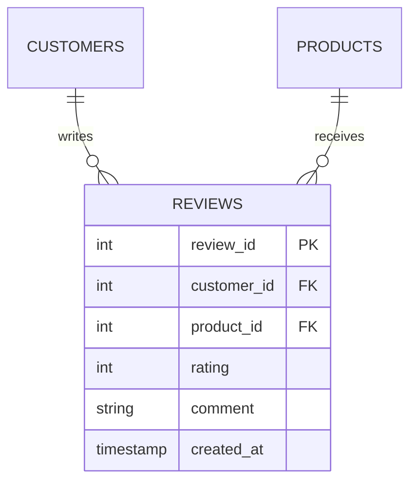

← [2.18 User & Access Management](18-user-access-management.md)

# 2.19 Capstone: Product Reviews

One last feature, built end to end with everything from Part 1: the Apple
Store wants **product reviews**. Let's design, build, and query it —
touching normalization, relationships, constraints, transactions, indexes,
and views along the way.

## Step 1 — Design (Normalization + Relationships)

A review belongs to one customer, about one product. Following
[Lesson 2.9](09-normalization.md) and [Lesson 2.10](10-relationships-and-foreign-keys.md):



## Step 2 — Build the table (Constraints)

Applying every constraint type from [Lesson 2.13](13-constraints.md):

```sql
CREATE TABLE reviews (
    review_id   SERIAL PRIMARY KEY,
    customer_id INTEGER NOT NULL REFERENCES customers(customer_id),
    product_id  INTEGER NOT NULL REFERENCES products(product_id),
    rating      INTEGER NOT NULL CHECK (rating BETWEEN 1 AND 5),
    comment     TEXT,
    created_at  TIMESTAMP NOT NULL DEFAULT CURRENT_TIMESTAMP,
    UNIQUE (customer_id, product_id)   -- one review per customer per product
);
```

## Step 3 — Add the review, as a transaction (Transactions)

A real "submit review" action often updates more than one thing at once —
here, inserting the review and (imagining a `products.review_count` counter
column) keeping it in sync, following [Lesson 2.14](14-transactions.md)'s
pattern:

```sql
BEGIN;
INSERT INTO reviews (customer_id, product_id, rating, comment) VALUES
    (1, 1, 5, 'Best phone I have owned.'),      -- Alice on iPhone 17 Pro
    (1, 7, 4, 'Great sound, a bit pricey.'),     -- Alice on AirPods Max
    (2, 2, 5, 'Perfect for travel.'),            -- Bob on MacBook Air
    (3, 4, 3, 'Good, but battery could be better.'); -- Carla on iPad Air
COMMIT;
```

Notice every review is for a product the customer actually bought — nothing
enforces that automatically here (a good "what would you add?" extension:
a `CHECK` can't reach across tables, so this would need a trigger or
application-level check in a real system).

## Step 4 — Add the index (Indexes & Performance)

Following [Lesson 2.15](15-indexes-and-performance.md) — `customer_id` and
`product_id` are foreign keys, so they're **not** auto-indexed:

```sql
CREATE INDEX idx_reviews_product_id ON reviews(product_id);
CREATE INDEX idx_reviews_customer_id ON reviews(customer_id);
```

## Step 5 — Per-product ratings (Joins + Group + Functions)

```sql
SELECT p.product_id, p.name,
       COUNT(r.review_id) AS num_reviews,
       ROUND(AVG(r.rating), 2) AS avg_rating
FROM products p
LEFT JOIN reviews r ON r.product_id = p.product_id
GROUP BY p.product_id, p.name
ORDER BY avg_rating DESC NULLS LAST;
```
| product_id | name | num_reviews | avg_rating |
|---|---|---|---|
| 1 | iPhone 17 Pro | 1 | 5.00 |
| 2 | MacBook Air | 1 | 5.00 |
| 7 | AirPods Max | 1 | 4.00 |
| 4 | iPad Air | 1 | 3.00 |
| 3 | MacBook Pro | 0 | `NULL` |
| 5 | iPad Pro | 0 | `NULL` |
| 10 | Mac Mini | 0 | `NULL` |
| 11 | iPhone 17 | 0 | `NULL` |

`LEFT JOIN` (from [Lesson 2.11](11-joins.md)) keeps every product, even the 4
with zero reviews. `NULLS LAST` sends products with no rating at all to the
bottom, instead of PostgreSQL's default of sorting `NULL` first on a `DESC`
sort.

## Step 6 — Save it as a view (Views)

```sql
CREATE VIEW product_ratings AS
SELECT p.product_id, p.name,
       COUNT(r.review_id) AS num_reviews,
       ROUND(AVG(r.rating), 2) AS avg_rating
FROM products p
LEFT JOIN reviews r ON r.product_id = p.product_id
GROUP BY p.product_id, p.name;
```

## Step 7 — The final synthesis query (CTEs + Subqueries)

*"Which products are outperforming average on **both** revenue and rating?"*
— combining [Lesson 2.12](12-subqueries-and-ctes.md)'s CTEs and subqueries:

```sql
WITH product_revenue AS (
    SELECT p.product_id, p.name,
           COALESCE(SUM(oi.quantity * oi.unit_price), 0) AS revenue
    FROM products p
    LEFT JOIN order_items oi ON oi.product_id = p.product_id
    GROUP BY p.product_id, p.name
),
product_rating AS (
    SELECT product_id, AVG(rating) AS avg_rating
    FROM reviews
    GROUP BY product_id
)
SELECT pr.name, pr.revenue, prt.avg_rating
FROM product_revenue pr
JOIN product_rating prt ON prt.product_id = pr.product_id
WHERE pr.revenue > (SELECT AVG(revenue) FROM product_revenue)
  AND prt.avg_rating > (SELECT AVG(avg_rating) FROM product_rating);
```
| name | revenue | avg_rating |
|---|---|---|
| iPhone 17 Pro | 1249.00 | 5.00 |
| MacBook Air | 989.10 | 5.00 |

Only 2 of our 8 products clear **both** bars — everything else is either
below-average revenue, below-average rating, or has no rating at all to
compare.

## Step 8 — One last access-control touch (User Management)

Following [Lesson 2.18](18-user-access-management.md), extend `app_user`'s
permissions to cover the new table:

```sql
GRANT SELECT, INSERT ON reviews TO app_user;   -- no UPDATE/DELETE — reviews are immutable once posted
```

That's every skill from Part 1, used together on one real feature — design,
build, secure, and query it, end to end.

---
← [2.18 User & Access Management](18-user-access-management.md) | Next: [2.20 Part 1 Conclusion →](20-conclusion.md)
