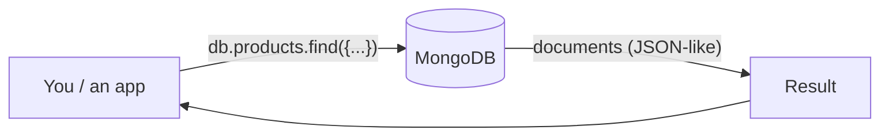

← [2.20 Part 1 Conclusion](../02-sql/20-conclusion.md)

# 3.1 What Is MongoDB?

Welcome to Part 2 — everything here uses **MongoDB**. Before any
definitions, 3 real-world moments where a document database is the natural
fit.

## 3 real-world scenarios

**1. A product catalog** where a book has `author`/`ISBN` fields, a laptop
has `CPU`/`RAM` fields, and a t-shirt has `size`/`color` fields — forcing all
3 into one rigid table means dozens of mostly-empty columns.

**2. A content management system** where each article can have a wildly
different set of custom fields depending on its type (a recipe has
`ingredients`; a video review has `duration`) — the shape of the data
genuinely varies record to record.

**3. A mobile app's user profile** that needs to evolve constantly — adding
a new preference field shouldn't require a schema migration across a
production database with millions of rows.

## What MongoDB actually is

MongoDB stores data as **documents** — JSON-like structures — grouped into
**collections**, instead of rows grouped into tables. Unlike SQL
([Lesson 2.1](../02-sql/01-what-is-sql.md)), there's no separate "language
vs. database" split: MongoDB's query syntax **is** MongoDB — there's no
MongoDB equivalent of "the same language also runs on 4 other brands."



## A document, concretely

```js
{
  _id: 1,
  name: "iPhone 17 Pro",
  category: "smartphone",
  price: 1249.00,
  specs: { storage_gb: 256, color: "black" }   // nested, right inside the document
}
```

Compare this to [Lesson 2.2](../02-sql/02-your-first-database-apple-example.md)'s
`products` **table** — same real-world fact, structured completely
differently: no separate table needed just to hold `specs`, because MongoDB
lets you nest data directly.

## Why this course teaches SQL first

Every idea from Part 1 — filtering, sorting, grouping, indexes,
transactions — still applies here. What changes is **how data is shaped**
and **how relationships are represented**. Learning SQL's strict structure
first makes it much easier to see exactly what MongoDB is trading away (and
gaining) by being flexible instead.

## Recap

- MongoDB stores **documents** (JSON-like) in **collections** — not rows in tables.
- Data can nest directly inside a document — no automatic normalization the
  way SQL enforces.
- The concepts from Part 1 (filter, sort, group, index, transaction) all
  return here, just with different syntax and different tradeoffs.

---
← [2.20 Part 1 Conclusion](../02-sql/20-conclusion.md) | Next: [3.2 Your First Database →](02-your-first-database-apple-example.md)
