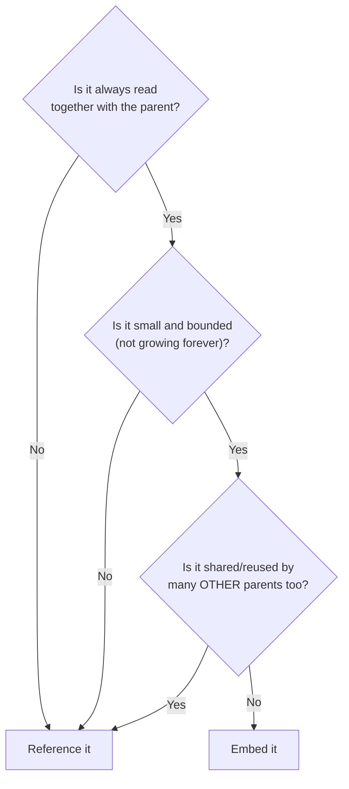
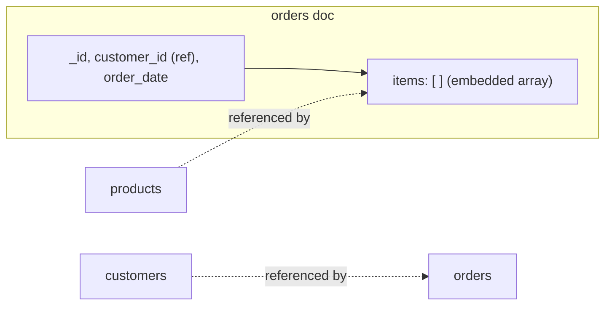

← [3.8 The `$group` Stage](08-group-stage.md)

# 3.9 Embedding vs. Referencing

[Lesson 2.9](../02-sql/09-normalization.md) split one flat table into 4,
specifically to eliminate 3 anomalies. MongoDB doesn't force that split —
but that doesn't mean the anomalies are gone. This lesson is about knowing
exactly when nesting data is safe, and when it silently reintroduces the
same problems.

## Step 1 — Remember the flat table's problem

[Lesson 2.9](../02-sql/09-normalization.md)'s flat table repeated Alice's
name/email/city on every line item she ordered — change her email, and you'd
need to update it in 4 places. That's not a SQL-specific problem; it's a
**data modeling** problem. Nest the wrong thing in MongoDB, and you get the
exact same anomaly, just inside a document instead of a table.

## Step 2 — MongoDB's actual answer: decide, deliberately, field by field

MongoDB doesn't have one universal rule like "always normalize to 3NF." You
choose, for each relationship, between:

- **Embedding** — nest the related data directly inside the parent document.
- **Referencing** — store just an ID, and look the related document up
  separately (MongoDB's version of a foreign key, but never enforced by the
  database itself — see [Lesson 3.10](10-relationships-in-mongodb.md)).

## Step 3 — Embedding, done safely: order items

```js
{
  _id: 1,
  customer_id: 1,
  order_date: ISODate("2026-03-01"),
  items: [
    { product_id: 1, quantity: 1, unit_price: 1249.00 },
    { product_id: 7, quantity: 1, unit_price: 549.00 }
  ]
}
```

Compare this to [Lesson 2.10](../02-sql/10-relationships-and-foreign-keys.md),
which needed a **separate `order_items` table** — a real relational
requirement, not a stylistic choice, since SQL tables can't nest a list.
Here, `items` lives directly inside its order. This is safe *specifically*
because order line items are:
- **Always fetched together** with their order — nobody asks for "line item
  #4" without its order.
- **Bounded** — an order has a handful of items, never millions.
- **Never shared** — no other order ever needs *this exact* line item.

## Step 4 — Referencing, done deliberately: the customer

```js
{
  _id: 1,
  customer_id: 1,     // a REFERENCE — not the customer's name/email/city
  order_date: ISODate("2026-03-01"),
  items: [ ... ]
}
```

Why not embed Alice's full name/email/city into every order, the way `items`
is embedded? Because that's **exactly** [Lesson 2.9](../02-sql/09-normalization.md)'s
flat-table mistake, just moved into a document: Alice's info would be
duplicated across every order she places, and changing her email would mean
updating it everywhere it was copied. Referencing `customer_id` — and
keeping customer details in their own `customers` collection — avoids that
entirely, at the cost of a second lookup when you need her name.

```js
db.customers.insertMany([
  { _id: 1, name: "Alice Chen", email: "alice@mail.com", city: "New York" },
  { _id: 2, name: "Bob Diaz",   email: "bob@mail.com",   city: "Los Angeles" },
  { _id: 3, name: "Carla Ruiz", email: "carla@mail.com", city: "Chicago" }
]);
```

## Step 5 — The decision rule



| Question | `items` in an order | `customer` on an order |
|---|---|---|
| Always read together with parent? | Yes | Yes, but... |
| Small and bounded? | Yes | Yes, but... |
| Shared/reused by many other parents? | No — never reused | **Yes** — the same customer places many orders |
| **Decision** | **Embed** | **Reference** |

## Step 6 — Our full schema, in MongoDB



- `customers` — its own collection, referenced by `orders.customer_id`.
- `orders` — references its customer, **embeds** its own line items.
- `products` — its own collection, referenced by each embedded item's
  `product_id` (a product is reused across many orders — reference it, for
  exactly the same reason as the customer).

## Step 7 — Recap

| | SQL ([Lesson 2.9](../02-sql/09-normalization.md)) | MongoDB |
|---|---|---|
| Default | Always split into normalized tables | Choose per relationship |
| Line items | Separate `order_items` table (required) | Embedded array (by choice, and it's safe here) |
| Customer info | Separate `customers` table | Referenced `customer_id` (embedding here would reintroduce the exact same anomaly) |
| Rule of thumb | "The key, the whole key, and nothing but the key" | "Embed what's always-together, bounded, and unshared; reference everything else" |

---
← [3.8 The `$group` Stage](08-group-stage.md) | Next: [3.10 Relationships in MongoDB →](10-relationships-in-mongodb.md)
