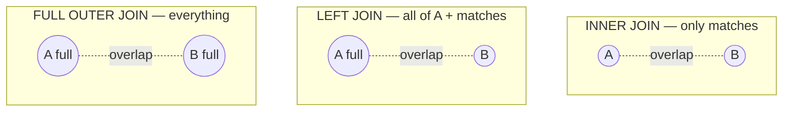

← [Module 03](README.md) | [Course Home](../README.md)

# 3.4 Joins

Joins combine rows from two or more tables based on a related column — almost
always a foreign key matching a primary key. This is *the* skill that
distinguishes comfortable SQL users from beginners.

## Setup: two small tables to reason about

**`authors`**
| author_id | name |
|---|---|
| 1 | Le Guin |
| 2 | Murakami |
| 3 | Adichie |

**`books`**
| book_id | title | author_id |
|---|---|---|
| 1 | The Left Hand of Darkness | 1 |
| 2 | Norwegian Wood | 2 |
| 3 | Americanah | 3 |
| 4 | The Dispossessed | 1 |
| 5 | Orphan Book | 99 *(no matching author)* |

## `INNER JOIN`

Returns only rows where the join condition matches **in both tables**.

```sql
SELECT b.title, a.name AS author
FROM books b
INNER JOIN authors a ON b.author_id = a.author_id;
```

| title | author |
|---|---|
| The Left Hand of Darkness | Le Guin |
| Norwegian Wood | Murakami |
| Americanah | Adichie |
| The Dispossessed | Le Guin |

`Orphan Book` is **excluded** — its `author_id` (99) matches no row in `authors`.

## `LEFT JOIN` (a.k.a. `LEFT OUTER JOIN`)

Returns **every row from the left table**, with matching right-table columns
filled in where they exist, and `NULL` where they don't.

```sql
SELECT b.title, a.name AS author
FROM books b
LEFT JOIN authors a ON b.author_id = a.author_id;
```

| title | author |
|---|---|
| The Left Hand of Darkness | Le Guin |
| Norwegian Wood | Murakami |
| Americanah | Adichie |
| The Dispossessed | Le Guin |
| Orphan Book | `NULL` |

**Common use**: "find rows in A that have no match in B" — add
`WHERE a.author_id IS NULL` to the query above, and you get exactly the orphaned
books. This pattern ("left join then filter for NULL") is one of the most useful
tricks in everyday SQL.

## `RIGHT JOIN`

The mirror image of `LEFT JOIN` — every row from the right table, matched where
possible. Rare in practice (people typically just swap table order and use
`LEFT JOIN` instead, which reads more naturally left-to-right).

## `FULL OUTER JOIN`

Every row from **both** tables, matched where possible, `NULL` on whichever side
has no match. (Not supported in MySQL directly — emulate with `LEFT JOIN UNION
RIGHT JOIN` if needed.)

## Visual summary



| Join type | Keeps unmatched left rows? | Keeps unmatched right rows? |
|---|---|---|
| `INNER JOIN` | No | No |
| `LEFT JOIN` | **Yes** | No |
| `RIGHT JOIN` | No | **Yes** |
| `FULL OUTER JOIN` | **Yes** | **Yes** |

## Joining more than two tables

```sql
SELECT c.name AS customer, b.title, oi.quantity, oi.unit_price
FROM orders o
JOIN customers c   ON o.customer_id = c.customer_id
JOIN order_items oi ON oi.order_id = o.order_id
JOIN books b       ON b.book_id = oi.book_id
WHERE o.order_id = 10;
```

Chain `JOIN`s one at a time — each adds columns from one more table. Order
usually doesn't affect correctness (the optimizer reorders them anyway — see
[Module 05, Lesson 2](../05-indexing-performance/02-execution-plans.md)), but
write them in whatever order reads most naturally to you.

## `CROSS JOIN` (use sparingly, on purpose)

Every row of A paired with every row of B — no condition. Useful for generating
combinations (e.g., "every size × every color"), dangerous by accident (an
unintended `CROSS JOIN` from a forgotten `WHERE`/`ON` clause can silently
multiply your row count and duplicate data in results).

```sql
SELECT s.size, c.color FROM sizes s CROSS JOIN colors c;
```

## Self-joins

A table can join to itself — common for hierarchical data (e.g., an `employees`
table with a `manager_id` referencing another row in the same table):

```sql
SELECT e.name AS employee, m.name AS manager
FROM employees e
LEFT JOIN employees m ON e.manager_id = m.employee_id;
```

## Try it yourself

Using the bookstore schema:
1. List every book with its author's name (`INNER JOIN`).
2. List every author, including ones with **zero** books (`LEFT JOIN` the other
   direction, then look for `NULL` book titles).
3. Write a query listing each order with the customer's name, each book title in
   it, quantity, and line total (`quantity * unit_price`) — joining 4 tables.
4. Deliberately write a `CROSS JOIN` between `books` and `customers` (don't run
   it if either table is large!) just to see the row count explode, then note
   how many rows you'd get: `(rows in books) × (rows in customers)`.

---
← [3.3 Filtering & Sorting](03-filtering-sorting.md) | [Module 03](README.md) | Next: [Aggregation & Grouping →](05-aggregation-grouping.md)
