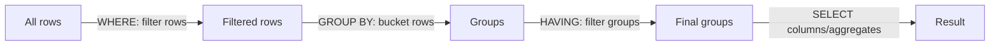

← [Module 03](README.md) | [Course Home](../README.md)

# 3.5 Aggregation & Grouping

Aggregation collapses many rows into a summary — counts, sums, averages — often
broken down "per group" (per genre, per customer, per month).

## Aggregate functions

```sql
SELECT COUNT(*) FROM books;                 -- total number of books
SELECT COUNT(DISTINCT genre) FROM books;    -- number of unique genres
SELECT SUM(stock) FROM books;               -- total copies in stock
SELECT AVG(price) FROM books;               -- average price
SELECT MIN(price), MAX(price) FROM books;   -- cheapest and priciest book
```

| Function | Ignores `NULL`s? | Notes |
|---|---|---|
| `COUNT(*)` | N/A | Counts rows, `NULL` or not |
| `COUNT(column)` | Yes | Counts only non-`NULL` values in that column |
| `SUM`, `AVG` | Yes | `NULL`s excluded from the calculation entirely |
| `MIN`, `MAX` | Yes | Works on numbers, dates, and text (alphabetical) |

## `GROUP BY`: aggregating per category

```sql
SELECT genre, COUNT(*) AS num_books, AVG(price) AS avg_price
FROM books
GROUP BY genre;
```

| genre | num_books | avg_price |
|---|---|---|
| Science Fiction | 12 | 14.50 |
| Fantasy | 8 | 16.25 |
| Literary Fiction | 5 | 13.80 |

**The rule**: every column in `SELECT` that *isn't* wrapped in an aggregate
function must appear in `GROUP BY`. This is the single most common `GROUP BY`
error for beginners:

```sql
-- ❌ Error in most databases: "author_id" is neither aggregated nor grouped
SELECT genre, author_id, COUNT(*) FROM books GROUP BY genre;

-- ✅ Fixed: group by both, or aggregate author_id too
SELECT genre, author_id, COUNT(*) FROM books GROUP BY genre, author_id;
```

## `HAVING`: filtering *after* grouping

`WHERE` filters individual rows *before* grouping; `HAVING` filters *groups*
after aggregation — you can't put an aggregate function in `WHERE`.

```sql
SELECT genre, COUNT(*) AS num_books
FROM books
WHERE stock > 0                 -- filter rows first (only in-stock books)
GROUP BY genre
HAVING COUNT(*) >= 5;           -- then keep only genres with 5+ such books
```



## A realistic multi-table aggregation

```sql
SELECT c.name AS customer, COUNT(o.order_id) AS num_orders, SUM(oi.quantity * oi.unit_price) AS total_spent
FROM customers c
JOIN orders o        ON o.customer_id = c.customer_id
JOIN order_items oi  ON oi.order_id = o.order_id
GROUP BY c.customer_id, c.name
ORDER BY total_spent DESC;
```

This answers "who are my highest-spending customers?" — combining joins
(Lesson 4) with grouping in one query, exactly the shape of query you'll write
constantly in real applications and reports.

## `GROUP BY` with `LEFT JOIN` — a common trap

If you want "every genre including ones with zero books," a plain `INNER JOIN`
+ `GROUP BY` silently drops empty groups. Use `LEFT JOIN` and `COUNT` the joined
column (not `COUNT(*)`) so empty groups show `0` instead of vanishing or showing `1`:

```sql
SELECT g.genre_name, COUNT(b.book_id) AS num_books   -- COUNT(b.book_id), not COUNT(*)
FROM genres g
LEFT JOIN books b ON b.genre = g.genre_name
GROUP BY g.genre_name;
```

## Window functions (a preview)

Sometimes you want an aggregate value **alongside** each individual row, not
collapsed into a summary — e.g., "this book's price, and the average price of
its genre, side by side." That's what **window functions** are for:

```sql
SELECT title, genre, price,
       AVG(price) OVER (PARTITION BY genre) AS genre_avg_price,
       RANK() OVER (PARTITION BY genre ORDER BY price DESC) AS price_rank_in_genre
FROM books;
```

Unlike `GROUP BY`, window functions don't collapse rows — every book still gets
its own row, just with extra calculated columns. This is an advanced topic
outside this course's core path, but worth knowing exists once `GROUP BY`
starts feeling limiting.

## Try it yourself

Using the bookstore schema:
1. Count how many books exist per genre.
2. Find the average, min, and max price per genre, but only for genres with more
   than 2 books (`HAVING`).
3. Write the "top customers by total spend" query above and identify your single
   highest-spending customer.
4. For each author, count how many books they've written, including authors with
   zero books (needs a `LEFT JOIN`).

---
← [3.4 Joins](04-joins.md) | [Module 03](README.md) | Next: [Subqueries & CTEs →](06-subqueries-ctes.md)
