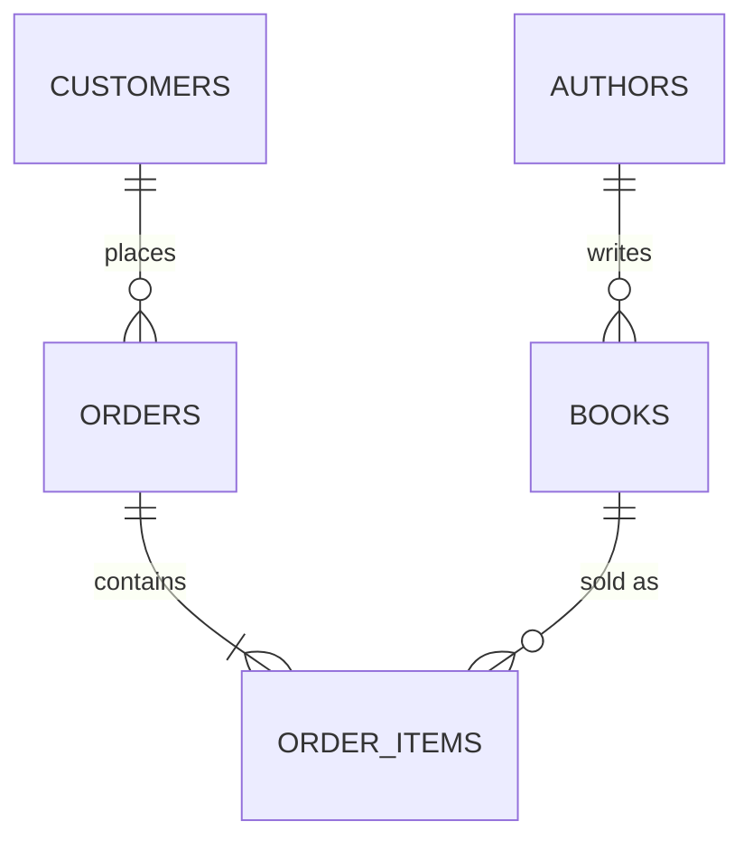

# Module 03 — SQL Fundamentals

This is the hands-on core of the course. Every lesson uses one running example
database (a small bookstore) so the SQL you write builds on itself. **Type these
queries out yourself** — muscle memory matters more than reading comprehension here.

## Setup

If you have PostgreSQL, MySQL, or SQLite available, run this once to create the
example schema and data used across every lesson in this module:

```sql
CREATE TABLE authors (
    author_id   INTEGER PRIMARY KEY,
    name        TEXT NOT NULL,
    country     TEXT
);

CREATE TABLE books (
    book_id     INTEGER PRIMARY KEY,
    title       TEXT NOT NULL,
    author_id   INTEGER NOT NULL REFERENCES authors(author_id),
    genre       TEXT NOT NULL,
    price       DECIMAL(6,2) NOT NULL CHECK (price >= 0),
    published   DATE NOT NULL,
    stock       INTEGER NOT NULL DEFAULT 0 CHECK (stock >= 0)
);

CREATE TABLE customers (
    customer_id INTEGER PRIMARY KEY,
    name        TEXT NOT NULL,
    email       TEXT NOT NULL UNIQUE,
    city        TEXT
);

CREATE TABLE orders (
    order_id    INTEGER PRIMARY KEY,
    customer_id INTEGER NOT NULL REFERENCES customers(customer_id),
    order_date  DATE NOT NULL
);

CREATE TABLE order_items (
    order_id    INTEGER REFERENCES orders(order_id),
    book_id     INTEGER REFERENCES books(book_id),
    quantity    INTEGER NOT NULL CHECK (quantity > 0),
    unit_price  DECIMAL(6,2) NOT NULL,
    PRIMARY KEY (order_id, book_id)
);
```



No local database? Paste the schema into [DB Fiddle](https://www.db-fiddle.com/)
(choose PostgreSQL) and run everything there.

## Lessons

1. [DDL Basics](01-ddl-basics.md) — creating and altering structure
2. [DML & CRUD](02-dml-crud.md) — inserting, updating, deleting data
3. [Filtering & Sorting](03-filtering-sorting.md) — `WHERE`, `ORDER BY`, `LIMIT`
4. [Joins](04-joins.md) — combining tables
5. [Aggregation & Grouping](05-aggregation-grouping.md) — `GROUP BY`, aggregate functions
6. [Subqueries & CTEs](06-subqueries-ctes.md) — queries within queries

---
[← Module 02](../02-relational-model/) | [Course Home](../README.md) | Next: [DDL Basics →](01-ddl-basics.md)
