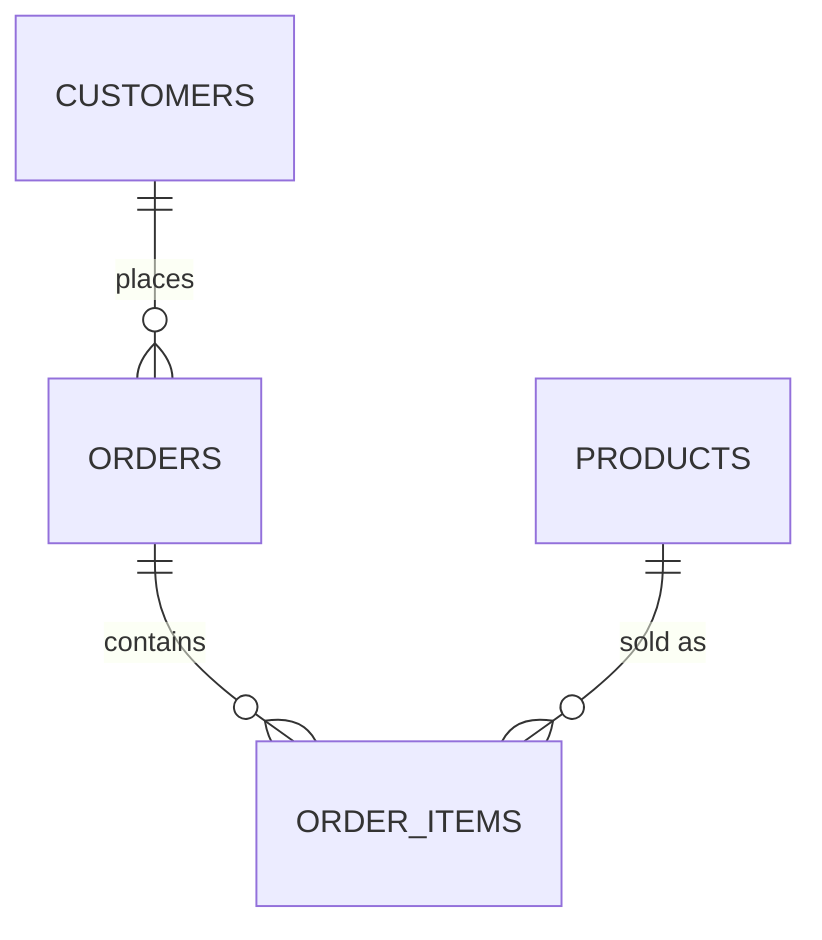
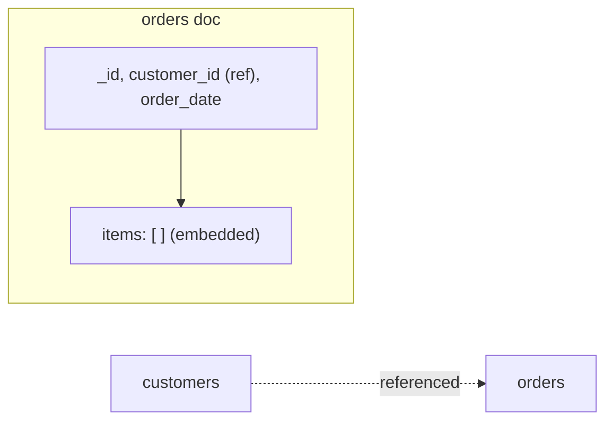

← [3.20 Part 2 Conclusion](../03-mongodb/20-conclusion.md)

# 4.1 The Same Data, Two Ways

Same `apple_store` data throughout Parts 1 and 2, on purpose — so this
comparison is never abstract. Let's look at both shapes side by side.

## The relational shape (Part 1)



4 tables. `order_items` exists purely because SQL tables can't nest a list
— [Lesson 2.9](../02-sql/09-normalization.md) required it, not chose it.

```sql
-- customers
{ customer_id: 1, name: "Alice Chen", email: "alice@mail.com", city: "New York" }

-- orders
{ order_id: 1, customer_id: 1, order_date: '2026-03-01' }

-- order_items (a SEPARATE table)
{ order_id: 1, product_id: 1, quantity: 1, unit_price: 1249.00 }
{ order_id: 1, product_id: 7, quantity: 1, unit_price: 549.00 }
```

Reconstructing "order 1, with everything in it" means a `JOIN` across 3
tables ([Lesson 2.11](../02-sql/11-joins.md)).

## The document shape (Part 2)



3 collections. [Lesson 3.9](../03-mongodb/09-embedding-vs-referencing.md)
**chose** to embed line items, because they're always read together with
their order.

```js
// customers
{ _id: 1, name: "Alice Chen", email: "alice@mail.com", city: "New York" }

// orders — items are RIGHT THERE, no separate collection
{
  _id: 1, customer_id: 1, order_date: ISODate("2026-03-01"),
  items: [
    { product_id: 1, quantity: 1, unit_price: 1249.00 },
    { product_id: 7, quantity: 1, unit_price: 549.00 }
  ]
}
```

Reconstructing "order 1, with everything in it" means **one single read** —
no join needed at all.

## Side by side

| | SQL (Part 1) | MongoDB (Part 2) |
|---|---|---|
| Collections/tables | 4 (`customers`, `orders`, `order_items`, `products`) | 3 (`customers`, `orders`, `products`) |
| Line items | Separate table, required | Embedded array, chosen |
| Fetch one full order | Requires a `JOIN` | One document read |
| Add a new order field | `ALTER TABLE` | Just start writing it — no migration |
| Guarantee every order has a real customer | Enforced (`FOREIGN KEY`) | **Not enforced** ([Lesson 3.10](../03-mongodb/10-relationships-in-mongodb.md)) |
| Guarantee `order_items` never duplicates a product per order | Enforced (composite `PRIMARY KEY`) | Only if you add that check yourself |

## The pattern to notice

Neither shape is "the data" — both are **decisions** about how to organize
the exact same facts. SQL's shape came from normalization rules applied
uniformly; MongoDB's shape came from asking "what's read together?" for each
relationship, one at a time. [Lesson 4.2](02-same-query-two-ways.md) shows
what querying each shape actually feels like.

---
← [3.20 Part 2 Conclusion](../03-mongodb/20-conclusion.md) | Next: [4.2 The Same Query, Two Ways →](02-same-query-two-ways.md)
