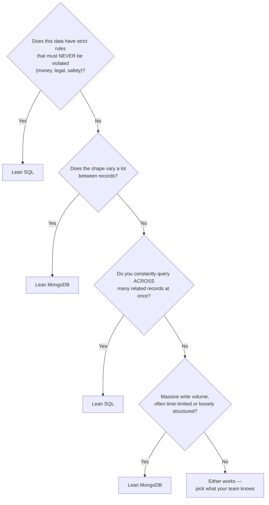
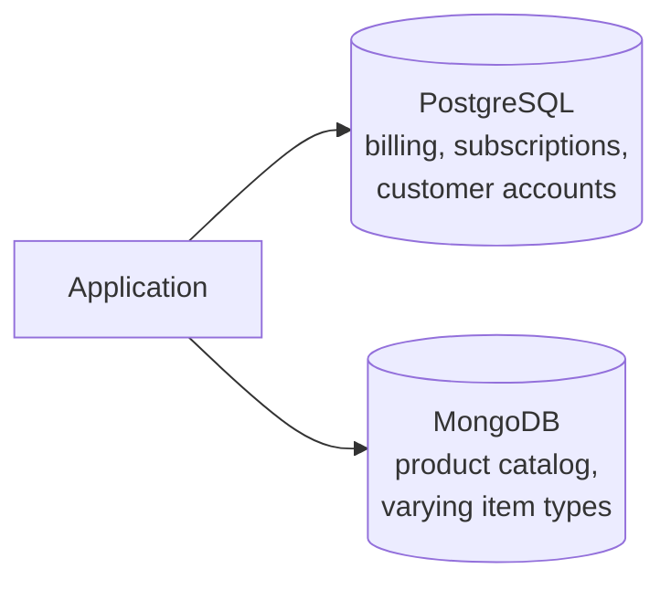

← [4.4 Real-World Scenarios & Which Fits](04-real-world-scenarios.md)

# 4.5 Decision Framework

A practical process for a real, new project — built from everything in
Chapter 4 so far.

## Step 1 — Ask these 4 questions, in order

This mirrors [Lesson 4.4](04-real-world-scenarios.md)'s 7 scenarios exactly
— each one answered "yes" to one of these questions first.

## Step 2 — A worked example

*"We're building a subscription box service: customer accounts, monthly
billing, and a product catalog with wildly different item types."*

1. Strict rules that must never break? **Billing — yes.** → SQL for
   customers/subscriptions/payments.
2. Shape varies a lot? **The catalog — yes.** → MongoDB for products.
3. Result: **two databases**, each doing what it's actually good at.

## Step 3 — Polyglot persistence: using both, deliberately

Most real, non-trivial systems don't pick one database for everything —
they pick the right tool **per problem**, inside one application:

This isn't a compromise or a sign of indecision — it's the same instinct as
[Lesson 1.3](../01-fundamentals/03-types-of-databases.md)'s "choose the
database type that fits the problem," just applied twice in one system
instead of once.

## Step 4 — The cost of polyglot persistence (be honest about it)

- **Two systems to run, monitor, and back up**, not one.
- **No single query spans both** — joining "a customer's subscription
  status" with "a product's catalog entry" means two separate queries,
  combined in application code.
- **Two skill sets** your team needs to maintain.

**Rule of thumb**: don't reach for a second database until one specific,
real pain point demands it (the exact anti-pattern warning from
[Module 1](../01-fundamentals/03-types-of-databases.md) — "index everything
just in case" applies here too: don't add a second database "just in
case").

## Step 5 — When genuinely unsure, default to SQL

If none of Step 1's questions gave a clear signal, prefer SQL
([Lesson 1.4](../01-fundamentals/04-database-brands.md)'s original
recommendation): it handles a surprisingly wide range of workloads well
(including flexible data, via `JSONB` — [Lesson 2.4](../02-sql/04-postgresql-data-types.md)),
and adding MongoDB later, once a real need appears, is far easier than
retrofitting SQL's guarantees onto a system that started without them.

---
← [4.4 Real-World Scenarios & Which Fits](04-real-world-scenarios.md) | Next: [4.6 Course Conclusion →](06-course-conclusion.md)
