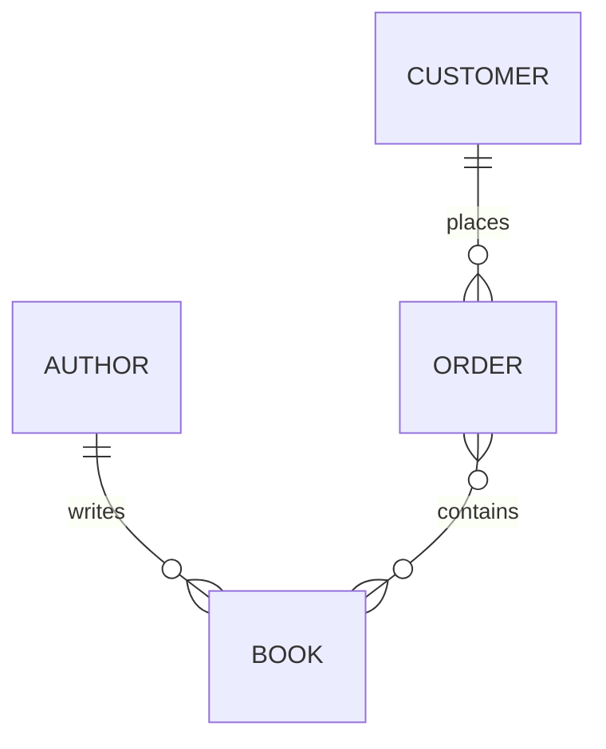
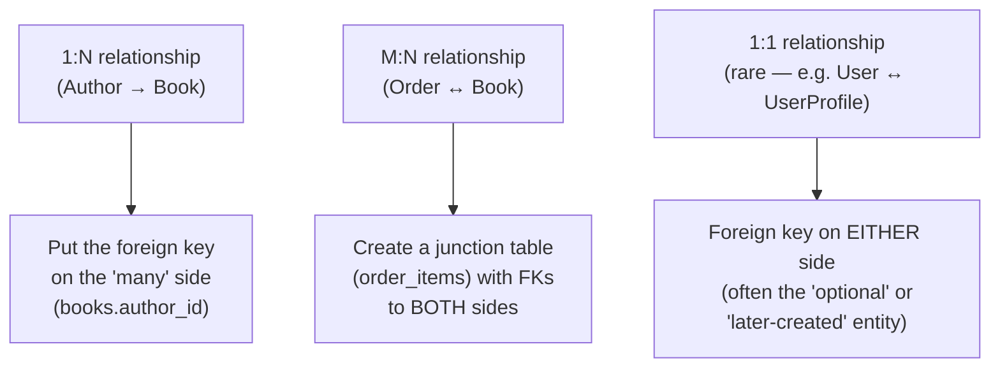
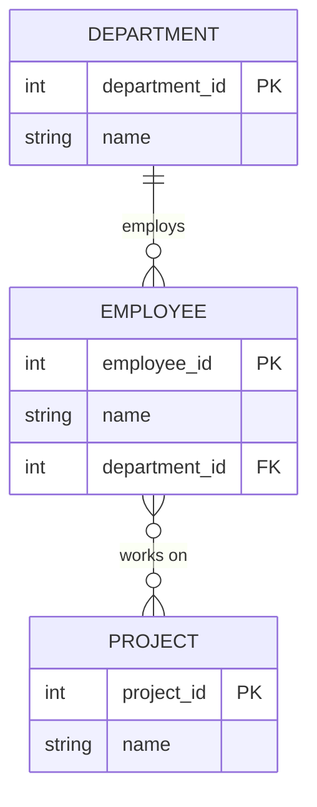

← [Module 04](README.md) | [Course Home](../README.md)

# 4.1 ER Modeling

**Entity-Relationship (ER) modeling** is the process of turning a real-world
requirement into entities, their attributes, and the relationships between them
— *before* writing a single `CREATE TABLE`. Do this step on paper or a whiteboard;
resist the urge to jump straight into SQL.

## Step 1: Identify entities

An **entity** is a "thing" your system needs to track — usually a noun in the
requirements. From "customers place orders containing books written by authors,"
the entities are: `Customer`, `Order`, `Book`, `Author`.

## Step 2: Identify attributes

For each entity, list the facts you need to store about it:

- `Customer`: name, email, city
- `Book`: title, price, genre, published date
- `Author`: name, country
- `Order`: order date

## Step 3: Identify relationships and their cardinality

This is the step people get wrong most often. For every pair of related
entities, ask: **"for one X, how many Y's? And for one Y, how many X's?"**

| Relationship | Cardinality | Real meaning |
|---|---|---|
| Author → Book | One-to-Many (1:N) | One author writes many books; each book has one (primary) author |
| Customer → Order | One-to-Many (1:N) | One customer places many orders; each order belongs to one customer |
| Order ↔ Book | Many-to-Many (M:N) | One order can contain many books; one book can appear in many orders |

## Notation: crow's foot ER diagrams



Reading `||--o{`:
- `||` = exactly one (mandatory)
- `o{` = zero or many (optional, multiple)
- So `AUTHOR ||--o{ BOOK` reads: "one author relates to zero-or-many books."

| Symbol | Meaning |
|---|---|
| `\|\|` | exactly one |
| `o\|` | zero or one |
| `\|{` | one or many |
| `o{` | zero or many |

## Turning cardinality into tables

This is the mechanical part — the mapping is always the same:



- **One-to-many**: the foreign key goes on the "many" side.
  `books.author_id → authors.author_id`
- **Many-to-many**: you *cannot* represent this with a single foreign key —
  you need a **junction table** (also called an associative or bridge table)
  with foreign keys to both sides, as we did with `order_items` in
  [Module 02, Lesson 2](../02-relational-model/02-keys-and-constraints.md).
- **One-to-one**: rare, but the foreign key can go on either side — typically
  whichever entity is "optional" or logically dependent on the other (e.g., a
  `user_profiles` table with a `user_id` foreign key that's also `UNIQUE`).

## A worked mini-example

**Requirement**: "Track employees, the departments they belong to, and the
projects they work on. A department has many employees; an employee works on
many projects, and a project can have many employees."



`Department ↔ Employee` is 1:N → FK lives on `employees`.
`Employee ↔ Project` is M:N → needs a junction table:

```sql
CREATE TABLE employee_projects (
    employee_id INTEGER REFERENCES employees(employee_id),
    project_id  INTEGER REFERENCES projects(project_id),
    role        TEXT,                     -- junction tables can carry their own attributes!
    PRIMARY KEY (employee_id, project_id)
);
```

Notice `role` — junction tables aren't just "glue," they can hold attributes
that only make sense *about the relationship itself* (e.g., "what role did this
employee play on this specific project").

## Try it yourself

Model this requirement as an ER diagram (entities, attributes, relationships
with cardinality), before looking at the full worked case study in the next
lesson:

> "A hospital has doctors and patients. A doctor can treat many patients, and a
> patient can be treated by many doctors over time. Each specific
> treatment/appointment has a date and a diagnosis note that belongs to that
> doctor-patient pairing, not to the doctor or patient generally."

Hint: think carefully about whether "doctor treats patient" is really 1:N or
M:N here, and where the `date`/`diagnosis` attributes should live.

---
← [Module 04](README.md) | Next: [Case Study: Bookstore Schema →](02-case-study-bookstore.md)
