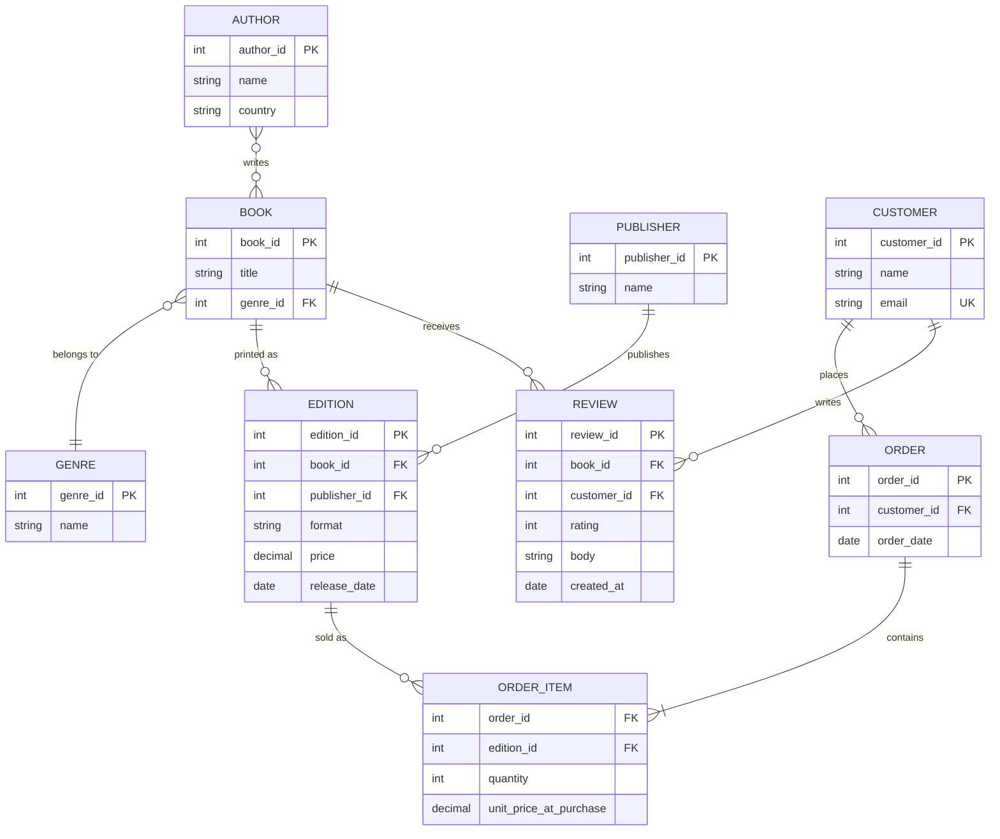

← [Module 04](README.md) | [Course Home](../README.md)

# 4.2 Case Study: Designing a Bookstore Schema

Let's design a schema from scratch, from a realistic (slightly messy) brief —
the way requirements actually arrive in practice.

## The brief

> "We're building an online bookstore. We sell books, each written by one or
> more authors, each belonging to one genre. Customers create accounts and
> place orders; an order can contain multiple books, and we need to remember
> the price at the time of purchase (prices change over time). Books can have
> multiple reviews from different customers, each with a rating (1–5) and
> optional text. We also want to track which publisher printed which edition of
> a book, since the same title can have multiple editions (paperback, hardcover)
> at different prices."

## Step 1 — extract entities

`Book`, `Author`, `Genre`, `Customer`, `Order`, `Review`, `Publisher`, `Edition`.

## Step 2 — question every assumption

Notice the brief says "each written by **one or more** authors" — that's
**many-to-many** (Book ↔ Author), not the simple 1:N we used in Module 03's
running example. Real requirements often reveal these subtleties on close
reading — always re-read for words like "one or more," "can also," "over time."

Also notice: "same title can have multiple editions at different prices" means
**price belongs to the Edition, not the Book** — the Book is the abstract work
("Americanah"), the Edition is a specific printed/priced version (hardcover
2013, paperback 2014).

## Step 3 — draw it



## Step 4 — write the DDL

```sql
CREATE TABLE genres (
    genre_id    INTEGER PRIMARY KEY,
    name        TEXT NOT NULL UNIQUE
);

CREATE TABLE authors (
    author_id   INTEGER PRIMARY KEY,
    name        TEXT NOT NULL,
    country     TEXT
);

CREATE TABLE books (
    book_id     INTEGER PRIMARY KEY,
    title       TEXT NOT NULL,
    genre_id    INTEGER NOT NULL REFERENCES genres(genre_id)
);

-- many-to-many: Book <-> Author
CREATE TABLE book_authors (
    book_id     INTEGER REFERENCES books(book_id),
    author_id   INTEGER REFERENCES authors(author_id),
    PRIMARY KEY (book_id, author_id)
);

CREATE TABLE publishers (
    publisher_id INTEGER PRIMARY KEY,
    name         TEXT NOT NULL
);

-- the priced, purchasable "thing" is an edition, not the abstract book
CREATE TABLE editions (
    edition_id    INTEGER PRIMARY KEY,
    book_id       INTEGER NOT NULL REFERENCES books(book_id),
    publisher_id  INTEGER NOT NULL REFERENCES publishers(publisher_id),
    format        TEXT NOT NULL CHECK (format IN ('paperback','hardcover','ebook')),
    price         DECIMAL(6,2) NOT NULL CHECK (price >= 0),
    release_date  DATE NOT NULL
);

CREATE TABLE customers (
    customer_id INTEGER PRIMARY KEY,
    name        TEXT NOT NULL,
    email       TEXT NOT NULL UNIQUE
);

CREATE TABLE orders (
    order_id    INTEGER PRIMARY KEY,
    customer_id INTEGER NOT NULL REFERENCES customers(customer_id),
    order_date  DATE NOT NULL
);

-- junction table AND it stores a price snapshot (deliberate denormalization —
-- see lesson 3 on anti-patterns for why this one is actually correct)
CREATE TABLE order_items (
    order_id                INTEGER REFERENCES orders(order_id),
    edition_id              INTEGER REFERENCES editions(edition_id),
    quantity                INTEGER NOT NULL CHECK (quantity > 0),
    unit_price_at_purchase  DECIMAL(6,2) NOT NULL,
    PRIMARY KEY (order_id, edition_id)
);

CREATE TABLE reviews (
    review_id   INTEGER PRIMARY KEY,
    book_id     INTEGER NOT NULL REFERENCES books(book_id),
    customer_id INTEGER NOT NULL REFERENCES customers(customer_id),
    rating      INTEGER NOT NULL CHECK (rating BETWEEN 1 AND 5),
    body        TEXT,
    created_at  DATE NOT NULL DEFAULT CURRENT_DATE,
    UNIQUE (book_id, customer_id)   -- one review per customer per book
);
```

## Design decisions worth noting

1. **`unit_price_at_purchase` is intentionally denormalized.** The "true"
   current price lives on `editions.price`, but orders must remain historically
   accurate even if the price later changes. Copying the price at purchase time
   into `order_items` is a deliberate, justified duplication — not a mistake.
2. **`UNIQUE (book_id, customer_id)` on `reviews`** encodes a business rule
   directly in the schema ("one review per customer per book") rather than
   relying on application code to enforce it — the database becomes a second
   line of defense against bugs.
3. **`book_authors` and `order_items` are both junction tables** for M:N
   relationships, but only `order_items` carries extra attributes
   (`quantity`, `unit_price_at_purchase`). A junction table doesn't have to
   carry attributes — sometimes it's *just* the two foreign keys.

## Try it yourself

Extend this schema to support **wishlists**: a customer can save any number of
editions to a personal wishlist, and an edition can be wishlisted by many
customers.
1. Is this a new entity, or another junction table? Justify your answer.
2. Write the `CREATE TABLE` statement for it.
3. Write a query listing every customer's wishlist with book titles and prices.

---
← [4.1 ER Modeling](01-er-modeling.md) | [Module 04](README.md) | Next: [Schema Anti-Patterns →](03-antipatterns.md)
