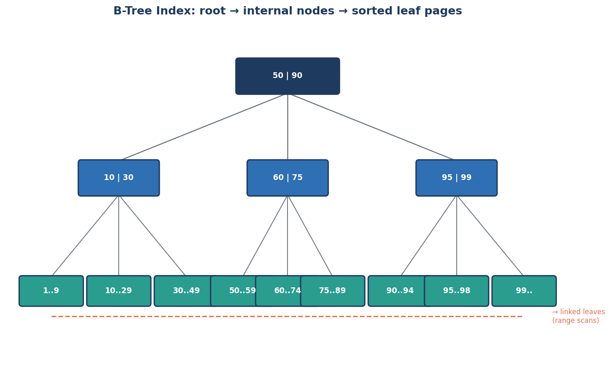

← [Module 05](README.md) | [Course Home](../README.md)

# 5.1 Indexes Explained

## The problem: scanning is slow

Without any help, finding a row means checking every single row — a **full
table scan**. For `SELECT * FROM books WHERE title = 'Americanah'` on a table
with 10 million rows, that's up to 10 million comparisons. An **index** is a
separate, sorted data structure the DBMS maintains alongside the table
specifically to avoid this.

## The mental model: an index is like a book's index

You don't read every page of a book to find "database" — you flip to the index
at the back, find "database, p. 142," and jump straight there. A database
index works the same way: a sorted structure mapping values → row locations.

## B-Tree indexes (the default, almost everywhere)

Most indexes (in PostgreSQL, MySQL/InnoDB, SQLite, SQL Server) are **B-trees** —
balanced tree structures where every leaf is the same distance from the root,
guaranteeing consistent lookup speed regardless of which value you search for.



Why this shape is fast:
- **Balanced** — no matter which value you're looking for, you traverse the
  same small number of levels (typically 3–4 levels covers *millions* of rows,
  since each node branches into many children).
- **Sorted leaves, linked together** — perfect for range queries
  (`WHERE price BETWEEN 10 AND 20`) and `ORDER BY`, since adjacent values sit
  next to each other and the engine can just walk the leaf chain.
- **Logarithmic lookup time** — going from 1 million to 1 billion rows adds only
  a couple more tree levels to traverse, not 1000x more work.

```sql
CREATE INDEX idx_books_title ON books(title);
CREATE INDEX idx_books_author_id ON books(author_id);
```

## What gets an index automatically

- **Primary keys** — always indexed automatically.
- **Unique constraints** — always indexed automatically (to enforce uniqueness
  efficiently).
- Everything else — you must create the index yourself.

## Composite (multi-column) indexes

```sql
CREATE INDEX idx_books_genre_price ON books(genre, price);
```

Order matters enormously. This index is efficient for:
- `WHERE genre = 'Fantasy'` ✅ (leftmost column alone)
- `WHERE genre = 'Fantasy' AND price > 10` ✅ (both columns, in order)

...but **not** efficient for:
- `WHERE price > 10` alone ❌ — the index is sorted by `genre` first, so without
  a `genre` filter the engine can't jump straight to a price range; it would
  need to scan across every genre.

**Rule of thumb**: put the column you filter on with `=` first, range/sort
columns after. This is often summarized as "equality, then range."

## When an index *won't* help (or actively hurts)

| Situation | Why |
|---|---|
| Table is tiny (a few hundred rows) | A full scan is already fast; index overhead isn't worth it |
| Query returns most of the table anyway | Scanning sequentially can beat jumping around via an index |
| Column has very low cardinality (e.g., a boolean) | The index barely narrows anything down — "half the table" isn't a useful filter |
| Function applied to the column: `WHERE LOWER(email) = ...` | A plain index on `email` can't be used — see below |
| Leading wildcard: `WHERE title LIKE '%wind%'` | B-tree indexes can't help with "contains" searches — that needs full-text or trigram indexes |
| Table is written to far more than read | Every index slows down every `INSERT`/`UPDATE`/`DELETE`, since the index must be kept up to date too |

### Functional/expression indexes fix the "function applied" case

```sql
-- Without this, WHERE LOWER(email) = 'alice@mail.com' can't use a plain index on email
CREATE INDEX idx_customers_email_lower ON customers(LOWER(email));
```

## Other index types worth knowing

| Type | Best for |
|---|---|
| **B-Tree** | The default — equality and range queries |
| **Hash** | Pure equality lookups only (no ranges); rarely chosen over B-tree in practice |
| **GIN** (Postgres) | Full-text search, `JSONB` containment queries, array columns |
| **GiST** (Postgres) | Geometric/spatial data, full-text search |
| **Full-text index** (MySQL `FULLTEXT`, Postgres `tsvector`) | Natural-language "contains this word" search |

## The cost of indexes (they're not free)

Every index:
- Takes disk space (sometimes rivaling the table itself).
- Slows down every `INSERT`/`UPDATE`/`DELETE` on that table (each index must be
  updated too).
- Needs to be chosen deliberately — "index everything" is itself an
  anti-pattern for write-heavy tables.

**Rule of thumb**: index columns you filter, join, or sort on frequently;
resist indexing columns "just in case."

## Try it yourself

Using the bookstore schema:
1. Add an index on `books.genre`. Would `WHERE genre = 'Fantasy' AND price < 15`
   benefit more from that single-column index, or a composite
   `(genre, price)` index? Why?
2. Would an index help `WHERE title LIKE '%dispossessed%'`? What about
   `WHERE title LIKE 'The%'`? Explain the difference.
3. List two columns in the bookstore schema you would **not** bother indexing,
   and explain why.

---
← [Module 05](README.md) | Next: [Reading Execution Plans →](02-execution-plans.md)
