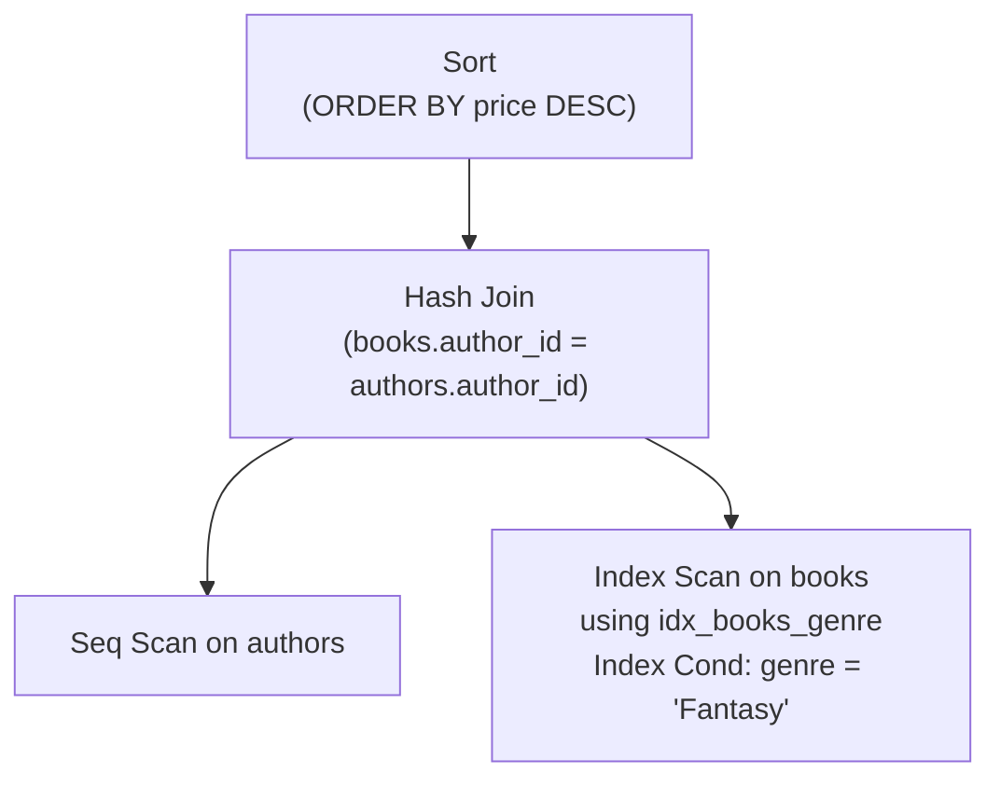

← [Module 05](README.md) | [Course Home](../README.md)

# 5.2 Reading Execution Plans

You don't have to guess whether a query uses an index — you can ask the
database to show you exactly what it plans to do (or actually did) with
`EXPLAIN`.

## `EXPLAIN` vs. `EXPLAIN ANALYZE`

```sql
EXPLAIN SELECT * FROM books WHERE genre = 'Fantasy';          -- estimated plan only
EXPLAIN ANALYZE SELECT * FROM books WHERE genre = 'Fantasy';  -- actually RUNS the query, shows real timing
```

- `EXPLAIN` shows what the planner *intends* to do, based on estimates — fast,
  safe on production.
- `EXPLAIN ANALYZE` actually executes the query and reports real timings and
  row counts — very useful, but be cautious running it with a modifying query
  (an `EXPLAIN ANALYZE UPDATE ...` really updates the data).

## Reading a simple plan (PostgreSQL-style)

```
EXPLAIN SELECT * FROM books WHERE genre = 'Fantasy';

Seq Scan on books  (cost=0.00..25.88 rows=8 width=64)
  Filter: (genre = 'Fantasy'::text)
```

- **`Seq Scan`** = sequential scan = full table scan, reading every row. Fine
  for a small table; a red flag on a large one if you expected an index to help.
- **`cost=0.00..25.88`** = the planner's estimated cost (start cost .. total
  cost), in abstract units — useful for *comparing* plans, not a real time unit.
- **`rows=8`** = estimated rows this step will produce.

Now with an index in place:

```
EXPLAIN SELECT * FROM books WHERE genre = 'Fantasy';

Index Scan using idx_books_genre on books  (cost=0.15..8.32 rows=8 width=64)
  Index Cond: (genre = 'Fantasy'::text)
```

- **`Index Scan`** = the planner used the index — jumping straight to matching
  rows instead of reading the whole table. Notice the much lower cost estimate
  (`8.32` vs `25.88`).

## Common plan node types

| Node | Meaning |
|---|---|
| `Seq Scan` | Full table scan — reads every row |
| `Index Scan` | Uses an index, then fetches full rows from the table for each match |
| `Index Only Scan` | Uses an index and *never* touches the table — every needed column exists in the index itself (fastest) |
| `Bitmap Heap Scan` / `Bitmap Index Scan` | Combines multiple index matches efficiently before fetching rows — common when a query touches many but not most rows |
| `Nested Loop` | For each row on one side, scans/looks up matches on the other — good when one side is small |
| `Hash Join` | Builds an in-memory hash table from one side, probes it with the other — good for larger, unsorted joins |
| `Merge Join` | Both inputs are sorted (often via an index) and merged together in one pass — good when both sides are already ordered |
| `Sort` | An explicit sort step (for `ORDER BY`, or to prepare for a Merge Join) |

## Following a full query plan



Plans read **bottom-up**: the database first scans `books` using the genre
index, scans `authors` fully (small table, no filter), joins them with a hash
join, then sorts the combined result by price. Reading this shape becomes
second nature with practice — always find the leaves (scans) first, then trace
how they're combined upward.

## Red flags to look for

| You see | Likely problem |
|---|---|
| `Seq Scan` on a large table with a selective `WHERE` | Missing index, or an existing index isn't being used (see below) |
| Estimated `rows` wildly different from actual `rows` (in `EXPLAIN ANALYZE`) | Stale statistics — run `ANALYZE`/`ANALYZE TABLE` to refresh them |
| `Nested Loop` over two very large tables | Often a sign a needed index is missing on the inner side |
| A `Sort` node consuming a large fraction of total time | Consider an index that already produces data in the needed order, avoiding the sort entirely |

## Why an index might be ignored even though it exists

- The table is small enough that a sequential scan is genuinely faster (index
  overhead isn't worth it below some row count).
- The query applies a function to the indexed column without a matching
  expression index (`WHERE LOWER(genre) = 'fantasy'` vs. a plain index on
  `genre` — see [Lesson 1](01-indexes-explained.md)).
- Statistics are stale, so the planner *thinks* a sequential scan will be
  cheaper.
- The query returns a large fraction of the table — a sequential scan can
  legitimately beat many random index lookups.

## Try it yourself

If you have PostgreSQL, MySQL, or SQLite available:
1. Run `EXPLAIN` on a `books` query filtered by `genre`, before and after adding
   an index on `genre` — compare the plans.
2. Run `EXPLAIN ANALYZE` on the 4-table join query from
   [Module 03, Lesson 4](../03-sql-fundamentals/04-joins.md) and identify which
   join algorithm was chosen for each pair of tables.
3. Find a `Seq Scan` in one of your own plans and decide: is it actually a
   problem here, or a case where a scan is genuinely the right choice?

---
← [5.1 Indexes Explained](01-indexes-explained.md) | [Module 05](README.md) | Next: [Performance Tuning in Practice →](03-performance-tuning.md)
