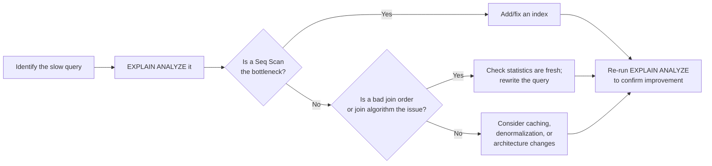

← [Module 05](README.md) | [Course Home](../README.md)

# 5.3 Performance Tuning in Practice

A practical workflow for when a query — or a whole application — feels slow.

## The tuning workflow



## 1. Find the slow query first

Don't guess — measure. Most databases can log slow queries directly:

- PostgreSQL: `log_min_duration_statement` in `postgresql.conf`, or the
  `pg_stat_statements` extension for aggregated statistics across all queries.
- MySQL: the "slow query log" (`slow_query_log = 1`, `long_query_time`).

Application-level APM tools (New Relic, Datadog, etc.) also surface this, but
the database's own logs are the ground truth.

## 2. Understand *why* it's slow (Module 05, Lesson 2)

Run `EXPLAIN ANALYZE` and look for the red flags from the previous lesson:
unindexed scans on large tables, stale statistics, expensive sorts.

## 3. The most common fixes, roughly in order of how often they apply

### Missing index
By far the most common cause. Add an index on columns used in `WHERE`, `JOIN
ON`, and `ORDER BY` clauses for your slow query (see
[Lesson 1](01-indexes-explained.md) for how to choose composite index order).

### `N+1` query problem
A classic application-layer mistake: fetching a list, then looping over it and
issuing one query per item.

```
-- 1 query to get 50 orders, then 50 MORE queries, one per order, to get its items
SELECT * FROM orders WHERE customer_id = 5;
-- ...in application code: for each order, run:
SELECT * FROM order_items WHERE order_id = ?;
```

**Fix**: one query with a `JOIN`, or one query with `WHERE order_id IN (...)`
batching all the IDs at once — turning 51 round-trips into 1.

### Fetching more than you need
`SELECT *` when you only use 2 of 15 columns, or fetching 10,000 rows to
display 20. **Fix**: select only needed columns; always paginate
(`LIMIT`/keyset pagination from
[Module 03, Lesson 3](../03-sql-fundamentals/03-filtering-sorting.md)).

### Stale statistics
The query planner's cost estimates are based on statistics about your data's
distribution, refreshed periodically (or on `ANALYZE`/`ANALYZE TABLE`). After a
huge bulk load or delete, stale statistics can lead to badly chosen plans.
**Fix**: run `ANALYZE` (Postgres) or `ANALYZE TABLE` (MySQL) manually after
large data changes.

### Over-normalized hot paths
A report that joins 6 tables and runs on every page load might benefit from a
deliberately denormalized summary column or table (see
[Module 04, Lesson 3](../04-schema-design/03-antipatterns.md) on doing this
*deliberately*, not accidentally) — or a materialized view that's refreshed on
a schedule instead of computed live every time.

### Lock contention
Sometimes a query is fast in isolation but slow in production because it's
waiting on a lock held by another transaction. This is a concurrency problem,
not an indexing problem — covered fully in
[Module 06](../06-transactions-concurrency/03-locking-mvcc.md).

## 4. Caching, as a last resort (not a first instinct)

Once query-level and schema-level fixes are exhausted, caching (an
application-level cache like Redis, or the database's own buffer cache sized
appropriately) can help — but caching adds complexity (cache invalidation,
staleness) and should come *after* fixing the underlying query, not instead of
it. "Just cache it" without understanding why a query is slow tends to hide
problems rather than solve them.

## 5. Connection pooling

A subtler but very common production issue: opening a new database connection
per request is expensive (TCP handshake, auth, memory allocation per
connection). **Fix**: use a connection pool (PgBouncer for Postgres, built-in
pooling in most application frameworks) so connections are reused across
requests instead of recreated constantly.

## A realistic before/after example

```sql
-- BEFORE: 3.2 seconds on 2M rows
SELECT c.name, COUNT(*) 
FROM customers c 
JOIN orders o ON o.customer_id = c.customer_id 
WHERE o.order_date > '2025-01-01'
GROUP BY c.name;
-- EXPLAIN shows: Seq Scan on orders, then Hash Join

-- Fix: add an index supporting the filter
CREATE INDEX idx_orders_date ON orders(order_date);

-- AFTER: 0.04 seconds — Index Scan on orders instead of Seq Scan
```

An 80x speedup from one correctly chosen index is an entirely ordinary result
— which is exactly why "check for a missing index first" belongs at the top of
this list.

## Try it yourself

Take the multi-table aggregation query from
[Module 03, Lesson 5](../03-sql-fundamentals/05-aggregation-grouping.md)
("top customers by total spend"). Assume `orders` and `order_items` each have
several million rows.
1. Which columns would you index to make this fast, and why?
2. Sketch (in words) what the `EXPLAIN` plan should look like *after* adding
   those indexes — which scans should become `Index Scan`s?
3. Identify one place in this query where an `N+1` mistake could easily creep in
   if it were written naively in application code instead of as one SQL query.

---
← [5.2 Reading Execution Plans](02-execution-plans.md) | [Module 05](README.md) | Next: [Module 06 — Transactions & Concurrency →](../06-transactions-concurrency/)
