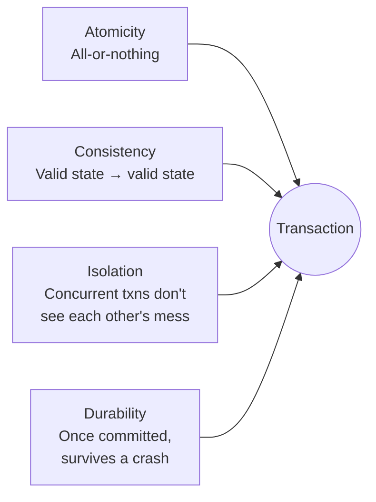

← [Module 06](README.md) | [Course Home](../README.md)

# 6.1 ACID Explained

Back in [Module 01](../01-fundamentals/01-what-is-a-database.md), we posed this
scenario: *two people click "buy" on the last item in stock at the exact same
millisecond.* Now we can answer it properly. A **transaction** is a group of
operations that must succeed or fail as a single unit, and **ACID** is the set
of guarantees a properly implemented transaction gives you.

## The race condition, concretely

```sql
-- Both users' applications run this "check stock" logic at nearly the same instant:
SELECT stock FROM books WHERE book_id = 1;   -- both read: stock = 1
-- Both applications see stock = 1, both think "great, it's available!"
UPDATE books SET stock = stock - 1 WHERE book_id = 1;   -- both run this
-- Final stock: -1 (or, worse, both orders get "confirmed" for the one remaining copy)
```

Without protection, this is a genuine, common bug in real systems — the fix is
ACID transactions plus the right isolation level (next lesson) or database
constraints (`CHECK (stock >= 0)`, which would at least make the second
`UPDATE` fail loudly instead of silently going negative).

## The four guarantees



### Atomicity — all or nothing

A transaction either fully completes (`COMMIT`) or fully undoes (`ROLLBACK`) —
there's no "half-applied" state visible to anyone else.

```sql
BEGIN;
UPDATE accounts SET balance = balance - 100 WHERE account_id = 1;  -- debit
UPDATE accounts SET balance = balance + 100 WHERE account_id = 2;  -- credit
COMMIT;
```

If the process crashes right after the debit but before the credit, atomicity
guarantees that on recovery, **neither** update took effect — money doesn't
vanish. Without atomicity, a crash mid-transfer could delete $100 from
existence.

### Consistency — valid state to valid state

Every transaction takes the database from one state that satisfies all defined
rules (constraints, checks, foreign keys) to another such state. If a
transaction would violate a `CHECK`, `NOT NULL`, `UNIQUE`, or foreign key
constraint, it's rejected entirely — this is really the constraints from
[Module 02](../02-relational-model/02-keys-and-constraints.md) working together
with atomicity.

### Isolation — concurrent transactions don't interfere

Even though many transactions run at the "same time" physically, each one
should behave *as if* it ran alone. This is the guarantee that actually
prevents the race condition above — but as we'll see in the
[next lesson](02-isolation-levels.md), "isolation" isn't all-or-nothing; there
are configurable levels with different tradeoffs.

### Durability — once committed, it survives

After a `COMMIT` returns successfully, the change is guaranteed to survive a
crash, power loss, or restart immediately after — this is what the
write-ahead log from
[Module 01, Lesson 3](../01-fundamentals/03-dbms-architecture.md) exists to
guarantee.

## Transactions in SQL

```sql
BEGIN;                                    -- start a transaction
UPDATE books SET stock = stock - 1 WHERE book_id = 1;
INSERT INTO orders (order_id, customer_id, order_date) VALUES (11, 3, CURRENT_DATE);
-- if anything looks wrong, or an error occurs:
ROLLBACK;                                 -- undo everything since BEGIN
-- otherwise:
COMMIT;                                   -- make it permanent
```

**Savepoints** let you roll back part of a transaction without discarding it
entirely:

```sql
BEGIN;
UPDATE books SET stock = stock - 1 WHERE book_id = 1;
SAVEPOINT before_risky_step;
UPDATE books SET stock = stock - 1 WHERE book_id = 2;   -- suppose this fails a check
ROLLBACK TO before_risky_step;    -- undo just the second update, keep the first
COMMIT;
```

## The fix for our race condition

The correct fix combines a `CHECK` constraint (a Consistency guarantee) with the
right isolation level or explicit locking:

```sql
BEGIN;
UPDATE books SET stock = stock - 1 WHERE book_id = 1 AND stock > 0;
-- Check how many rows were actually affected (in application code).
-- If 0 rows were updated, stock had already hit 0 — reject this order.
COMMIT;
```

This single-statement `UPDATE ... WHERE stock > 0` pattern is atomic by
construction — the database itself guarantees no other transaction can sneak in
between the read and the write, because there *is* no separate read step here
at all. This is a common and important pattern: **prefer one atomic statement
over "read, check in app code, then write"** whenever possible.

## Try it yourself

1. Using the bookstore schema, write a transaction that transfers a book's stock
   from being "reserved" to "sold" — decrementing a `reserved` count and
   incrementing a `sold` count in the same transaction — and explain in one
   sentence what atomicity guarantees here that running the two `UPDATE`s
   separately, without a transaction, would not.
2. Rewrite the race-condition example from the top of this lesson as a single
   atomic `UPDATE ... WHERE stock > 0` statement, and explain why this avoids
   the bug even with two simultaneous requests.

---
← [Module 06](README.md) | Next: [Isolation Levels →](02-isolation-levels.md)
