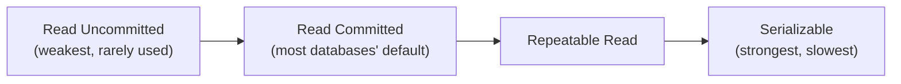
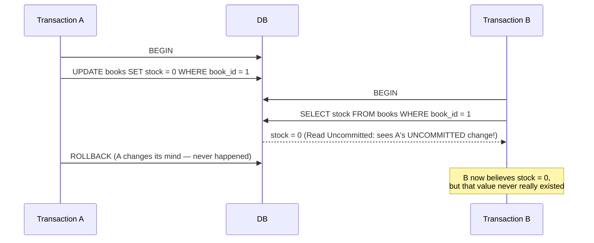
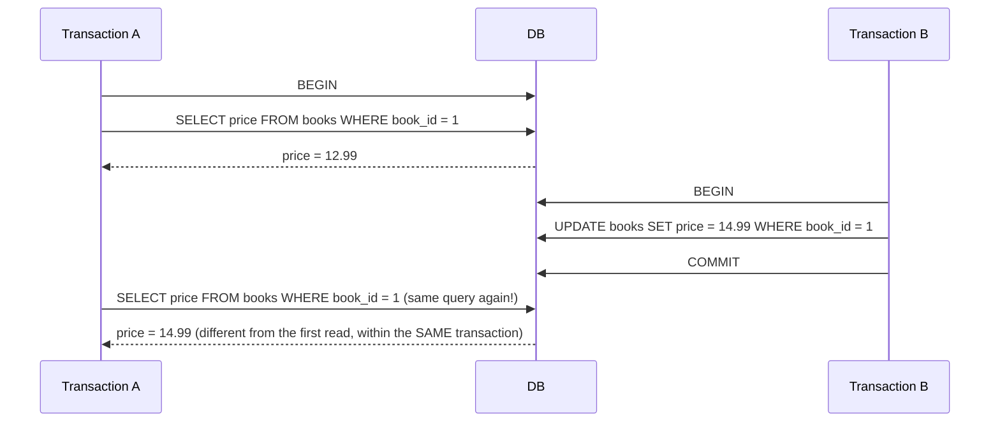

← [Module 06](README.md) | [Course Home](../README.md)

# 6.2 Isolation Levels

"Isolation" from ACID isn't one fixed guarantee — it's a **spectrum**, because
perfect isolation (transactions behaving as if fully sequential) is expensive
for performance. SQL defines four standard levels, each preventing more
anomalies at the cost of more overhead/blocking.

## The three classic anomalies

| Anomaly | What happens |
|---|---|
| **Dirty read** | Transaction A reads data written by transaction B, which hasn't committed yet — and B then rolls back. A now has data that never really existed. |
| **Non-repeatable read** | Transaction A reads a row twice, and gets **different values** each time, because B committed a change to that row in between. |
| **Phantom read** | Transaction A runs the same `WHERE` query twice, and gets a **different set of rows** the second time, because B inserted or deleted rows matching that condition in between. |

## The four isolation levels



| Level | Dirty read | Non-repeatable read | Phantom read |
|---|---|---|---|
| **Read Uncommitted** | Possible | Possible | Possible |
| **Read Committed** | Prevented | Possible | Possible |
| **Repeatable Read** | Prevented | Prevented | Possible* |
| **Serializable** | Prevented | Prevented | Prevented |

*\*PostgreSQL's implementation of Repeatable Read actually prevents phantom
reads too, going beyond the SQL standard's minimum requirement — a good example
of why it's worth checking your specific database's documentation rather than
assuming the standard table applies exactly.*

```sql
BEGIN;
SET TRANSACTION ISOLATION LEVEL REPEATABLE READ;
-- ... your queries ...
COMMIT;
```

## Walking through a dirty read



Under **Read Committed** or stricter, step 4 would instead return the
*previously committed* value (whatever `stock` was before A's uncommitted
change), because uncommitted data from other transactions is never visible.

## Walking through a non-repeatable read



**Repeatable Read** or stricter prevents this — A would see `12.99` both times,
as if it took a consistent snapshot at the start of its transaction.

## Choosing a level in practice

| Level | When to use it |
|---|---|
| **Read Uncommitted** | Almost never — only for approximate analytics where dirty reads are tolerable and speed matters more than correctness |
| **Read Committed** | The sensible **default** for most applications — good balance of correctness and performance; what PostgreSQL, Oracle, and SQL Server default to |
| **Repeatable Read** | Reports or multi-step logic that needs a **consistent view** of data throughout, even if other transactions commit changes meanwhile; MySQL/InnoDB's default |
| **Serializable** | Financial transfers, inventory reservations, or any logic where even subtle anomalies are unacceptable — accept the performance cost for correctness |

## The cost of stronger isolation

Stronger isolation doesn't come free — it's implemented via more locking or more
work re-checking for conflicts (see the [next lesson](03-locking-mvcc.md)),
which means more blocking, more retries, and lower throughput under heavy
concurrent load. **Serializable** transactions in particular may fail with a
"could not serialize access" error under contention — your application must be
ready to **retry** the transaction when that happens.

```sql
-- pseudocode: the retry pattern serializable isolation requires
for attempt in 1..3:
    try:
        BEGIN; SET TRANSACTION ISOLATION LEVEL SERIALIZABLE;
        -- ... do the work ...
        COMMIT;
        break
    except SerializationFailure:
        ROLLBACK;
        continue   -- retry
```

## Try it yourself

1. For each of the following, name the *weakest* isolation level that prevents
   the described problem: (a) a report reads a customer's order total twice
   during generation and gets two different numbers; (b) a `SELECT COUNT(*)`
   run twice in one transaction returns different counts because rows were
   inserted in between; (c) a transaction reads data another transaction wrote
   but then rolled back.
2. Explain, in your own words, why "Serializable" is not simply the "correct"
   default choice for every application, given its performance tradeoffs.

---
← [6.1 ACID Explained](01-acid.md) | [Module 06](README.md) | Next: [Locking & MVCC →](03-locking-mvcc.md)
