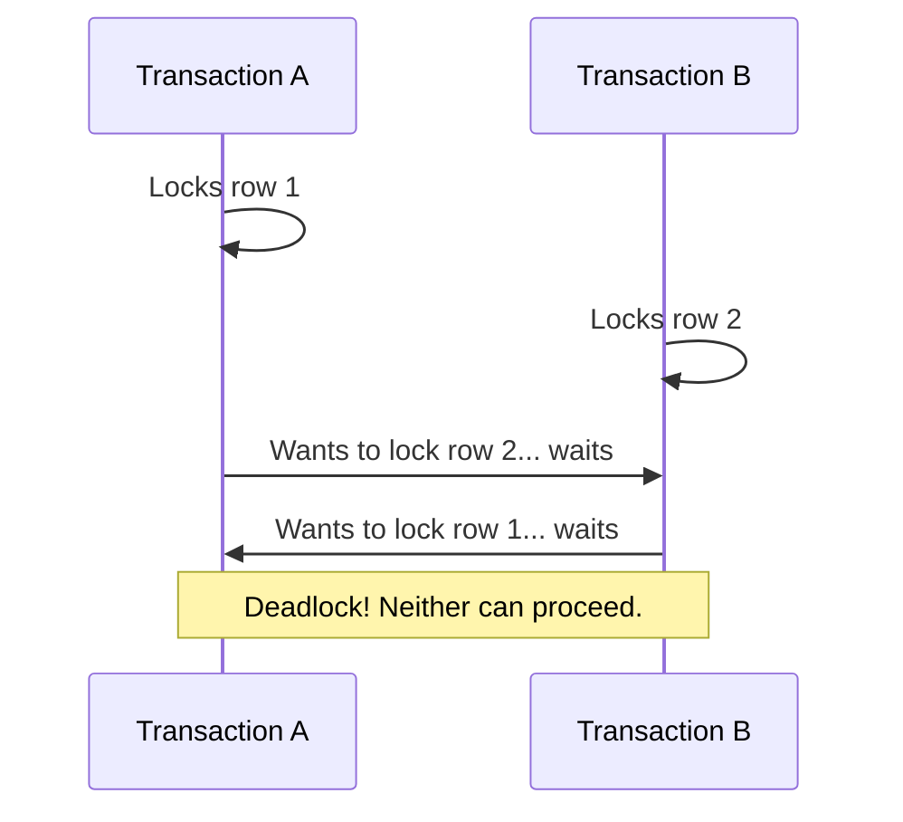
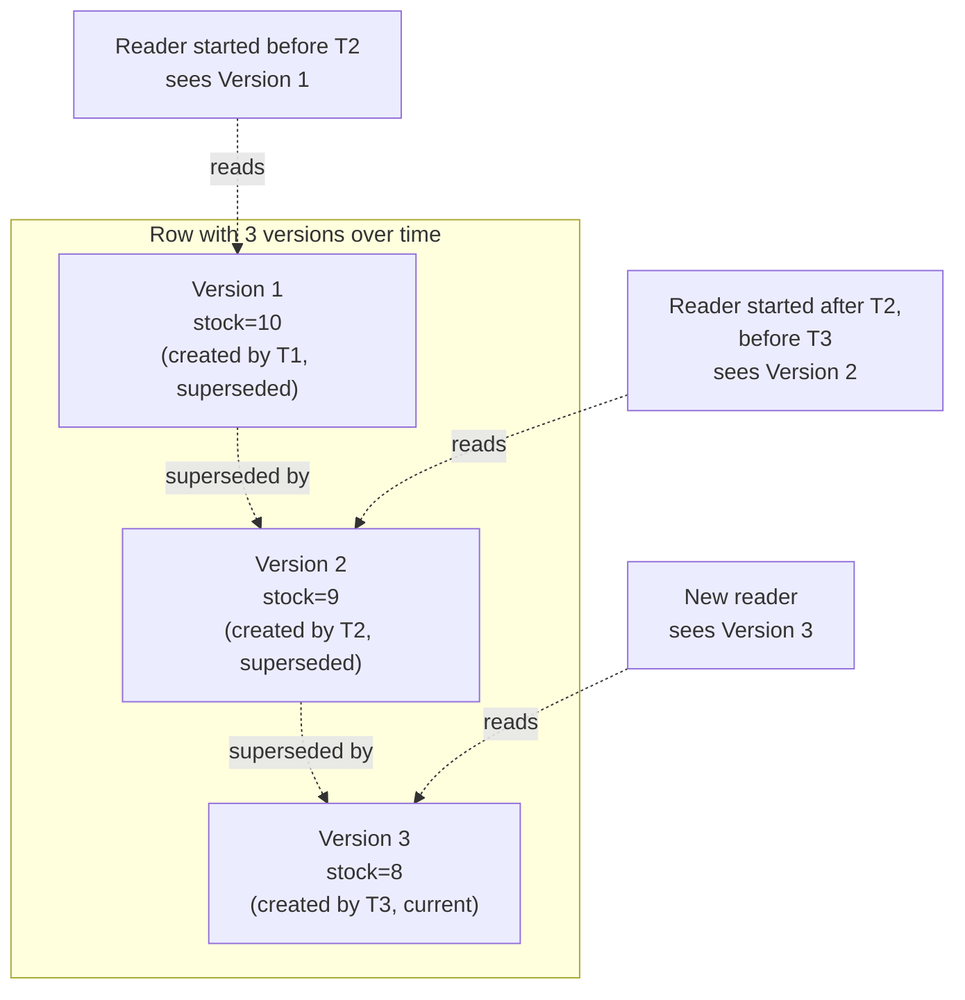

← [Module 06](README.md) | [Course Home](../README.md)

# 6.3 Locking & MVCC

How does a database actually *implement* isolation? Two main strategies exist,
and most modern databases use a hybrid of both.

## Strategy 1: Locking

A **lock** blocks other transactions from accessing a row (or table) in
conflicting ways until the lock is released.

| Lock type | Blocks | Used for |
|---|---|---|
| **Shared lock (read lock)** | Other writers, not other readers | `SELECT` in some databases/levels |
| **Exclusive lock (write lock)** | Both other readers and writers | `UPDATE`, `DELETE`, `INSERT` |

```sql
-- Explicit locking: prevent others from modifying this row until COMMIT
BEGIN;
SELECT * FROM books WHERE book_id = 1 FOR UPDATE;   -- acquires an exclusive lock
UPDATE books SET stock = stock - 1 WHERE book_id = 1;
COMMIT;   -- lock released here
```

`SELECT ... FOR UPDATE` is the standard way to say "I'm about to modify this
row based on what I just read — don't let anyone else touch it until I'm done."
This directly solves the race condition from
[Lesson 1](01-acid.md): the second transaction's `FOR UPDATE` simply **waits**
until the first commits, then sees the updated stock value.

### Deadlocks

Locking introduces a new failure mode: two transactions can each hold a lock
the other needs, waiting forever.



Databases detect this automatically and **abort one transaction** (raising a
deadlock error) so the other can proceed. **Fix on the application side**:
always acquire locks on multiple rows in a **consistent order** (e.g., always
lock the lower `id` first) across your whole codebase — this alone prevents
almost all deadlocks in practice.

## Strategy 2: MVCC (Multi-Version Concurrency Control)

Rather than blocking readers, **MVCC** (used by PostgreSQL, MySQL/InnoDB,
Oracle, SQLite's WAL mode) keeps multiple **versions** of a row and gives each
transaction a consistent **snapshot** to read from — so readers never block
writers, and writers never block readers.



- Every write creates a **new version** of the row rather than overwriting it
  in place.
- Every transaction sees the version of each row that was current **when its
  own transaction/snapshot started** — this is exactly what gives Repeatable
  Read its guarantee.
- Old versions are eventually cleaned up once no active transaction could still
  need them (Postgres calls this process **vacuuming**).

### Locking vs. MVCC, side by side

| | Locking | MVCC |
|---|---|---|
| Readers block writers? | Often, yes | No — readers see an old snapshot instead |
| Writers block readers? | Yes | No |
| Writers block writers? | Yes (always, in both models) | Yes (always, in both models) |
| Storage overhead | Low (single copy per row) | Higher (multiple row versions kept temporarily) |
| Needs cleanup? | No | Yes (vacuuming/garbage collection of old versions) |

**Important nuance**: even under MVCC, two transactions trying to **write** the
same row still conflict — MVCC solves reader/writer contention, not
writer/writer contention. Two concurrent `UPDATE`s to the same row will still
have one wait for (or abort due to) the other.

## Optimistic vs. pessimistic concurrency control

- **Pessimistic** (locking, `SELECT ... FOR UPDATE`): assume conflicts are
  likely; prevent them up front by blocking.
- **Optimistic**: assume conflicts are rare; proceed without locking, but check
  for conflicts *before* committing (e.g., a `version` column you increment on
  every update, checked in the `WHERE` clause):

```sql
-- Optimistic concurrency using a version column
UPDATE books
SET stock = stock - 1, version = version + 1
WHERE book_id = 1 AND version = 7;   -- fails to match (0 rows updated) if someone
                                       -- else already changed the version
```

If `0` rows are affected, your application knows someone else updated the row
first, and can retry by re-reading and trying again. This pattern scales very
well when conflicts are genuinely rare, avoiding lock overhead entirely in the
common case.

## Try it yourself

1. Using `SELECT ... FOR UPDATE`, rewrite the stock-decrement transaction from
   [Lesson 1](01-acid.md) so two simultaneous transactions can never both
   successfully sell the last copy of a book.
2. Explain in your own words why MVCC lets a long-running report query run
   *without* blocking simultaneous `UPDATE`s to the same table, and what the
   report will (and won't) see as a result.
3. Design a `version`-column optimistic-concurrency scheme for updating a
   customer's shipping address, and explain what your application code should
   do if the update affects 0 rows.

---
← [6.2 Isolation Levels](02-isolation-levels.md) | [Module 06](README.md) | Next: [Module 07 — NoSQL →](../07-nosql/)
