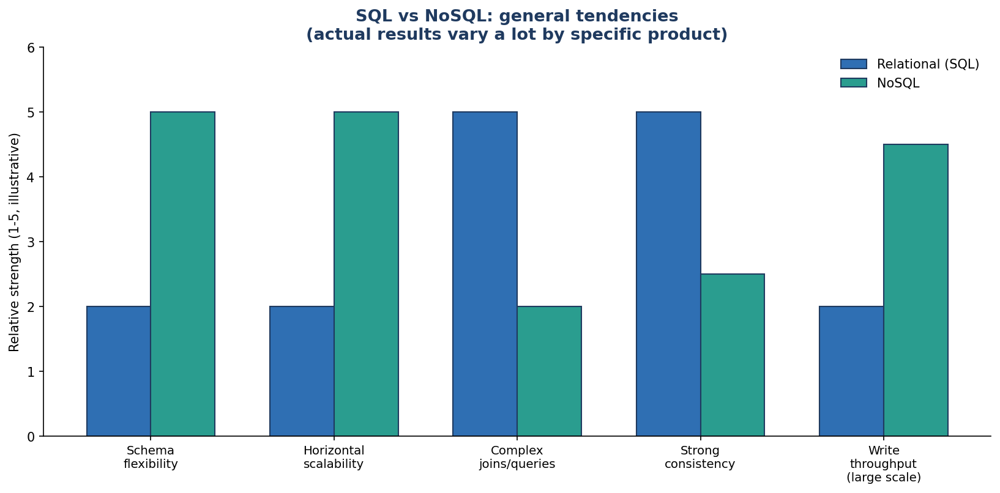
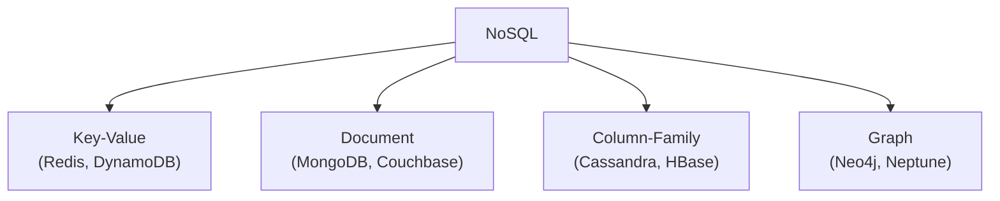

← [Module 07](README.md) | [Course Home](../README.md)

# 7.1 NoSQL Overview

## What "NoSQL" actually means

"NoSQL" doesn't mean "no SQL query language" as literally as it sounds — it's
better read as **"Not Only SQL"**: an umbrella term for databases that depart
from the classic relational-table model in at least one way, usually to gain
schema flexibility or easier horizontal scaling.

## Why NoSQL emerged

Relational databases were designed in an era of single, powerful machines.
Around the 2000s, internet-scale companies (Google, Amazon, Facebook) hit
workloads where:

- Data no longer fit comfortably in one strict tabular schema (documents with
  wildly varying shapes, graphs of relationships).
- A single machine could no longer handle the write volume, no matter how
  powerful — data needed to be spread across many machines (see
  [Module 08](../08-scaling-and-replication/)).
- Strict, immediate consistency across every read wasn't always worth the
  availability/latency cost — see the CAP theorem, covered in
  [Module 08, Lesson 3](../08-scaling-and-replication/03-cap-theorem.md).

## The common thread across NoSQL databases

Despite their different data models, most NoSQL systems share these tendencies:

| Tendency | What it usually means in practice |
|---|---|
| **Flexible/dynamic schema** | Different records can have different fields, added without a migration |
| **Built for horizontal scaling** | Designed from the ground up to spread data across many machines |
| **Denormalization by default** | Related data often lives together (nested), not spread across joined tables |
| **Relaxed consistency options** | Many offer "eventual consistency" as a deliberate, tunable tradeoff for availability/speed |
| **Simpler query capabilities** | Usually no arbitrary joins across collections — you design around your access patterns up front |

None of these are universal rules — plenty of NoSQL databases support strong
consistency, and some (MongoDB) support limited join-like operations. Treat this
table as "common tendencies," not hard laws.

## The four categories this course covers

We cover key-value and document stores together in the
[next lesson](02-key-value-and-document-stores.md) (they're conceptually
close — a document store is really "a key-value store where the value is
structured and queryable"), and column-family + graph stores in
[Lesson 3](03-column-family-and-graph-stores.md).

## A crucial mindset shift: design around queries, not entities

In relational modeling (Module 04), you model entities and relationships first,
then write whatever query you need later — the normalized structure supports
arbitrary questions reasonably well.

In most NoSQL databases, you flip this: you **design your data model around the
specific queries your application needs to make**, often duplicating data
deliberately so each query hits exactly one place, since arbitrary joins aren't
cheap (or available at all). This is the single biggest mental adjustment moving
from SQL to NoSQL thinking, and it's why "just copy your SQL schema into
MongoDB" is a common and painful beginner mistake.

## Try it yourself

Without looking ahead, write one sentence for each: what do you think a
"key-value," "document," and "graph" database's basic unit of storage looks
like? (You'll check your answers against the next two lessons.)

---
← [Module 07](README.md) | Next: [Key-Value & Document Stores →](02-key-value-and-document-stores.md)
