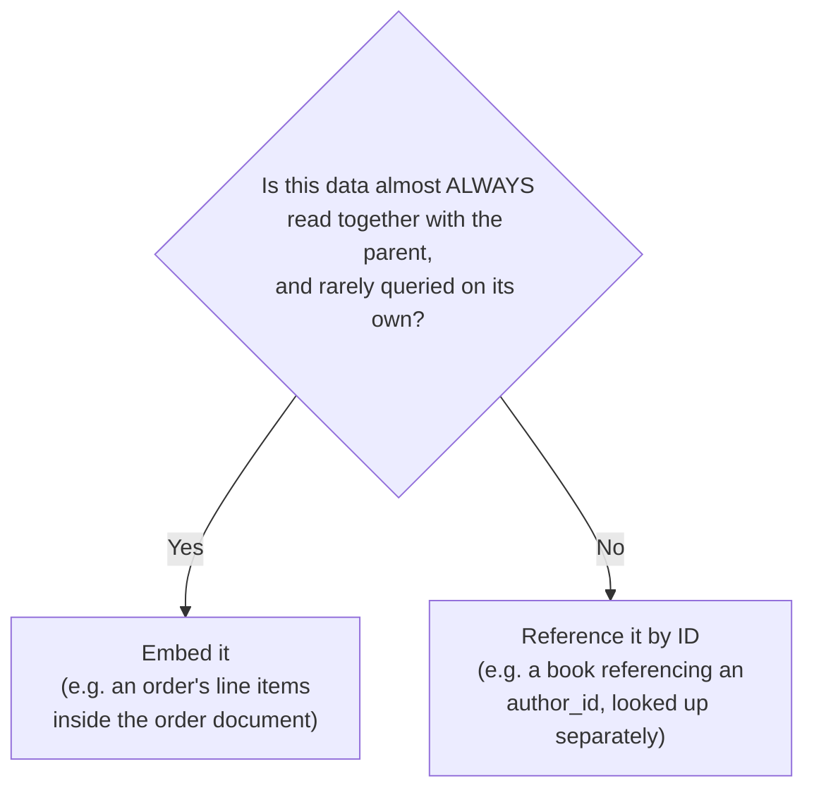

← [Module 07](README.md) | [Course Home](../README.md)

# 7.2 Key-Value & Document Stores

## Key-Value stores

The simplest possible data model: every piece of data is a `key → value` pair,
and the value is opaque to the database — it doesn't understand or index
*inside* it.

```
SET session:abc123 '{"user_id": 42, "cart": ["book-1", "book-4"]}'
GET session:abc123
DEL session:abc123
EXPIRE session:abc123 3600     -- auto-delete after 1 hour (Redis-specific)
```

**What it's good at**: single-key lookups at extremely high speed and scale —
often entirely in-memory (Redis) for sub-millisecond latency.

**What it's bad at**: querying by anything *other* than the key. "Find all
sessions belonging to user 42" isn't something a pure key-value store can do
efficiently — you'd need a secondary index maintained separately, or a
different tool entirely.

**Typical uses**: caching (the single most common use case), session storage,
rate-limiting counters, feature flags, leaderboards (Redis's sorted sets),
distributed locks.

## Document stores

A document store is a key-value store where the **value is a structured
document** (typically JSON/BSON) that the database *can* look inside — index
specific fields, query by them, and update parts of it without rewriting the
whole document.

```json
// A single document in a "books" collection (MongoDB-style)
{
  "_id": "b1",
  "title": "The Left Hand of Darkness",
  "author": { "name": "Ursula K. Le Guin", "country": "USA" },
  "genre": "Science Fiction",
  "price": 12.99,
  "tags": ["award-winning", "classic"],
  "editions": [
    { "format": "paperback", "price": 12.99 },
    { "format": "hardcover", "price": 24.99 }
  ]
}
```

```js
// MongoDB query examples
db.books.find({ genre: "Science Fiction" });
db.books.find({ "editions.format": "hardcover" });
db.books.updateOne({ _id: "b1" }, { $set: { price: 13.99 } });
db.books.createIndex({ genre: 1 });   // yes, document stores support indexes too
```

Notice how much this differs from the relational bookstore schema in
[Module 04, Lesson 2](../04-schema-design/02-case-study-bookstore.md): the
author and every edition are **nested inside the book document** rather than
living in separate joined tables. This is denormalization by design, not
accident — the whole "book with its editions" is fetched in one lookup, no
join needed.

### The tradeoff, concretely

| | Relational (normalized) | Document (nested) |
|---|---|---|
| Get a book + all its editions | `JOIN books, editions` | One document read, no join |
| Update a publisher's name everywhere | One `UPDATE` on `publishers` | Must update every document that embeds that publisher's name |
| Query "editions cheaper than $15 across ALL books" | Simple: query the `editions` table directly | Requires "unwinding" nested arrays across every document — awkward |

This is the fundamental tradeoff: **document stores optimize for "fetch this
one aggregate/entity and everything it needs in one read,"** at the cost of
making cross-cutting queries and keeping duplicated data in sync harder.

### When to embed vs. when to reference

Even within a document database, you choose between nesting data inline
("embedding") or storing an ID and looking it up separately ("referencing") —
mirroring the relational foreign-key idea, just used more sparingly:



**Rule of thumb**: embed data that's small, bounded in size, and always
accessed together with its parent (an address inside a user document, line
items inside an order). Reference data that's large, unbounded, shared across
many parents, or frequently queried/updated independently (a product catalog
referenced by many orders — you don't want to duplicate a whole product's data
into every order that includes it).

## Try it yourself

1. Model the bookstore's `orders` + `order_items` from
   [Module 04](../04-schema-design/02-case-study-bookstore.md) as a single
   MongoDB-style JSON document for one order, embedding its line items.
2. Would you embed or reference the `customer` on that order document? Justify
   your answer using the rule of thumb above.
3. Write (in plain English, or MongoDB query syntax if you know it) the query
   you'd need to find "the average price across every edition of every book" in
   your embedded design — and compare how much more awkward this feels than the
   equivalent single relational `SELECT AVG(price) FROM editions`.

---
← [7.1 NoSQL Overview](01-nosql-overview.md) | [Module 07](README.md) | Next: [Column-Family & Graph Stores →](03-column-family-and-graph-stores.md)
