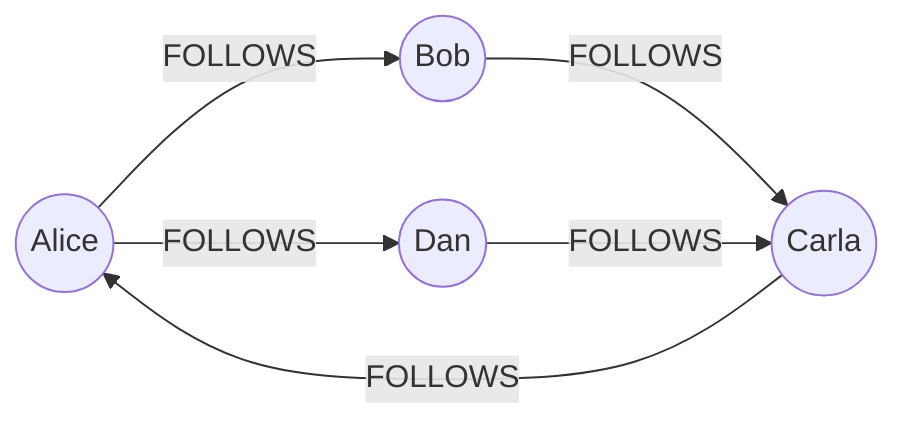

← [Module 07](README.md) | [Course Home](../README.md)

# 7.3 Column-Family & Graph Stores

Two more specialized NoSQL categories, each solving a specific shape of problem
that neither relational nor document databases handle as naturally.

## Column-Family stores

Despite the name, don't confuse this with the "columnar/OLAP" storage mentioned
in [Module 01, Lesson 3](../01-fundamentals/03-dbms-architecture.md) — it's a
different concept. A column-family store organizes data by a **row key**, but
each row can have a different, sparse set of **columns**, grouped into
**column families** — and it's built from the ground up to spread massive
write volume across many machines.

```
Row key: "user_42"
Column family "profile":       name="Alice", city="NYC"
Column family "activity_2026": jan_15="login", jan_16="purchase", jan_20="login"

Row key: "user_43"
Column family "profile":       name="Bob"   (no city — that's fine, columns are sparse)
Column family "activity_2026": jan_16="login"
```

Every row can have a wildly different set of columns within a family — there's
no fixed schema requiring every row to have the same columns, unlike a
relational table.

**What it's good at**: extremely high write throughput spread across a cluster,
data naturally keyed by one dominant access pattern (e.g., "give me everything
for this user" or "give me this sensor's readings for this time range").

**What it's bad at**: ad-hoc queries across dimensions other than the row key;
you must know your access pattern before designing the schema (an even
stricter version of the "design around your queries" mindset from
[Lesson 1](01-nosql-overview.md)).

**Typical uses**: time-series/IoT sensor data, activity feeds/event logging,
recommendation data, any workload with massive, steady write volume that must
scale horizontally (Cassandra was built at Facebook for exactly this).

## Graph databases

A graph database makes relationships themselves **first-class, indexed data**
— not something reconstructed via foreign keys and joins at query time, but
stored as direct pointers between nodes that can be traversed in constant time
per hop, regardless of how large the overall graph gets.



```cypher
// Cypher query language (Neo4j) — "friends of friends" recommendation
MATCH (me:Person {name: "Alice"})-[:FOLLOWS]->(friend)-[:FOLLOWS]->(fof)
WHERE NOT (me)-[:FOLLOWS]->(fof) AND fof <> me
RETURN DISTINCT fof.name AS suggestion;
```

**Why not just do this with SQL joins?** You could — but "friends of friends of
friends" (3+ hops) requires a 3-way self-join in SQL, and each additional hop
adds another join, getting slower and more awkward fast. A graph database
traverses each hop as a direct pointer-following operation regardless of how
many total nodes exist in the graph — the query above stays fast whether your
social network has 1,000 or 100,000,000 people, because it never has to
consider anyone outside the local neighborhood being traversed.

**What it's good at**: deeply relational, connection-heavy queries — "shortest
path between X and Y," "recommendations via shared connections,"
"fraud rings" (clusters of suspiciously connected accounts).

**What it's bad at**: aggregate queries over the whole dataset regardless of
connections (e.g., "average order value across all customers" is just as
natural in SQL and gains nothing from a graph model); very large-scale
analytical scans.

**Typical uses**: social networks, recommendation engines, fraud/anomaly
detection, knowledge graphs, network/IT infrastructure mapping.

## Side-by-side recap of all four NoSQL categories

| | Key-Value | Document | Column-Family | Graph |
|---|---|---|---|---|
| Basic unit | Opaque value per key | Structured document per key | Sparse columns per row key | Nodes + edges |
| Query by | Key only | Key or indexed fields inside the document | Row key (+ column family) | Relationships/traversals |
| Scales by | Sharding keys across nodes | Sharding documents across nodes | Sharding row keys across nodes | Harder to shard (relationships often span shards) |
| Best for | Caching, sessions | Flexible, nested entities | Massive write throughput | Connection-heavy queries |
| Example | Redis, DynamoDB | MongoDB, Couchbase | Cassandra, HBase | Neo4j, Amazon Neptune |

## Try it yourself

For each scenario, name the best-fit category from **all four** NoSQL types
(plus "relational" as a fifth option) and justify it in one sentence:

1. A ride-sharing app logging every GPS ping from every driver, every few
   seconds, at massive scale.
2. A fraud-detection system that flags clusters of accounts sharing suspicious
   payment methods and devices.
3. A product catalog for an e-commerce site with wildly different attributes
   per category.
4. A leaderboard for a mobile game, updated on every score change, read
   constantly.

---
← [7.2 Key-Value & Document Stores](02-key-value-and-document-stores.md) | [Module 07](README.md) | Next: [SQL vs. NoSQL: A Decision Guide →](04-sql-vs-nosql-decision-guide.md)
