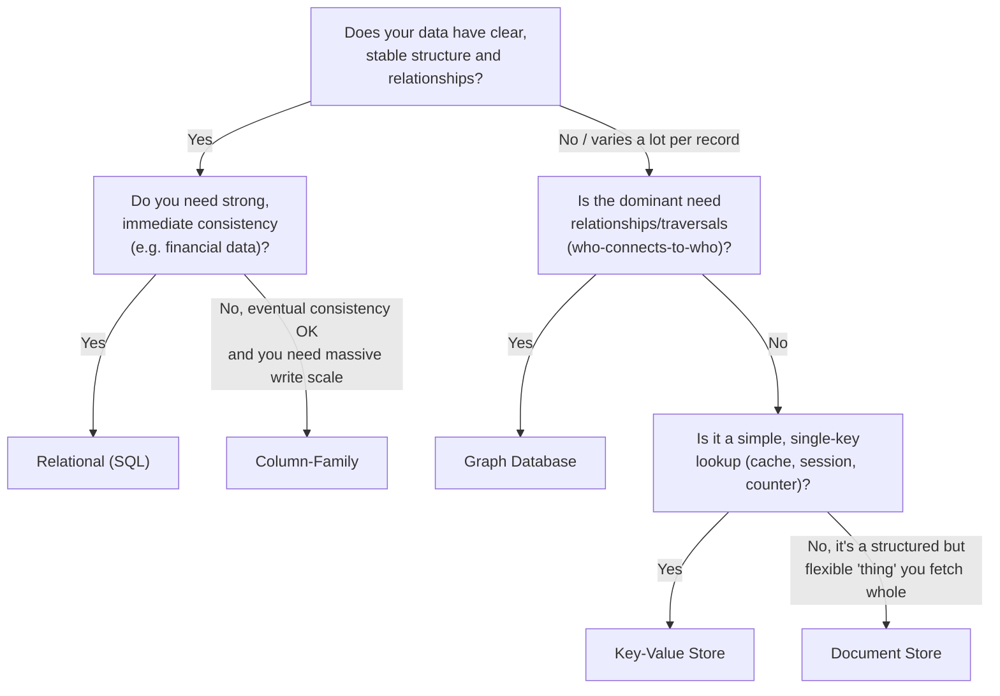
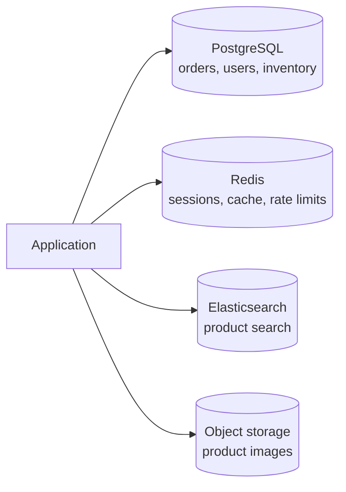

← [Module 07](README.md) | [Course Home](../README.md)

# 7.4 SQL vs. NoSQL: A Decision Guide

Now let's turn everything from this module into a practical decision process —
and answer the [Module 01](../01-fundamentals/02-types-of-databases.md) and
[Module 07, Lesson 3](03-column-family-and-graph-stores.md) exercises properly.

## The decision flowchart

## A worked example, start to finish

**Scenario**: "We're building a note-taking app. Each note has a title, rich
text content, tags, and can be shared with other users with different
permission levels (view/edit)."

Walking the flowchart:
1. Does the data have clear, stable structure? *Notes have a fairly consistent
   shape, but "rich text content" is somewhat free-form, and tags are a
   variable-length list.*
2. Is the dominant need relationships/traversals? *Sharing creates a
   many-to-many relationship (notes ↔ users, with a permission level attribute
   on the relationship itself) — but it's a bounded, shallow relationship
   (direct shares), not deep multi-hop traversal. This doesn't need a graph
   database.*
3. This leans toward **either relational or document**, not key-value or graph.

**Reasonable answer**: relational works well here — `notes`, `users`, and a
`note_shares` junction table (with a `permission_level` column, exactly like
the `order_items` pattern from
[Module 04](../04-schema-design/02-case-study-bookstore.md)) models this
cleanly, with real referential integrity on sharing. A document store would
also work reasonably (embed tags as an array field in the note document), but
the sharing relationship — which needs to be queried from *both* directions
("notes I own," "notes shared with me") and carries its own attribute — is a
genuinely relational shape, so this is a case where SQL is the more natural fit.

**This is normal**: many real systems don't have one "obviously correct" answer
— the exercise is being able to articulate the tradeoffs, not landing on one
universally "right" choice.

## Checking your Module 01 and 07 exercise answers

From [Module 01, Lesson 2](../01-fundamentals/02-types-of-databases.md):

| Scenario | Reasonable answer | Why |
|---|---|---|
| Bank ledger of balances/transactions | Relational | Needs strong consistency, well-defined structure, ACID transactions ([Module 06](../06-transactions-concurrency/01-acid.md)) |
| Shopping-cart session, <5ms responses | Key-Value | Single-key lookup, speed over query flexibility |
| "People you may know" | Graph | Multi-hop relationship traversal is the entire point |
| Product catalog, wildly different attributes per category | Document | Flexible schema per record, fetched whole |

From [Module 07, Lesson 3](03-column-family-and-graph-stores.md):

| Scenario | Reasonable answer | Why |
|---|---|---|
| GPS pings at massive scale | Column-Family | Enormous write throughput, keyed by driver/time |
| Fraud rings via shared connections | Graph | The whole task IS relationship traversal |
| Product catalog, varying attributes | Document | Same reasoning as above |
| Game leaderboard | Key-Value | Redis's sorted-set structure is purpose-built for exactly this |

## Polyglot persistence: it's rarely all-or-nothing

Most real, non-trivial systems use **multiple** databases for different parts
of the same application — this is called **polyglot persistence**:

An e-commerce platform might use PostgreSQL for orders/inventory (needs strong
consistency and relationships), Redis for sessions/caching (needs speed),
Elasticsearch for product search (needs full-text search), and object storage
for images. Each tool is chosen for what it's actually good at, rather than
forcing one database to do everything adequately.

## A pragmatic default for most new projects

Unless you have a specific, demonstrated reason not to (a workload from the
tables above), **default to a relational database** (PostgreSQL is a strong
general default): it handles a surprisingly wide range of workloads well
(including flexible data, via `JSONB` columns), has mature tooling, and gives
you strong consistency guarantees you can *choose* to relax later, whereas
adding relational guarantees on top of a NoSQL choice made too early is much
harder to retrofit.

## Try it yourself

Pick a real app you use or are building. Walk it through the decision
flowchart above for **two different pieces of its data** (e.g., "user
accounts" and "activity feed"), and write one paragraph justifying whether a
single database or a polyglot approach fits best.

---
← [7.3 Column-Family & Graph Stores](03-column-family-and-graph-stores.md) | [Module 07](README.md) | Next: [Module 08 — Scaling & Replication →](../08-scaling-and-replication/)
