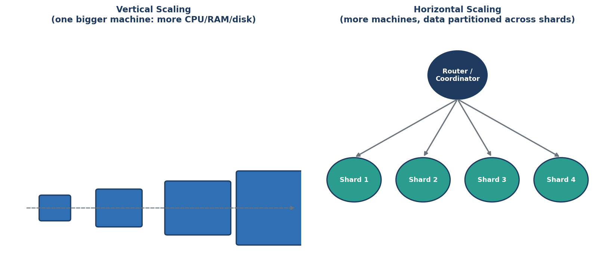
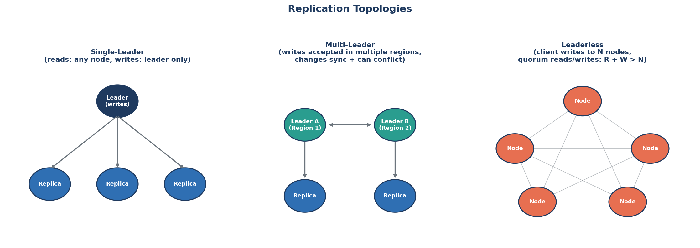
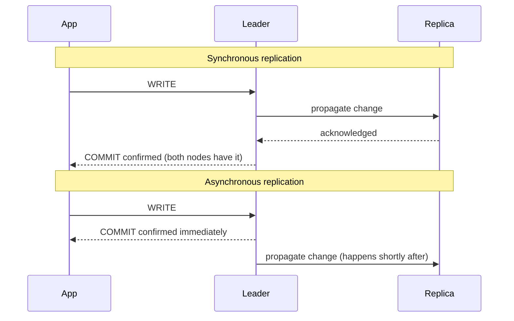

← [Module 08](README.md) | [Course Home](../README.md)

# 8.1 Replication

**Replication** means keeping copies of the same data on multiple machines —
for two reasons: **reliability** (if one machine dies, another has the data)
and **read scaling** (spread read traffic across multiple copies).

## Vertical vs. horizontal scaling — a quick refresher



Replication and sharding (next lesson) are both **horizontal scaling**
strategies — adding more machines rather than a single, bigger one. Vertical
scaling (a bigger machine) is simpler but always hits a ceiling and creates a
single point of failure.

## The three replication topologies



### Single-Leader (a.k.a. primary-replica, master-slave)

One node — the **leader** — accepts all writes. Changes propagate to
**replicas**, which serve read traffic and stand ready to take over if the
leader fails.

```sql
-- Application writes always go to the leader
INSERT INTO orders (...) VALUES (...);   -- must hit the leader

-- Reads can be spread across replicas
SELECT * FROM books WHERE genre = 'Fantasy';   -- fine on a replica, if slightly stale is OK
```

**Pros**: simple to reason about — writes never conflict, since only one node
accepts them. **Cons**: the leader is a bottleneck for write throughput, and a
single point of failure until a replica is promoted (an operation called
**failover**, which takes time and can briefly lose very recent writes).

This is the default topology for PostgreSQL, MySQL, and most relational
databases in production.

### Multi-Leader

Multiple nodes (often in different geographic regions) each accept writes
independently, then propagate changes to each other.

**Pros**: writes can happen close to users in each region (lower latency), and
the system tolerates a whole region going down. **Cons**: two leaders can
accept **conflicting writes** to the same data at nearly the same time (e.g.,
two regions both process an update to the same customer record) — the system
needs a conflict-resolution strategy (last-write-wins, based on timestamp, is
common but can silently discard one region's change).

### Leaderless

Any node can accept a write; the client (or a coordinator) writes to several
nodes at once and reads from several, using **quorums** to guarantee
consistency: if you write to `W` nodes and read from `R` nodes, and `R + W >
N` (total replicas), you're guaranteed at least one node in your read set has
the latest write.

```
N = 3 replicas, W = 2, R = 2  →  R + W = 4 > 3  ✅ guaranteed overlap
N = 3 replicas, W = 1, R = 1  →  R + W = 2 ≤ 3  ❌ might read stale data
```

**Pros**: no single leader bottleneck, highly available even with multiple node
failures. **Cons**: more complex to reason about, and tuning `W`/`R` is a
direct, explicit tradeoff between consistency and availability/latency — this
is a NoSQL-world pattern (Cassandra, DynamoDB), not typically used in classic
relational databases.

## Synchronous vs. asynchronous replication



- **Synchronous**: the leader waits for the replica to confirm before telling
  the application "committed." Guarantees the replica is never behind, at the
  cost of higher write latency (and writes stall if the replica is slow/down).
- **Asynchronous**: the leader confirms immediately, and replicates in the
  background. Lower latency, but a replica can lag behind — and if the leader
  crashes before replicating a recent write, that write can be **lost** on
  failover. Most production systems default to asynchronous for performance,
  accepting this small risk window.

## Read replica lag, in practice

A very common real-world bug: a user submits a form (writes to the leader),
gets redirected to a page that reads from a lagging replica, and doesn't see
their own change yet ("I just saved this — why isn't it showing?"). **Fix
patterns**: read your own writes from the leader for a short window after
writing, or route session-specific reads to the leader, or accept and design
around brief inconsistency where it truly doesn't matter.

## Try it yourself

1. For the bookstore application, would you choose single-leader, multi-leader,
   or leaderless replication? Justify your choice given that book orders need
   strong consistency (no overselling) but browsing the catalog does not.
2. Explain, in your own words, the tradeoff between synchronous and
   asynchronous replication in terms of a concrete scenario: an online payment
   confirming a $10,000 wire transfer.
3. If `N = 5` replicas, choose `W` and `R` values that guarantee read-after-
   write consistency, and one alternative pair that favors speed over that
   guarantee.

---
← [Module 08](README.md) | Next: [Sharding & Partitioning →](02-sharding-partitioning.md)
