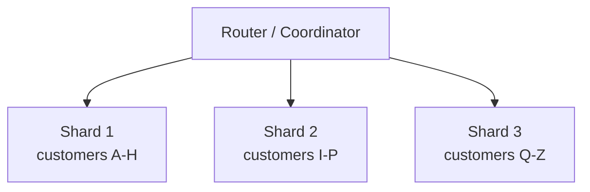
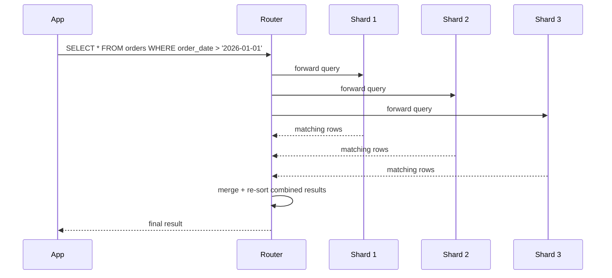

← [Module 08](README.md) | [Course Home](../README.md)

# 8.2 Sharding & Partitioning

Replication (previous lesson) copies the **same** data onto multiple machines —
it doesn't help once your dataset is too large for a single machine to hold, or
your *write* volume exceeds what one machine can process. **Sharding**
(a.k.a. horizontal partitioning) splits your data itself across multiple
machines, each holding a different subset.

## The core idea



Each shard holds a portion of the rows (not a portion of the columns — that's
a different concept, "vertical partitioning," briefly below). A **shard key**
(or partition key) determines which shard a given row lives on.

## Choosing a shard key

This is the single most consequential decision in sharding — it's very
difficult to change later without a major data migration.

| Strategy | How it works | Risk |
|---|---|---|
| **Range-based** | Shard by ranges of the key (e.g., customer IDs 1–999999 on shard 1) | Prone to "hot spots" — new customers all land on the newest shard, overloading it |
| **Hash-based** | Hash the key, use the hash to pick a shard | Spreads load evenly, but range queries (`WHERE id BETWEEN...`) now must hit every shard |
| **Directory-based** | A lookup table explicitly maps each key to its shard | Flexible (can rebalance individually), but the lookup table itself becomes a critical, must-be-fast component |

**Rule of thumb**: choose a shard key that matches your dominant access
pattern. If almost every query is scoped to one customer (`WHERE customer_id
= ?`), sharding by `customer_id` means the vast majority of queries hit
exactly one shard — the ideal case.

## The problem sharding introduces: cross-shard queries

```sql
-- If sharded by customer_id, this is EASY — hits exactly one shard:
SELECT * FROM orders WHERE customer_id = 42;

-- This is HARD — must query every shard and combine results ("scatter-gather"):
SELECT * FROM orders WHERE order_date > '2026-01-01' ORDER BY order_date;
```



This "scatter-gather" pattern works but is inherently slower and more complex
than a single-shard query — and joins **across shards** (e.g., joining `orders`
on one shard with `products` that might live on any shard) are even harder,
which is why sharded systems often **denormalize** aggressively (echoing the
NoSQL "design around your queries" mindset from
[Module 07, Lesson 1](../07-nosql/01-nosql-overview.md)) or duplicate small,
frequently-joined reference tables onto every shard.

## Vertical partitioning (a different, complementary idea)

Sharding (above) splits rows across machines — **vertical partitioning** splits
**columns** instead, often within a single machine: rarely-used or huge columns
(e.g., a `full_text_content` blob) moved to a separate table/store, so the
"hot," frequently-queried columns stay compact and fast to scan.

## Rebalancing: the operational challenge

As data grows unevenly, some shards become "hotter" than others and need
splitting or rebalancing — moving data between shards while the system stays
live. This is genuinely difficult operationally, which is why many teams use
managed, sharding-aware databases (Vitess for MySQL, Citus for Postgres,
MongoDB's built-in sharding, DynamoDB, Cassandra) rather than building sharding
logic from scratch.

## When you actually need sharding (and when you don't)

Sharding adds substantial operational and query complexity — don't reach for
it prematurely:

1. **Vertical scaling first** — modern hardware handles surprisingly large
   datasets (hundreds of GB to low TBs) on a single well-tuned machine.
2. **Read replicas next** — if your bottleneck is *read* traffic, replication
   alone (previous lesson) solves it without sharding's complexity.
3. **Sharding last** — reach for it once you've outgrown a single machine's
   write throughput or total storage capacity, and after confirming indexing
   and query tuning ([Module 05](../05-indexing-performance/)) aren't the
   actual bottleneck.

## Try it yourself

1. For the bookstore's `orders` table, propose a shard key and justify it based
   on the queries you wrote in [Module 03](../03-sql-fundamentals/).
2. Using your chosen shard key, identify one query from Module 03's exercises
   that would become a cross-shard "scatter-gather" query, and explain why.
3. Explain, in your own words, why choosing a bad shard key is much more
   costly to fix later than choosing a bad index (which you can simply drop
   and recreate).

---
← [8.1 Replication](01-replication.md) | [Module 08](README.md) | Next: [The CAP Theorem →](03-cap-theorem.md)
