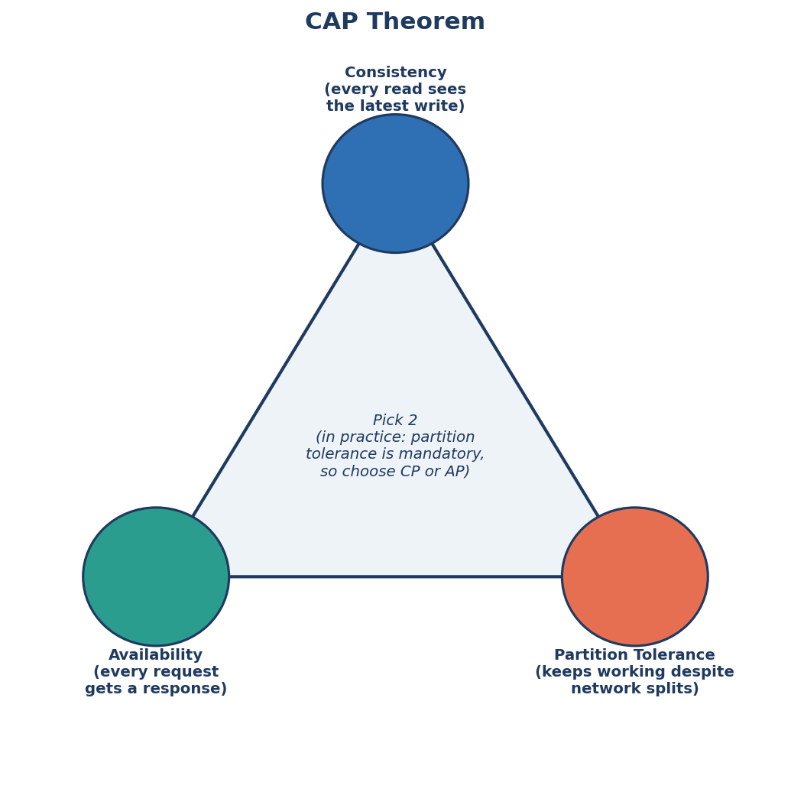
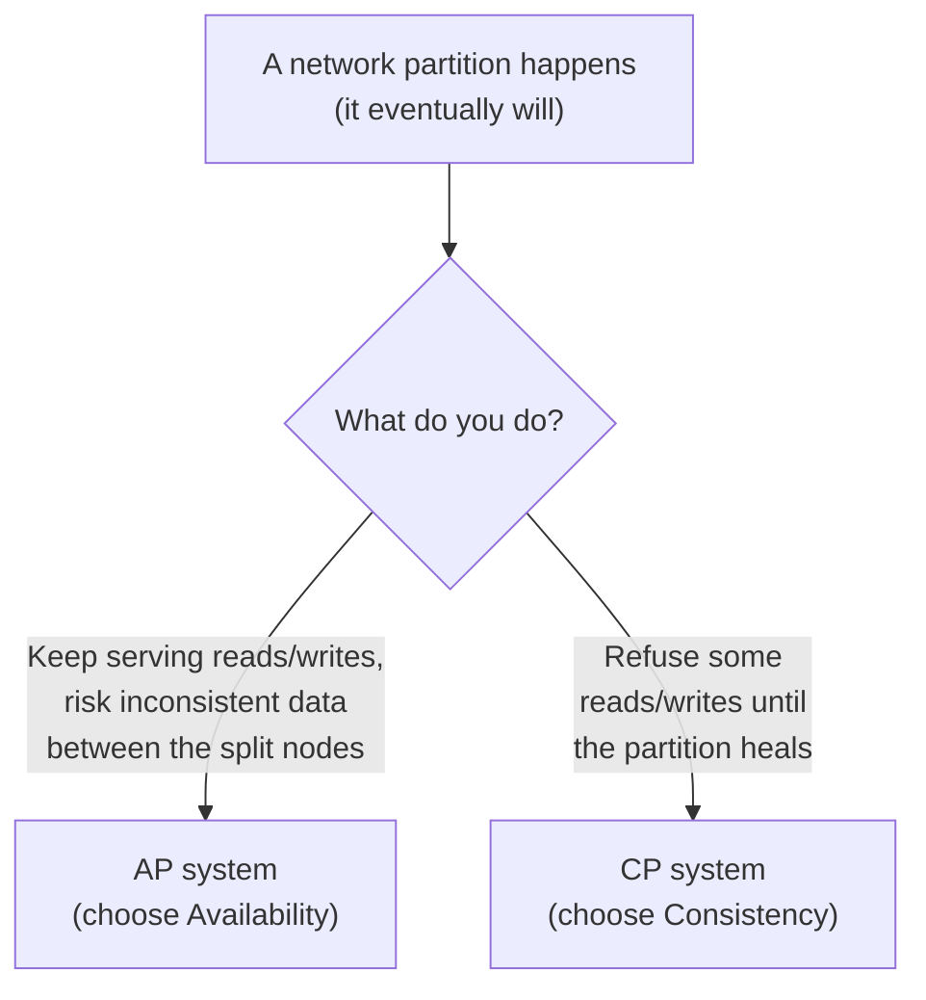
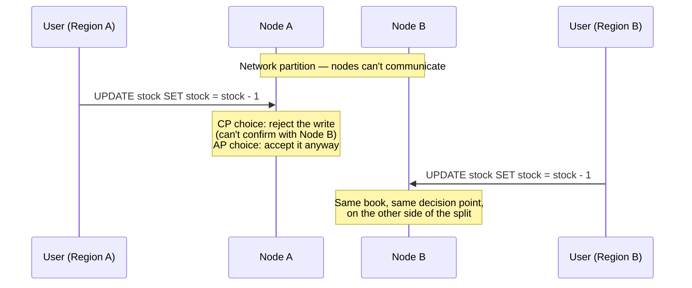

← [Module 08](README.md) | [Course Home](../README.md)

# 8.3 The CAP Theorem

The CAP theorem explains a fundamental tradeoff that every distributed
database (one spread across multiple machines, as in the last two lessons)
must make.

## The three properties

- **Consistency (C)** — every read receives the most recent write (or an
  error) — all nodes see the same data at the same time. (Note: this is a
  different, stricter notion of "consistency" than the "C" in ACID from
  [Module 06](../06-transactions-concurrency/01-acid.md), which is about valid
  states relative to constraints — a frequent source of confusion.)
- **Availability (A)** — every request to a non-failed node receives a
  (non-error) response — the system keeps working even if some nodes are down.
- **Partition Tolerance (P)** — the system keeps working even when network
  communication between nodes is disrupted (a "network partition" — messages
  between some nodes are delayed or lost).

## The theorem, precisely

**You cannot have all three simultaneously during an actual network
partition** — you must choose to sacrifice either Consistency or Availability
while the partition is happening.

Why this isn't really "pick 2 of 3" in practice: network partitions **will**
happen eventually in any real distributed system (a cable gets cut, a
data-center link times out, a router misbehaves) — partition tolerance isn't
really optional to give up if you're distributed across more than one machine.
So the real, practical choice is:

## CP vs. AP, with real systems

| | CP (Consistency + Partition tolerance) | AP (Availability + Partition tolerance) |
|---|---|---|
| During a partition | Some nodes refuse requests rather than risk stale/conflicting data | All nodes keep responding, possibly with stale or conflicting data |
| Example systems | Traditional relational databases in single-leader mode, HBase, MongoDB (with default settings) | Cassandra, DynamoDB, CouchDB |
| Good fit for | Financial transactions, inventory counts — wrong data is worse than no data | Social media feeds, shopping carts, product catalogs — stale data briefly is fine, an error page is not |

## A concrete walkthrough

**Scenario**: a network partition splits your 2-region database in half —
Region A and Region B can no longer talk to each other, but each still has
users connected.

If both sides choose **AP** and both accept the write, you may have now sold
the same last copy of a book twice — the system stayed available, but paid for
it with an inconsistency that must be reconciled once the partition heals
(this reconciliation, and how painful it is, is exactly why inventory/payment
systems usually lean **CP** instead).

## PACELC: CAP's more complete sequel

CAP only describes behavior *during* a partition — but there's also a tradeoff
that exists *even when there's no partition at all*, between latency and
consistency. **PACELC** extends this: "if Partitioned, choose Availability or
Consistency; Else (normally operating), choose Latency or Consistency." Even a
perfectly healthy, unpartitioned system faces a real choice: wait for every
replica to confirm a write (more consistent, higher latency) or not (faster,
briefly less consistent) — connecting directly back to the synchronous vs.
asynchronous replication tradeoff from
[Lesson 1](01-replication.md).

## Why this matters for choosing a database

This is the theoretical foundation behind the SQL-vs-NoSQL decisions from
[Module 07, Lesson 4](../07-nosql/04-sql-vs-nosql-decision-guide.md): when a
NoSQL database advertises "eventual consistency" or "tunable consistency," it's
describing exactly where it sits on this CAP/PACELC spectrum, and why. A
single-machine relational database technically sidesteps CAP entirely — with
only one node, there's no "partition" possible — which is part of why
relational databases can offer strong consistency so comfortably by default,
until you scale them out with replication or sharding.

## Try it yourself

1. Classify each as leaning CP or AP, and justify: (a) a bank's core ledger;
   (b) a "likes" counter on a social media post; (c) an airline's seat
   reservation system; (d) a product recommendation cache.
2. Explain in your own words why "partition tolerance" isn't really an optional
   third choice for any database that runs on more than one machine.
3. Revisit your replication topology choice from
   [Lesson 1](01-replication.md)'s exercise for the bookstore. Would you now
   describe it as leaning CP or AP? Does that match what you'd actually want
   for an online bookstore's order/stock data?

---
← [8.2 Sharding & Partitioning](02-sharding-partitioning.md) | [Module 08](README.md) | Next: [Module 09 — Security & Administration →](../09-security-and-administration/)
