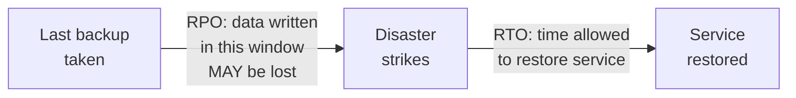
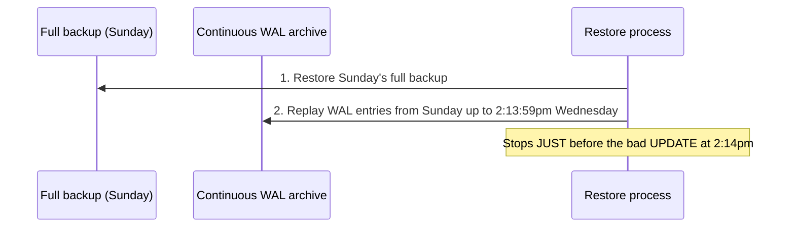

← [Module 09](README.md) | [Course Home](../README.md)

# 9.2 Backup & Recovery

Every guarantee from [Module 06](../06-transactions-concurrency/01-acid.md)
protects you against *software* failures within a single running system — it
does nothing against a deleted table, a bad migration, ransomware, or an
entire data center burning down. Backups are the last line of defense, and the
one most teams under-invest in until it's too late.

## Two numbers that define your backup strategy

- **RPO (Recovery Point Objective)** — how much data can you afford to lose,
  measured in time? "RPO of 1 hour" means: in the worst case, you lose up to 1
  hour of the most recent writes.
- **RTO (Recovery Time Objective)** — how long can you afford to be down while
  recovering? "RTO of 30 minutes" means: from the moment disaster strikes,
  you must be back up within 30 minutes.

These two numbers should be **business decisions**, not purely technical ones —
"how much data loss and downtime can we actually tolerate?" — and they
determine which backup strategy below is appropriate.

## Backup types

| Type | What it captures | Restore speed | Storage cost |
|---|---|---|---|
| **Full backup** | Entire database, point-in-time | Fast to restore (one file/set to load) | Highest — a complete copy each time |
| **Incremental backup** | Only changes since the last backup (full or incremental) | Slower (must replay a chain of backups in order) | Lowest |
| **Differential backup** | All changes since the last *full* backup | Faster than incremental (only 2 pieces: full + latest differential) | Middle ground |
| **Continuous (WAL-based) archiving** | Every committed transaction, continuously, via the write-ahead log from [Module 01](../01-fundamentals/03-dbms-architecture.md) | Enables **point-in-time recovery** to any specific second | Ongoing, but efficient |

## Point-in-time recovery (PITR)

Combining a periodic full backup with continuous WAL archiving lets you restore
to **any specific moment**, not just the moment of the last backup — essential
for recovering from something like "we accidentally ran a bad `UPDATE` with no
`WHERE` clause at 2:14pm":

Without this, your only option would be restoring to Sunday's backup and
losing every legitimate write made between then and the disaster — PITR is
what makes "restore to 2:13:59pm" possible instead of "restore to last Sunday."

## The 3-2-1 backup rule

A widely used rule of thumb:
- **3** copies of your data total (the original + 2 backups)
- **2** different storage media/systems (not just 2 copies on the same disk)
- **1** copy stored off-site (a different physical location/region, protecting
  against fire, regional outages, or a compromised single account)

## Backups are worthless until you've tested restoring them

This is the single most common, most expensive mistake in backup strategy:
**an untested backup is a hope, not a plan.** Corrupted backup files, missing
permissions during restore, or a restore process that takes 14 hours when your
RTO is 30 minutes — all of these are only discovered the hard way, during an
actual outage, unless you schedule regular **restore drills**: actually
restoring a backup to a separate environment and verifying the data is
complete and correct.

## Replication is not a backup

A common, dangerous misconception: "we have replicas, so we're backed up."
Replication (from [Module 08, Lesson 1](../08-scaling-and-replication/01-replication.md))
protects against **hardware failure** — a replica has a copy of the data. It
does **not** protect against:

- **Human error**: `DELETE FROM customers;` with no `WHERE` clause replicates
  to every replica almost instantly — you now have several copies of the
  mistake, not a safety net against it.
- **Logical corruption**: a bad migration or application bug that writes wrong
  data — replicated everywhere, just as wrong.
- **Ransomware/malicious deletion**: an attacker with write access can delete
  data across replicas just as easily as a single machine.

**You need real, separate backups (ideally with some delay/immutability) in
addition to replication — they solve different problems.**

## A practical checklist

- [ ] Automated backups run on a schedule matching your RPO
- [ ] WAL/continuous archiving enabled if point-in-time recovery matters to you
- [ ] Backups stored off-site, following the 3-2-1 rule
- [ ] Backups are encrypted (see [Lesson 1](01-security-basics.md))
- [ ] You have actually performed a restore drill in the last quarter, not just
      configured backups and assumed they work

## Try it yourself

1. Propose an RPO and RTO for the bookstore's order database, and justify your
   numbers in terms of real business impact (e.g., "losing 1 hour of orders
   means re-contacting X customers manually").
2. Design a backup schedule (full + incremental/WAL) that meets your proposed
   RPO, and explain how you'd perform a point-in-time restore to "5 minutes
   before a bad deploy."
3. Explain, in your own words, to a hypothetical teammate who says "we have 3
   read replicas, we don't need backups," exactly why they're wrong.

---
← [9.1 Database Security Basics](01-security-basics.md) | [Module 09](README.md) | Next: [Module 10 — Capstone Project →](../10-capstone-project/)
