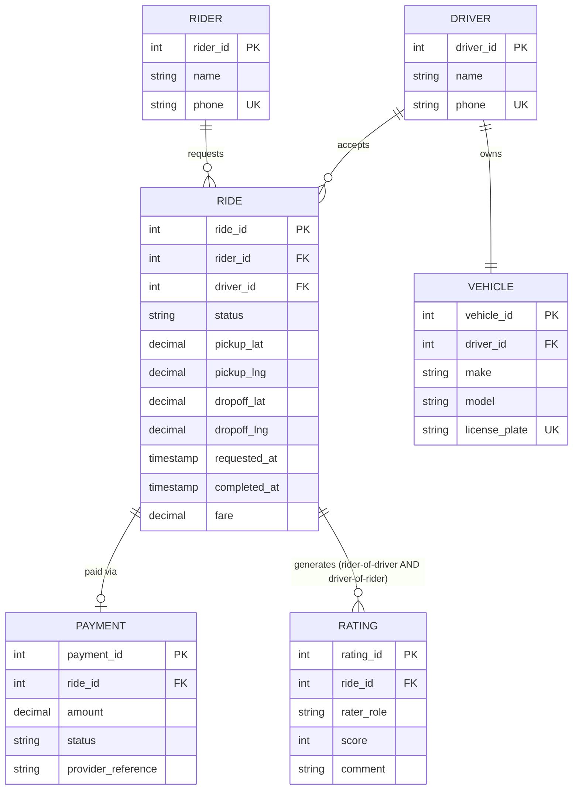

← [Module 10](README.md) | [Course Home](../README.md)

# 10.2 Solution Guide: RideShare

A full worked solution to the [project brief](01-project-brief.md). Compare
this against your own attempt — don't just read it as the "correct" answer;
reasonable designs can differ, as long as the reasoning holds up.

## 1. ER Modeling

The subtle part: **ratings are bidirectional and per-ride** — a rider rates a
driver *for that specific ride*, and a driver rates a rider *for that same
ride*. That's two separate rating records per completed ride, both tied to the
same ride, not a generic "user rates user" relationship.



`RATING.rater_role` (`'rider'` or `'driver'`) distinguishes the two ratings per
ride without needing two separate tables — a deliberate, documented modeling
choice, not an EAV anti-pattern
([Module 04, Lesson 3](../04-schema-design/03-antipatterns.md)), since the
column set is small, fixed, and identical for both roles.

## 2. Schema & DDL

```sql
CREATE TABLE riders (
    rider_id    INTEGER PRIMARY KEY,
    name        TEXT NOT NULL,
    phone       TEXT NOT NULL UNIQUE
);

CREATE TABLE drivers (
    driver_id   INTEGER PRIMARY KEY,
    name        TEXT NOT NULL,
    phone       TEXT NOT NULL UNIQUE
);

CREATE TABLE vehicles (
    vehicle_id      INTEGER PRIMARY KEY,
    driver_id       INTEGER NOT NULL UNIQUE REFERENCES drivers(driver_id),
    make            TEXT NOT NULL,
    model           TEXT NOT NULL,
    license_plate   TEXT NOT NULL UNIQUE
);

CREATE TABLE rides (
    ride_id       INTEGER PRIMARY KEY,
    rider_id      INTEGER NOT NULL REFERENCES riders(rider_id),
    driver_id     INTEGER REFERENCES drivers(driver_id),  -- NULL until accepted
    status        TEXT NOT NULL DEFAULT 'requested'
                  CHECK (status IN ('requested','accepted','in_progress','completed','cancelled')),
    pickup_lat    DECIMAL(9,6) NOT NULL,
    pickup_lng    DECIMAL(9,6) NOT NULL,
    dropoff_lat   DECIMAL(9,6) NOT NULL,
    dropoff_lng   DECIMAL(9,6) NOT NULL,
    requested_at  TIMESTAMP NOT NULL DEFAULT CURRENT_TIMESTAMP,
    completed_at  TIMESTAMP,
    fare          DECIMAL(8,2) CHECK (fare >= 0)   -- NULL until completed
);

CREATE TABLE payments (
    payment_id          INTEGER PRIMARY KEY,
    ride_id             INTEGER NOT NULL UNIQUE REFERENCES rides(ride_id),
    amount              DECIMAL(8,2) NOT NULL CHECK (amount >= 0),
    status              TEXT NOT NULL CHECK (status IN ('pending','succeeded','failed','refunded')),
    provider_reference  TEXT NOT NULL
);

CREATE TABLE ratings (
    rating_id   INTEGER PRIMARY KEY,
    ride_id     INTEGER NOT NULL REFERENCES rides(ride_id),
    rater_role  TEXT NOT NULL CHECK (rater_role IN ('rider','driver')),
    score       INTEGER NOT NULL CHECK (score BETWEEN 1 AND 5),
    comment     TEXT,
    UNIQUE (ride_id, rater_role)   -- at most one rating per role per ride
);
```

**Design decisions**: `rides.driver_id` and `.fare`/`.completed_at` are
nullable, since a ride legitimately doesn't have them yet in early states —
this is normal, not a design flaw; the `CHECK` on `status` encodes the state
machine directly in the schema; `ON DELETE` is left as the default `RESTRICT`
throughout, since silently cascading deletes through payment/rating history
would be dangerous — historical ride data should be archived deliberately, not
deleted implicitly by a cascade.

## 3. Core Queries

```sql
-- A rider's ride history with driver name, fare, and the rider's given rating
SELECT r.ride_id, r.requested_at, d.name AS driver_name, r.fare, rt.score
FROM rides r
JOIN drivers d ON d.driver_id = r.driver_id
LEFT JOIN ratings rt ON rt.ride_id = r.ride_id AND rt.rater_role = 'rider'
WHERE r.rider_id = 42
ORDER BY r.requested_at DESC;

-- Each driver's average rating and total completed rides
SELECT d.driver_id, d.name,
       COUNT(r.ride_id) FILTER (WHERE r.status = 'completed') AS completed_rides,
       AVG(rt.score) AS avg_rating
FROM drivers d
LEFT JOIN rides r   ON r.driver_id = d.driver_id
LEFT JOIN ratings rt ON rt.ride_id = r.ride_id AND rt.rater_role = 'rider'
GROUP BY d.driver_id, d.name;

-- Busiest hour of the day by completed ride count
SELECT EXTRACT(HOUR FROM completed_at) AS hour_of_day, COUNT(*) AS num_rides
FROM rides
WHERE status = 'completed'
GROUP BY hour_of_day
ORDER BY num_rides DESC
LIMIT 1;
```

These use `JOIN`s ([Module 03, Lesson 4](../03-sql-fundamentals/04-joins.md)),
`LEFT JOIN` + filtered aggregate patterns, and `GROUP BY`
([Lesson 5](../03-sql-fundamentals/05-aggregation-grouping.md)) directly.

## 4. Indexing

| Index | Supports |
|---|---|
| `rides(rider_id, requested_at)` | The ride-history query above, sorted, per rider |
| `rides(driver_id)` | Joining rides to drivers for the ratings/completed-rides query |
| `rides(status)` | Filtering active/completed rides platform-wide |
| `payments(ride_id)` | Already covered by the `UNIQUE` constraint, which auto-indexes |
| `ratings(ride_id, rater_role)` | Already covered by the `UNIQUE` constraint |

Justified per [Module 05, Lesson 1](../05-indexing-performance/01-indexes-explained.md):
each supports a specific, named query pattern from Task 3 rather than being
added speculatively.

## 5. Transactions & Concurrency

The "two riders matched to one driver" race is exactly the
[Module 06, Lesson 1](../06-transactions-concurrency/01-acid.md) stock race,
reshaped: instead of `UPDATE stock WHERE stock > 0`, use an atomic
conditional update on the ride assignment:

```sql
BEGIN;
UPDATE rides
SET driver_id = 17, status = 'accepted'
WHERE ride_id = 501 AND driver_id IS NULL AND status = 'requested';
-- application checks: did this affect 1 row? If 0, someone else already claimed this ride.
COMMIT;
```

And separately, prevent the *same driver* from being double-booked with a
similar guarded update against a `drivers.current_ride_id` column (or a
`driver_availability` table), following the same "one atomic conditional
statement, no separate read-then-write" pattern from
[Module 06, Lesson 1](../06-transactions-concurrency/01-acid.md), reinforced
with `SELECT ... FOR UPDATE` ([Lesson 3](../06-transactions-concurrency/03-locking-mvcc.md))
if the matching logic needs multiple steps within one transaction.

## 6. NoSQL Considerations

Live GPS locations (updated every few seconds, queried by proximity) are a
poor fit for a relational table under constant heavy write churn — this is
almost the canonical case for a **key-value store** (Redis) as described in
[Module 07, Lesson 2](../07-nosql/02-key-value-and-document-stores.md):
`SET driver:17:location '{"lat":...,"lng":...}' EX 30` with Redis's geospatial
commands (`GEOADD`/`GEOSEARCH`) for fast "drivers within X km" queries — far
better suited than repeatedly `UPDATE`ing a relational row and running spatial
queries against it at this write frequency. This is a **polyglot persistence**
decision ([Module 07, Lesson 4](../07-nosql/04-sql-vs-nosql-decision-guide.md)):
PostgreSQL remains the source of truth for rides/payments/ratings (needs
strong consistency), while Redis handles the ephemeral, high-churn location
data alongside it.

## 7. Scaling

Given "hundreds of cities," a natural shard key is **city_id** (or a derived
geographic region) — nearly every query (`find available drivers in this
city`, `a rider's ride history within their home city`) is naturally scoped to
one city, matching the [Module 08, Lesson 2](../08-scaling-and-replication/02-sharding-partitioning.md)
principle of choosing a shard key aligned with the dominant access pattern.

A query that becomes cross-shard: the "busiest hour of the day" query from
Task 3, if computed **platform-wide across all cities**, would need to
scatter-gather across every shard and merge results — a reasonable, expected
tradeoff given how rarely (compared to per-city queries) this particular
report runs.

## 8. Security & Backup

Roles, following [Module 09, Lesson 1](../09-security-and-administration/01-security-basics.md):

```sql
-- Rider/driver-facing app: read/write its own operational data, no ratings deletion
CREATE ROLE app_service LOGIN;
GRANT SELECT, INSERT, UPDATE ON rides, payments TO app_service;
GRANT SELECT, INSERT ON ratings TO app_service;   -- no UPDATE/DELETE — ratings are immutable once given

-- Internal support dashboard: read-only across the board
CREATE ROLE support_readonly LOGIN;
GRANT SELECT ON ALL TABLES IN SCHEMA public TO support_readonly;

-- Analytics pipeline: read-only, likely against a replica, not the primary
CREATE ROLE analytics_readonly LOGIN;
GRANT SELECT ON ALL TABLES IN SCHEMA public TO analytics_readonly;
```

**RPO/RTO** ([Module 09, Lesson 2](../09-security-and-administration/02-backup-recovery.md)):
given that `payments.provider_reference` is financial reconciliation data, a
tight **RPO of minutes** (via continuous WAL archiving, not just nightly full
backups) is justified — losing even 30 minutes of payment records could mean
un-reconcilable transactions with the payment provider. An **RTO of under 1
hour** is reasonable for a rider-facing platform, where extended downtime
directly stops the core business function.

---
← [Project Brief](01-project-brief.md) | [Module 10](README.md) | Back to [Course Home →](../README.md)

## You've completed the course 🎉

You've gone from "what is a database?" to designing, querying, tuning, and
scaling a real system across both relational and NoSQL models. From here:

- Build something real — the best way to cement this is applying it to your
  own project, not another exercise.
- Go deeper on whichever module challenged you most — re-read it now that you
  have the full picture the later modules provided.
- Explore a specific database's own documentation in depth (PostgreSQL's docs
  are exceptional and free) — this course gave you the concepts that transfer
  everywhere; the next step is one system's specifics.
